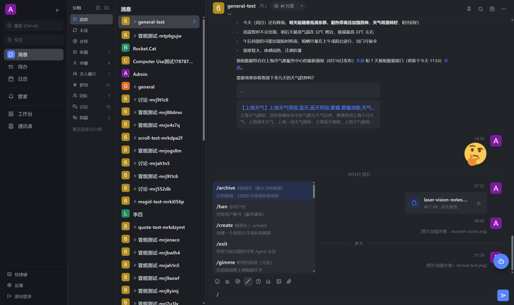
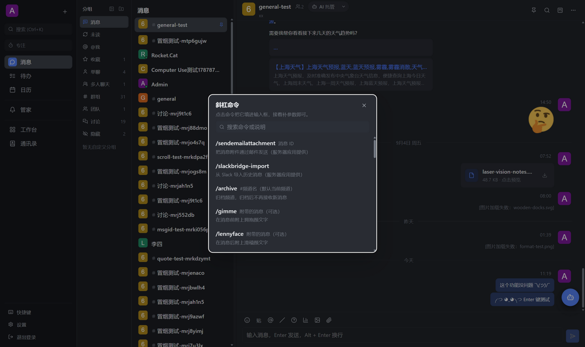
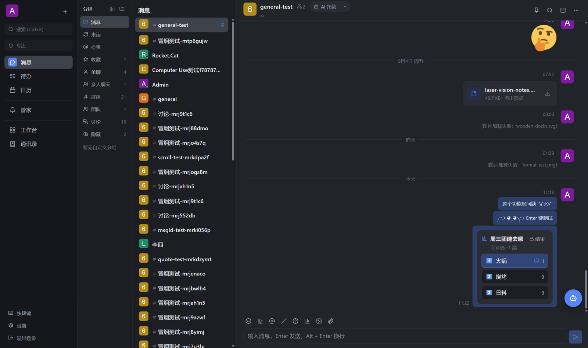
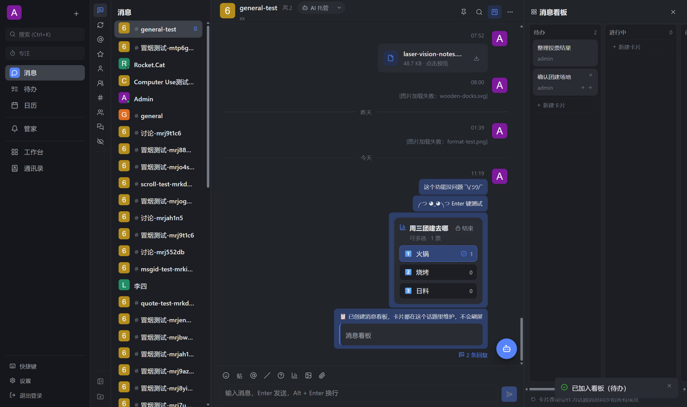
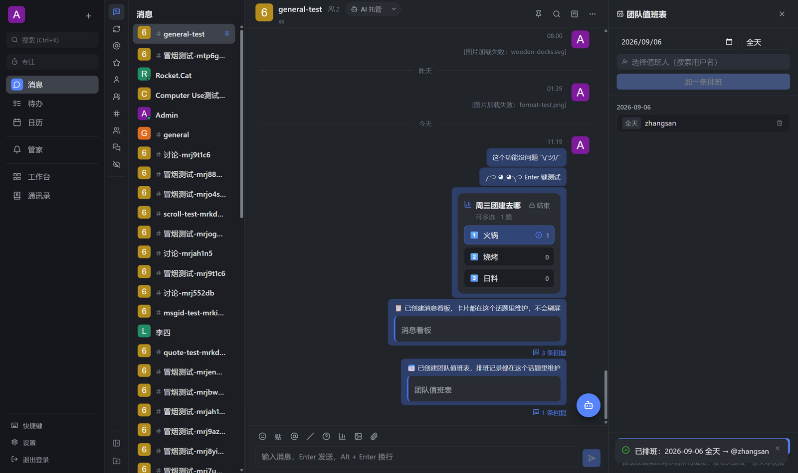
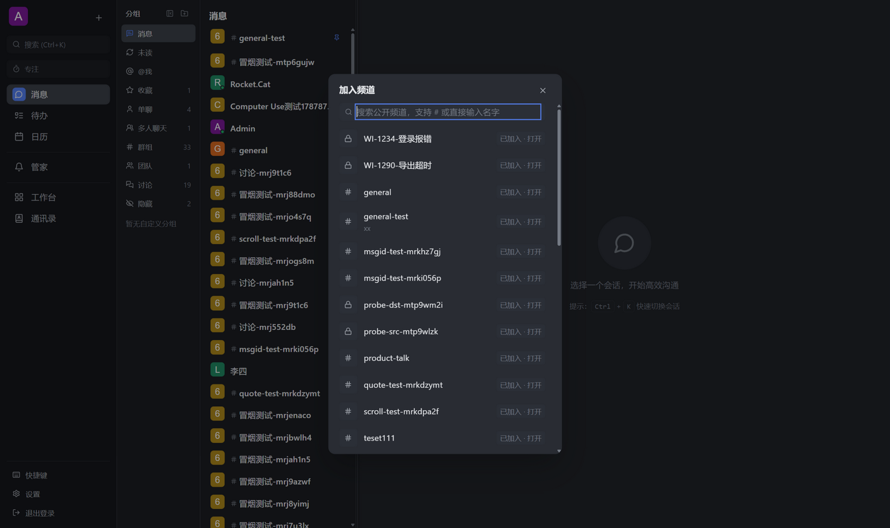
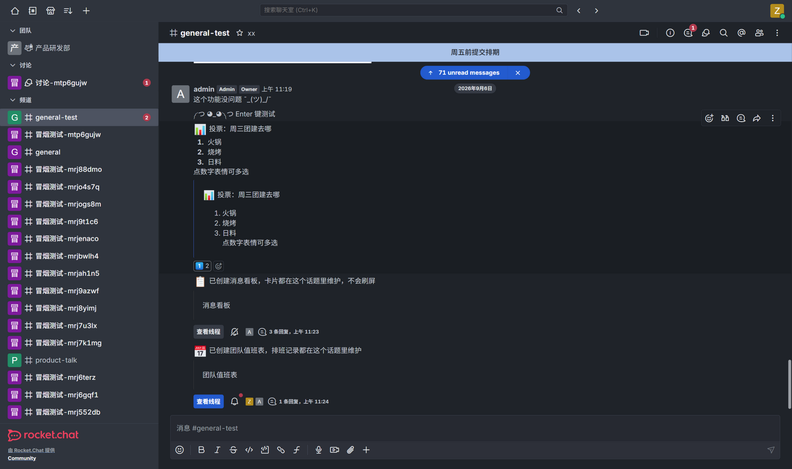
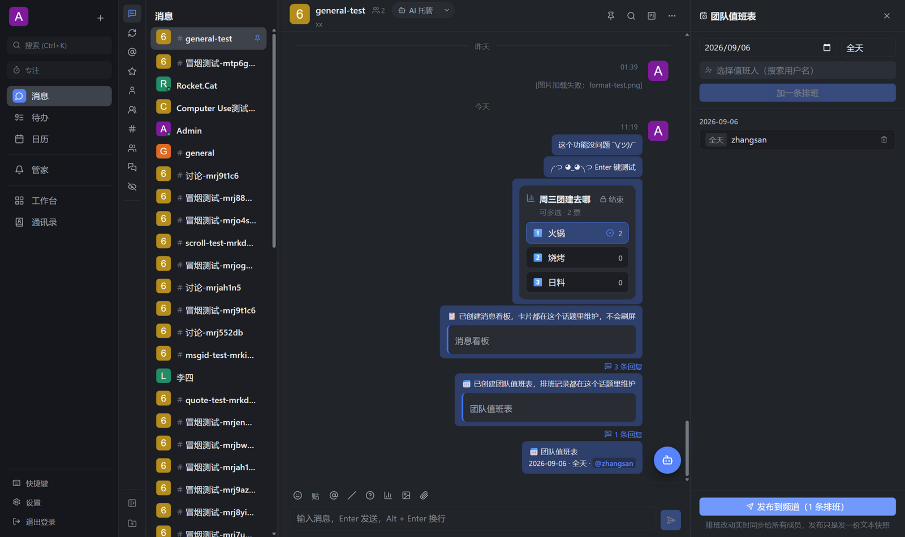

# RocketX

[English](README.en.md)

[](https://github.com/lusipad/RocketX/releases)
[](https://github.com/lusipad/RocketX/actions/workflows/ci.yml)
[](LICENSE)

基于原版 Rocket.Chat、体验对齐飞书的团队协作客户端。

RocketX 不改 Rocket.Chat 服务端，只通过公开 API 通信。你可以在现有 Rocket.Chat 服务器上直接部署，官方客户端与 RocketX 数据互通、同时登录。

```text
┌─────────────────────────────────────┐
│   RocketX 客户端                     │
│ 消息 │ 管家 │ 待办 │ 日历 │ 工作台 │ 通讯录 │
└────────┬───────────────┬────────────┘
         │ REST / WS     │ Webhook
┌────────▼──────┐  ┌─────▼──────────────┐
│  Rocket.Chat  │  │  ado-bridge        │
│  （原版不改）  │◄─┤  Azure DevOps      │
└───────────────┘  │  Server 2022 事件  │
                   └────────────────────┘
```

## 下载

从 [GitHub Releases](https://github.com/lusipad/RocketX/releases) 下载最新版本：

- **Windows**：slim 安装包（探测系统 Codex / DSH）或 full 安装包（内置固定版本运行时）
- **macOS**：universal DMG（ad-hoc 签名，未经 Apple 公证）
- **Linux**：AppImage / DEB / RPM
- **Web**：直接用浏览器访问部署地址，无需安装

> 当前版本：**v0.43.6**

## 主要功能

- **飞书式团队消息**：三栏布局、话题、表情回应、@ 提及、文件共享、讨论卡片、消息搜索。
- **完整斜杠命令**：30 个命令全量中文说明、参数提示条与命令帮助（`/help` 或 `Ctrl+/`）；参数化命令一律弹出图形界面（选人、选频道、确认框），不再要求手打 `@用户名` 语法。
- **原生团队功能**：`/poll` 投票（点数字表情计票）、`/kanban` 频道看板（消息一键收纳成卡片）、`/oncall` 值班表——数据全部存服务端实时共享，**官方 Rocket.Chat 客户端也能阅读和参与**（例如用表情参与投票）。
- **GTD 工作区**：收件箱、待办、日历、通讯录，以及可直连 Azure DevOps Server 2022 的工作台。
- **本地 AI 管家**：启动时从 OpenAI Codex、DeepSeek Harness（DSH）或“无 AI”中三选一。选择全局生效，保存后重启生效，不会同时跑两个后端。
- **房间共享 AI 托管**：在房间或讨论里开启共享 AI，Web 和无 AI 客户端也能看到状态、用 `@ai` 提问。
- **局域网连续可用**：认证点对点链路，Windows 上可选配 IPMSG / 内网通 Sidecar 插件。

## 快速上手

1. 启动 RocketX 桌面端或打开 Web 端。
2. 首次启动会介绍 GTD 流程：如何捕获事项、理清下一步、保护注意力。
3. 选择「加入团队」导入 `rcx.workspace.json`，或选择个人模式直接填写 Rocket.Chat 服务器地址。
4. 登录后即可使用消息、工作台、待办、日历；在设置 → AI 中选择想要的 AI 运行时，重启后生效。

> 团队配置文件示例见 [`docs/examples/rcx.workspace.sample.json`](docs/examples/rcx.workspace.sample.json)。它只包含非敏感默认值，不会存放密码或 PAT。

## 截图

| | |
| --- | --- |
|  |  |
| *斜杠命令补全：30 个命令全量中文说明与参数提示* | *命令帮助（`/help` 或 `Ctrl+/`）：可搜索、点击插入* |
|  |  |
| *投票：聊天内点数字表情计票，官方客户端用表情也能参与* | *频道消息看板：消息一键收纳成卡片，成员实时共享* |
|  |  |
| *团队值班表：排班实时共享，可发布文本快照到频道* | *加入频道：无需命令语法，浏览或搜索公开频道* |

**与官方 Rocket.Chat 客户端互通**——投票在官方网页端显示为可读文本 + 表情回应，官方客户端投下的票实时计入 RocketX 的投票卡片：

| 官方 Rocket.Chat 网页端 | RocketX 实时计票 |
| --- | --- |
|  |  |

欢迎在 issue 中分享你使用 RocketX 的界面截图。

## 文档

- [功能规格](docs/specs/README.md)：当前能力、平台限制和失败语义
- [能力矩阵](docs/specs/capability-matrix.md)：桌面端、Web、无 Runtime、性能模式下的可用性对照
- [团队配置说明](docs/proposal-config-provisioning.md)：`rcx.workspace.json` 字段与安全规则
- [应用开发指南](docs/app-development.md)：如何开发 RocketX 应用
- [架构决策](docs/architecture.md)、[兼容性说明](docs/compatibility.md)、[CHANGELOG.md](CHANGELOG.md)

## 安全与兼容性

- 只使用 Rocket.Chat 公开 API（`/api/v1/*`、`/websocket`），不改服务端、不私建数据表。
- 已验证服务端版本：**Rocket.Chat 8.6.x**（docker 镜像已固定为 8.6.1）。
- 原生集成的密钥停留在本地密钥边界；DSH `0.1.0-rc.6` 使用私有 `DSH_HOME/.credentials.yaml`，不会回显给 RocketX。

完整安全政策见 [SECURITY.md](SECURITY.md)。

## 参与开发

如果你想参与开发或本地调试，请阅读 [CONTRIBUTING.md](CONTRIBUTING.md)。开发环境需要 Node.js 22.19+、pnpm 11.12.0；桌面端开发还需要 Rust 和 Tauri 前置依赖。

## 许可

本项目使用 [MIT License](LICENSE)。

---

RocketX 是独立项目，与 Rocket.Chat Technologies Corp. 没有关联，也未获得其背书。
