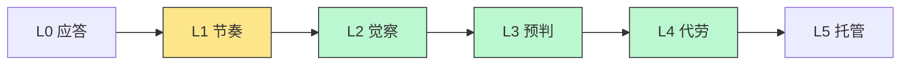

# RocketChatX · 管家主动性设计（AI 的灵魂）

> 状态：草案 · 2026-07-19 · 配套 [ai-product-design.md](ai-product-design.md)
> 主张：主动性不是管家的一个 feature，而是「AI 助理 vs AI 工具」的分水岭，是本产品的差异化灵魂。

---

## 1. 为什么主动性是核心

- **被动 AI 是工具，主动 AI 才是助理**。你问才答的，和你雇一个秘书的价值，差着一整个量级。
- 项目主旨是**管理注意力**。真正管理注意力，不是让你「多问几次 AI」——那是**增加**操作负担；而是 AI 替你盯着信号、替你预判、在对的时机把对的东西推到你面前，让你**少看、少想、少漏**。
- 现状只做到「定时晨报/晚报」——这只是主动性的**最低档**（L1）。所以「远远不够」。

一句话目标：**把管家从「会应答的机器人」做成「会替你操心的人」。**

---

## 2. 主动性阶梯（Proactivity Ladder）

设计的总框架——AI 主动程度的 6 个台阶：

| Level | 名称 | AI 在做什么 | 像谁 | 例子 |
|:---:|------|------------|------|------|
| L0 | 应答 | 你问才答 | 工具 | 你点「总结这个会话」 |
| L1 | 节奏 | 按固定时间呈现 | 闹钟 | 晨报 / 晚回顾 ← **现状到这** |
| L2 | 觉察 | 感知信号，主动提示 | 哨兵 | 「张三 2 天前 @你，还没回」 |
| L3 | 预判 | 不只提示，给出**建议动作** | 参谋 | 「这条要不要转成明天的任务？[采纳]」 |
| L4 | 代劳 | 一次授权后**替你执行** | 助理 | 「已按你的风格拟好回复，[发送]？」 |
| L5 | 托管 | 授权边界内**自主行动** | 代理人 | 值守 Agent 自动答常规问题 |

**目标**：让 **L2–L4 成为日常**，L5 在受控边界内可用。绿色是这次要补齐的主战场。

---

## 3. AI 从哪感知「该主动了」：四类触发源

主动性的前提是**持续感知**。管家在后台监听四类信号：

| 触发源 | 具体信号 | 能驱动的主动行为 |
|--------|---------|----------------|
| **消息信号** | @我、关键人发言、关键词、群异常活跃/异常沉默、我漏回的对话 | 提醒回复、异常预警、重要消息置顶 |
| **时间信号** | 日程临近、deadline、**我口头承诺的到期**、周期节点 | 承诺提醒、会前准备、周回顾 |
| **状态信号** | 工作项/PR 状态变化、文件更新、值守 Agent 产出 | 进展通报、review 提醒、结果回报 |
| **行为信号** | 收件箱积压、标记了却没跟进、长期未读堆积 | 「该清一下了」、聚焦建议、批量归档建议 |

> 感知是持续的、全覆盖的；但**打断是克制的**（见 §6）——这是主动 ≠ 打扰的关键。

---

## 4. 三个杀手级主动能力

### 4.1 承诺追踪 —— 最能体现「从不够到足够」

知识工作者最深的焦虑：**怕漏了自己答应别人的事**。

- **我的承诺**：管家扫描我发出的消息，识别「我答应要做的」——「我下午发你」「这个我来跟」「明天给结论」——自动记成**带时限的承诺**，到期前主动提醒，并可帮我起草兑现。
- **我的等待**：反向识别「我请别人做、对方还没回」——「你帮我看下这个」——对方超时未响应时，主动提醒我去催，或替我拟催促。

> 这一条几乎独立支撑「主动性足够」的体感：管家开始像一个**替你记着所有口头承诺的人**。

### 4.2 智能捕获 —— 把 GTD 的 Capture 主动化

不再需要你手动「提取待办」。管家**持续在后台**把聊天里的潜在行动项识别出来，静静放进 GTD 收件箱的「待厘清」区，你有空时批量确认/丢弃。

> 把「随手 AI 的提取待办」（L0，你触发）升级为「持续捕获」（L2，AI 触发）。你不再需要记得去抽取。

### 4.3 今日聚焦（Now / Next）—— 把 GTD 的 Engage 主动化

晨报只是列清单；**聚焦**是在一天中，根据时间、精力、优先级，主动告诉你「**现在最该做这一件**」，完成后主动递上下一件。

> 从「这是你今天的 12 件事」（让你更焦虑）到「现在先做这一件」（帮你降载）。

---

## 5. 统一载体：管家简报流（Butler Feed）

主动产出**绝不能是 N 条零散通知**——那正是「主动=打扰」的根源。所有主动内容汇聚成**一条可批处理的流**，按紧急度分区：

| 区 | 含义 | 打扰方式 | 例 |
|:---:|------|---------|-----|
| 🔴 立即 | 需马上处理 | **实时打断**（弹通知） | deadline 1 小时内、老板紧急 @ |
| 🟡 今天 | 今天该看 | **静默积累**，晨/午/晚各汇总一次 | 承诺到期、漏回的重要对话 |
| ⚪ 参考 | 不打扰 | 打开管家时才看 | 智能捕获的待厘清、进展通报 |

每条都带**一键动作**：采纳 / 忽略 / 稍后 / 调教（「少来这种」）。

> 核心设计：**感知持续、打断汇聚**。管家一直在盯，但只在 🔴 时打断你，其余攒成简报。

---

## 6. 主动 ≠ 打扰：平衡机制

主动性最大的风险是变烦人然后被关掉。四道闸门：

1. **打扰分级**：只有 🔴 实时打断，🟡/⚪ 一律汇聚（§5）。
2. **注意力预算**：每天实时打断次数设上限，超出的自动降级进流。
3. **信任曲线**：新能力默认「只建议不代劳」（L3）；用户采纳 N 次后，管家才提议「要不要以后自动办」（升 L4）。放权是挣来的，不是默认的。
4. **随处可调教 + 总档位**：每条可「静音这个群/这类事」；全局一个「主动性」档位——**保守 / 平衡 / 积极**。

---

## 7. 分阶段落地

| 阶段 | 主题 | 交付 | 到达 |
|:---:|------|------|:---:|
| **一** | 打底 | 管家简报流 + 打扰分级 + **承诺/等待追踪** | L2 |
| **二** | 建议 | 智能捕获 + 今日聚焦 + 每条带建议动作 | L3 |
| **三** | 放权 | 一次授权代劳 + 值守 Agent 自动化增强 | L4–L5 |

> 建议从**阶段一**起步：简报流 + 承诺追踪，投入产出比最高，且立刻让「主动性」的体感到位。

---

## 8. 与三层模型的关系

主动性主要长在 **② 管家**，但贯穿三层：

- **① 随手 AI** → 提供「捕获」的底层能力，被管家在后台**主动调用**（智能捕获）。
- **② 管家** → 主动性的家：感知、简报流、承诺追踪、聚焦、建议、代劳。
- **③ 作业 Agent** → 承接 L4–L5：管家「代劳/托管」需要动手时，派活给 Agent（值守模式即 L5 的托管形态）。

> 于是三层不是并列的三个功能，而是一条**主动性流水线**：随手捕获 → 管家研判/提醒/建议 → Agent 执行。
