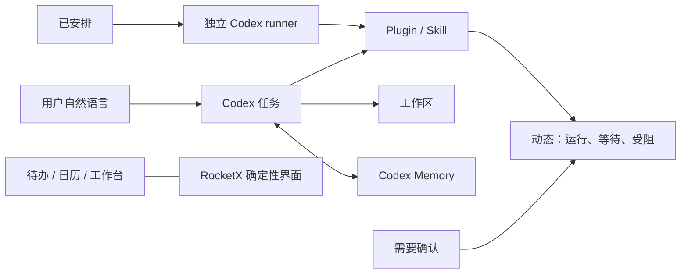

# 管家对标 Codex App — 理解报告与测验

> 文档状态：**历史理解记录**。本文保留架构迁移的解释，不替代[产品原则](specs/product-principles.md)或当前[功能规格](specs/README.md)。

## Why

这次变化不是“换一套文案”，而是重新确定能力归属：RocketX 提供消息、待办、日历、工作台等确定性界面；管家负责组织 Codex 任务，并控制 Plugin、Skill、Memory、工作区、安排与审批。这样每项能力只有一个权威实现。

## Mental model

只记住一句：管家控制 Codex 能力，RocketX 工作台展示确定性业务状态。

## What changed

- 任务：原“对话”成为主工作面，任务历史、新建、重命名和上下文保持沿用既有线程能力。
- 动态：集中展示运行中、等待用户、已完成和受阻任务，并保留直接触发与详情。
- 已安排：从 Codex skills/list 获取全部启用 Skill，保存并执行真实路径。
- 插件：直接展示 Codex Plugin 市场，不再维护第二套技能中心。
- 设置：明确替我审批、Codex Memory、工作区与沙箱边界。
- Memory：线程启用原生 Memory；RocketX 不再注入自建记忆或注册自建记忆工具。
- 兼容：历史数据和旧版不规范 Skill 仍可读取，但不再定义新产品结构。

## What it stands on

- Codex app-server 必须继续提供 thread start/resume、skills/list 和 Plugin 协议。
- dynamicTools 只允许执行当前线程已注册的 Host 工具；未注册工具不能越权。
- 写操作仍通过已有 checkpoint/确认卡完成，默认“替我审批”不等于静默跳过确认。
- scheduler 与手动“直接运行”共享同一 workflow 和 ephemeral runner，避免两条执行语义。
- openButlerPaper 只做兼容跳转；旧纸面数据本身没有被迁移或删除。

## Where it could break

- Codex 返回的 Skill metadata 缺路径、Skill 被停用或 Plugin 被卸载时，安排必须拒绝执行并显示原因。
- app-server 不支持 memoryMode 时，任务仍可运行，但跨任务 Memory 不可宣称已生效。
- 后续若重新把业务事实写进 Memory，会重新产生陈旧事实与实时数据冲突。
- 若新增管家一级入口，必须先证明它不能归入任务、动态、已安排、插件或设置。
- 删除 legacy Memory/Skill 兼容前，必须先有迁移与可回滚证据。

## Quiz

请一次回复，例如：1B 2C 3A 4B 5: A→B→C 6C。第 5 题为简答，其余为单选。

1. 管家现在从哪里获得跨任务用户偏好？
   - A. 每轮注入 RocketX v2 Memory 文本
   - B. Codex 原生 Memory
   - C. 今日纸
   - D. Plugin 市场

2. 用户为一个 Plugin Skill 新建安排时，最关键的路径修复是什么？
   - A. 把 Skill 内容复制进安排 prompt
   - B. 固定拼接 .agents/skills/名称/SKILL.md
   - C. 通过 skills/list 使用 Codex 返回的真实 Skill 路径
   - D. 把 Plugin 转成 RocketX 内置 Skill

3. “替我审批”在本实现中意味着什么？
   - A. 尽量由 Codex处理权限，但未解决的确认仍回到任务/动态，不伪造成功
   - B. 所有写操作都自动执行
   - C. 关闭 request_user_input
   - D. 仅允许只读任务

4. 为什么保留工作台，却移除今日纸的一级入口？
   - A. 工作台代码更少
   - B. 工作台是用户操作确定性业务状态的界面；今日纸是与 Codex 任务重复的管家概念
   - C. 今日纸不支持移动端
   - D. Plugin 依赖工作台

5. 简答：从“用户在已安排中选择 Plugin Skill”开始，到一次手动运行结束，写出关键链路（4—6 个节点）。

6. 如果 Codex 返回的 Skill 已停用或无法解析真实路径，正确行为是什么？
   - A. 回退到同名旧 Skill 并继续
   - B. 让模型猜测路径
   - C. 阻止创建或运行，显示明确错误且不伪造结果
   - D. 临时启用该 Skill
