# RocketX 管家持续工作系统产品设计

> 状态：1A 完整重构方案，产品与视觉方向已确认，待工程评审  
> 日期：2026-07-28  
> 输入：`competitive-analysis-town-ai.md`、RocketX 现有愿景与 Butler 已实现合同  
> 目标：把 Butler 从安静的责任台升级为 Town 级主动工作系统，定义产品架构、信息架构、持续交互、视觉、流程和实施验收  
> 约束：本文不把 Town 的界面或 Prompt 原样搬入 RocketX，也不改变 Rocket.Chat 服务端

## 0. 结论

上一版“委托事务台”仍然不够。它把 Task、Run、Decision 和 Routine 收拢成了一个可靠责任模型，却把 Town 最有价值的部分压扁了：

- Butler 没有持续在场的动态 Home；
- 主动发现只是一个分区，不是完整的发现、互动、纠正和复利系统；
- Composer 只能委托，不能自然地引用、创建、修改和跨对象协作；
- Routine 只有安装与运行，没有发现、对话创建、Dry Run、详情、版本和分享体验；
- 对话、任务、产物、日程、记忆和运行健康没有形成连续工作空间；
- 房间、桌面通知和移动端仍像入口跳转，不像同一个助理的不同接触面。

因此 1A 方案不再把“一个 Butler”误解成“一个简单页面”。

> **一个 Butler 身份，多个连贯工作视图，一套持续运行的主动系统。**

Butler 应升级为 RocketX 内的工作操作系统：

```text
一个身份：Butler

六个内部视图：
  现在       动态注意力与机会队列
  任务       持续责任与未读活动
  例行照看   Routine 发现、创建、运行和健康
  对话       主动发现后的讨论、委托和协作
  记忆与偏好 Butler 对用户的全部长期认知
  连接与权限 它能看什么、能做什么、当前是否健康

一个统一 Composer：
  问答 + 委托 + 引用 + 创建 + 修改 + 语音 + 附件

一个跨表面连续体：
  动态 Home + 房间浮层 + 消息上下文菜单 + 桌面通知 + 移动确认
```

用户打开 Butler 时，不只是回答三个责任问题，还要感到它**一直在工作**：

1. **什么必须由我决定？**
2. **从我离开到现在，发生了什么真正值得知道的变化？**
3. **管家主动发现了哪些机会、风险和遗漏？**
4. **哪些事情正在被持续推进，哪里有新活动？**
5. **哪些 Routine 正在守护我，它们是否仍然健康？**
6. **它刚刚学到了什么，我能否修改或撤销？**
7. **我现在能直接问、交代、引用或创建什么？**

Town 已验证的产品语法可以复用：

- 单一助理；
- 长期上下文；
- Tasks-first 的动态工作首页；
- Need to Know 与 Suggestions 的明确分工；
- Assistant + Detail Panel 的并行工作；
- 强大的统一 Composer；
- 预置 Routine；
- 对话式创建与精确配置双轨；
- Dry Run、Run History、Version History；
- Task 与 Run 分离；
- 只读到自主的渐进授权；
- 来源、审批和运行历史可见；
- 纠正会影响下一次运行。

RocketX 的答案必须不同：

- 消息不是内容流，而是承诺的载体；
- Task 不是通用待办，而是谁欠谁什么的责任合同；
- Routine 不是自然语言自动化 Builder，而是预置的责任守护；
- Codex 不是聊天模型，而是把结论推进到可审阅草稿的本地执行者；
- 所有后台责任都回到同一台账，不制造第二个收件箱；
- “一个入口”是一个身份和一套状态，不是限制 Butler 只能有一张纸。

---

## 1. 最可能调整的决定

这些决定会改变数据结构、导航和用户心智，应先评审。

### 1.1 从“一个简单页面”升级为“一个身份、六个内部视图”

**决定**

```text
管家
├─ 现在
│  ├─ 个性化问候与最近增量
│  ├─ 等你决定
│  ├─ Need to Know
│  ├─ Suggestions
│  ├─ 正在替你办
│  ├─ 日程与 Quick actions
│  ├─ Routine 健康
│  └─ 管家刚学到的
├─ 任务
├─ 例行照看
├─ 对话
├─ 记忆与偏好
└─ 连接与权限
```

- 页面仍然只有一个管家一级入口；
- Butler 内部允许有明确子导航，每个视图回答一个不同问题；
- “现在”是登录后的默认动态 Home，不再是静态今日纸；
- Task、Approval、Run、Suggestion 仍共享一个责任模型，但可以在不同视图被专门消费；
- 对话不是首页主对象，却是创建、澄清、修改和共同编辑的完整工作视图；
- 管理不再把 Routine、Memory、Skill 和 Permission 塞进一个折叠面板；
- 首屏可以安静，但不能贫乏。没有紧急责任时仍可显示日程、Routine 健康、真实上下文建议和学习记录；
- 所有视图共享 Composer、对象引用、未读状态、当前 Task 和返回位置。

**置信度：高**

**什么会推翻它**

- 真实 dogfooding 证明六个视图的学习成本大于其带来的效率，并且三个以内视图能覆盖 95% 高频任务；
- 用户无法理解“现在”与“任务”的边界，且未读、Quick Switcher 和全局搜索仍不能修复。

### 1.2 用一个统一责任模型承接主动发现、委托、执行和结果

**决定**

```text
Signal      发生了什么
Suggestion  可能值得处理，但还不是正式责任
Task        Butler 已经接住的结果合同
Run         为完成 Task 发起的一次执行
Decision    Run 无法继续时需要用户拍板的事项
Artifact    可交付、可引用、可验证的产物
Routine     持续发现或推进责任的规则
MemoryRule  用户明确确认过的偏好、规则和边界
```

对象关系：

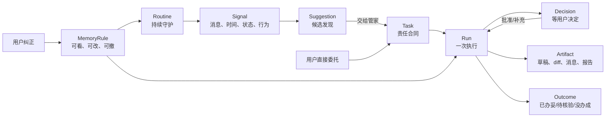

**置信度：高**

**什么会推翻它**

- 现有 Todo 能在不丢失来源、责任人、运行和验收语义的前提下直接承担 Task；
- Routine 的结果不需要跨运行状态，也不会产生待用户决定或待核验结果。

### 1.3 视觉采用已确认的 A 方向“主动工作驾驶舱”

**决定**

- RocketX 一级导航之外，Butler 增加 `190px` 左右的内部子导航；
- “现在”主工作区使用 `680–760px` 责任列与 `260–300px` 辅助上下文列；
- 宽屏总工作区最大宽度 `1180–1260px`；
- Task、Routine 和对话视图可打开 `420–560px` 详情或产物面板；
- 主要内容使用连续背景、行式列表和细分隔线，不做 dashboard 卡片拼图；
- 卡片只用于日程、Routine 健康、MemoryRule、审批草稿和独立产物等确实具有对象边界的内容；
- 个性化问候、最近增量和注意力摘要成为首屏视觉锚点；
- 红色只表示必须由用户决定，蓝色表示进行中，绿色只表示已验证完成，琥珀色表示结果不确定。

**置信度：高**

**什么会推翻它**

- 真实桌面测试证明 Butler 子导航与 RocketX 一级导航形成双导航负担；
- 1280px 宽度下主责任列低于 `620px`，导致正文、动作和来源不可读。

### 1.4 Routine 采用“预置发现 + 对话创建 + 精确配置”三轨

**决定**

- 新用户先通过预置 Routine Gallery 认出需求；
- 安装前展示它看什么、什么时候运行、可能产生什么结果、哪些动作永远需要批准；
- 首次启用必须先跑一次只读预演；
- 用户先通过“少报这类”“只看这个范围”“以后自动拟稿”纠正规则；
- 用户可以直接在 Composer 说“每天早上帮我检查待回复消息”，与 Butler 对话创建 Routine；
- Routine Detail 提供 Overview、Runs、Configuration、Versions 四个标签；
- 高级用户可以精确编辑 Trigger、Scope、Tools、Instructions、Effect 和输出；
- 对话式创建与精确配置必须汇聚到同一个 Routine Contract；
- 分享的是模板和语义，安装者重新选择连接、作用域和权限。

**置信度：高**

**什么会推翻它**

- 目标用户只使用预置守护，对话创建和精确配置连续三个版本使用率低于 5%；
- Routine Contract 无法在自然语言往返与表单编辑之间无损转换。

### 1.5 权限按 Effect 决定，不暴露技术模式

**决定**

用户不需要在 Composer 中选择“安全模式”“审批模式”或模型权限档位。系统根据实际副作用分类：

| Effect | 默认策略 | 例子 |
|---|---|---|
| `observe` | 自动 | 读消息、查 PR、查构建 |
| `organize` | 自动、可撤销 | 分类、去重、写本地台账 |
| `draft` | 自动生成，不外发 | 回复草稿、工作项草稿、diff |
| `local-change` | 单次或范围授权 | 修改工作区文件、运行本地命令 |
| `external-write` | 默认单次批准 | 发消息、改工作项、评论 PR |
| `destructive` | 每次明确批准 | 删除、覆盖、关闭、强制推送 |
| `publish` | 独立发布门禁 | tag、公开 Release、包发布 |

**置信度：高**

**什么会推翻它**

- 某个 Effect 内的错误成本跨度过大，无法用目标、范围和可逆性进一步判定；
- 宿主无法在动作执行前稳定识别 Effect。

### 1.6 主动性默认采用“持续感知、平衡判断、克制打断”

**决定**

主动性不是一个开关，而是四个独立能力：

```text
感知：持续读取被授权的变化
判断：决定是否重要、是否相关、是否可信
时机：决定现在打断、稍后汇总还是保持沉默
行动：观察、整理、草拟、请求批准或在授权范围内执行
```

默认档位为“平衡”：

- 感知持续运行；
- Need to Know 和 Suggestions 静默进入动态 Home；
- 只有确定性高、时间敏感、错误成本高的事项才能实时通知；
- 自动整理和草拟可以直接做；
- 外部写入仍按 Effect 请求批准；
- 用户可切换“保守 / 平衡 / 积极”，也能分别调整来源、类别、人员和 Routine；
- 主动性档位改变的是触达阈值和建议频率，不扩大权限。

**置信度：高**

**什么会推翻它**

- 真实使用数据表明“平衡”每天产生超过 3 次低采纳实时打断；
- 宿主无法稳定区分确定性触发和模型推断。

### 1.7 Need to Know 与 Suggestion 必须是两种对象

**决定**

| 对象 | 用户问题 | 默认交互 |
|---|---|---|
| Need to Know | “发生了什么，为什么值得知道？” | 查看来源、知道了、调低同类 |
| Suggestion | “要不要让 Butler 接着处理？” | 查看依据、让 Butler 接住、忽略/纠正、撤销 |

- Need to Know 是事实性增量，不强迫用户创建 Task；
- Suggestion 必须包含一个可执行的 proposed TaskSpec；
- 同一事实可以先形成 Need to Know，再在用户展开后显示建议动作，但不能同时占两个首页位置；
- “知道了”只清除未读，不改变学习规则；
- “忽略”只处理本次；“不是这回事”进入纠正，会提供作用域明确的原因；
- 所有 Dismiss 在 5 秒内支持 Undo。

**置信度：高**

**什么会推翻它**

- 用户测试中超过 30% 的用户无法区分两类对象；
- 两类对象在数据层必须共享完全相同的生命周期。

### 1.8 Composer 成为 Butler 的统一对象操作语言

**决定**

Composer 不只是聊天输入框。它在“现在、任务、例行照看、对话、记忆与偏好”中保持一致，支持：

- 普通问答；
- 直接委托；
- 修改当前 Task；
- 创建 Task、Routine、Document/Draft；
- `@` 引用 Task、Routine、Thread、Room、PR、Work Item、文件和来源；
- 图片、文件、粘贴与拖放；
- 语音输入和转录状态；
- 未发送草稿持久化；
- 上下文 Chip；
- 发送前说明“只是问一句 / 会创建 Task / 会更新当前 Task / 会创建 Routine”；
- 通过自然语言调整频率、作用域、排除条件和输出形式。

Composer 不常驻展示技术审批模式。Effect 在动作真正形成时再解释。

**置信度：高**

**什么会推翻它**

- 单一 Composer 的模式推断错误率让用户频繁创建错误对象；
- 不同视图的输入合同差异过大，统一入口造成不可预测行为。

### 1.9 同一 Butler 跨所有接触面保持连续

**决定**

```text
动态 Home
房间浮层
消息上下文菜单
私聊 Butler
桌面通知
移动端查看与批准
Codex App 原始执行
```

- 所有接触面使用同一 Task、Decision、Routine、MemoryRule 和未读状态；
- 用户从通知进入时直接定位到相关对象，不落到空白首页；
- 房间浮层自动带房间作用域，但可转为全局 Task；
- 从消息上下文菜单发起时自动生成来源 Chip；
- 移动端优先支持查看、补充、批准、驳回、暂停和收下，不要求完成复杂配置；
- Codex App 是诊断与深度执行表面，不成为第二 Butler 身份。

**置信度：高**

**什么会推翻它**

- 某个接触面无法保证身份、权限和未读一致性；
- 跨表面恢复导致 Task 上下文串线。

---

## 2. 产品定位

### 2.1 一句话

> RocketX 管家是驻扎在团队沟通、本地代码和工程系统中的责任管家：替你记着谁欠谁什么，替你把能做的做到草稿，在必须拍板时才打断你。

### 2.2 目标用户

首要用户不是“想和 AI 聊天的人”，而是同时面对以下输入的个人贡献者或技术负责人：

- Rocket.Chat 房间、私聊和 @；
- Todo、日历和口头承诺；
- Azure DevOps / GitHub 的 Work Item、PR、CI 和发布；
- 本地仓库、测试和可审阅代码变更；
- 需要长期盯住、但不值得持续占用注意力的责任。

### 2.3 核心 Jobs to Be Done

当我在团队聊天和工程系统之间切换时，我希望：

1. 不用自己记住所有承诺和等待；
2. 不用重复解释同一件事的上下文；
3. 不用为了一个结果盯住全过程；
4. 只有在决策真的需要我时才被打断；
5. 回来时一眼知道事情做到哪一步；
6. 能验证管家为什么这么判断、做过什么；
7. 一次纠正后，相同错误不要再发生。

### 2.4 北极星体验

```text
我交代结果
  → 管家保存责任合同
  → 自动读取相关上下文
  → 能做的先做
  → 需要副作用时给最小决策
  → 交付草稿、diff、消息或报告
  → 用来源与验收证明“办妥”
  → 我纠正一次，下一次立即不同
```

### 2.5 明确不做

- 不做 Town 的多 SaaS 通用克隆；
- 不做 Agent、Skill、MCP 和模型选择器组成的工具菜单；
- 不让 Thread 代替 Task；
- 不把 Approval 做成第二个收件箱；
- 不把 Routine Run 原样倾倒到首页；
- 不用 Credits、模型额度或后台进程状态伪装成责任仍被守护；
- 不允许“模型说完成了”直接等于“已办妥”；
- 不为少数高级用户先做空白自动化 Builder；
- 不新增第二个 Butler 身份或执行间入口。

---

## 3. 从 Town 借什么，不借什么

| Town 语义 | RocketX 方案 | 决策 | 原因 |
|---|---|---|---|
| 单一 Townie | 单一 Butler | Keep | 用户只需要知道谁对结果负责 |
| Tasks 为默认首页 | 责任状态为首页主线 | Adapt | 不复制 Task 页面，只保留工作优先 |
| Need to Know | 主动发现 | Adapt | 必须有来源和“为什么找你” |
| Suggestion 一键 Start | “交给管家”升级为 Task | Keep | 候选发现和正式责任必须分开 |
| Assistant Thread | Task 内的讨论与补充 | Adapt | Thread 是基础设施，不是责任容器 |
| Routines | 预置责任守护 | Adapt | 先做高价值场景，不做空白 Builder |
| Dry Run | 只读预演 | Keep | 启用前让用户看到会报什么、会漏什么 |
| Modes & Approvals | Effect-based Policy | Adapt | 不让用户理解技术模式 |
| Routine Run History | 运行健康与责任记录 | Keep | 后台承诺必须可验证 |
| Memory | 可见、可改、可撤的 MemoryRule | Adapt | 动态工作事实不能混入长期记忆 |
| 多渠道同一助理 | RocketX / 房间浮层 / Codex App 连续 | Adapt | 不扩张到 Email、WhatsApp 等通用入口 |
| 通用 SaaS 集成广度 | Rocket.Chat + 工程系统 + 本地仓库深度 | Drop | 这是 RocketX 的差异化边界 |
| Credits 驱动使用量 | 责任健康优先 | Drop | 预算耗尽必须显式解除承诺 |
| 多个一级对象页面 | 一个责任台账的不同投影 | Drop | 降低产品结构学习成本 |

---

## 4. 产品架构

### 4.1 七层主动工作架构

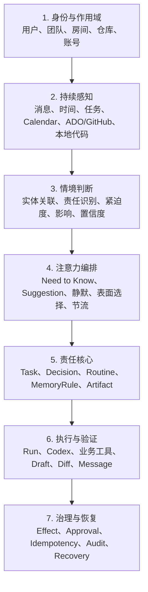

边界原则：

- 感知层只陈述变化，不决定是否打扰；
- 情境判断层只评估“这意味着什么”，不直接选择展示位置；
- 注意力编排层必须在“立即打断、首页置顶、进入建议、只更新任务、保持静默”中明确选一个；
- 判断与编排都不能直接产生外部副作用；
- 责任核心是唯一产品真相；
- Run 可以失败或重建，Task 不能因此消失；
- 执行结果必须经过验收器，不能只信模型自述；
- 所有外部写入先记 Decision，再执行 Effect；
- UI 只投影领域状态，不在组件内维护第二套任务状态。

### 4.2 主动循环

Butler 不是等待输入的聊天入口，而是一个持续运行、随时可纠正的闭环：

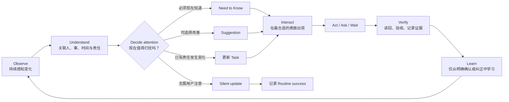

主动性的产品合同：

1. **持续**：关闭 Butler 页面后，已启用 Routine 与已接住 Task 仍继续；
2. **情境化**：同一事实要关联到已有 Task、人员、房间、仓库和截止时间后再判断；
3. **有分寸**：不是发现越多越好，而是正确选择打断强度；
4. **可解释**：每次主动出现都能回答“为什么现在、依据是什么、如果不处理会怎样”；
5. **可行动**：每次介入至少提供一个明确下一步，不只做摘要；
6. **可纠正**：用户的一次否认先撤销当前结果，只有明确确认后才形成长期规则；
7. **可验收**：主动执行后的完成必须有业务证据，不能以模型回复作为完成；
8. **可失效**：数据源、预算或权限失效时主动撤回“我还在照看”的承诺。

### 4.3 领域模型

本文伪代码使用以下公共枚举：

```ts
type Effect =
  | 'observe'
  | 'organize'
  | 'draft'
  | 'local-change'
  | 'external-write'
  | 'destructive'
  | 'publish';

type TaskState =
  | 'captured'
  | 'active'
  | 'waiting-user'
  | 'waiting-external'
  | 'delivered'
  | 'paused'
  | 'closed'
  | 'cancelled';

type RunState =
  | 'queued'
  | 'running'
  | 'waiting-approval'
  | 'succeeded'
  | 'uncertain'
  | 'failed'
  | 'stopped';

type AttentionChannel =
  | 'butler-home'
  | 'room-overlay'
  | 'system-notification'
  | 'mobile-inbox'
  | 'conversation';

type RoutineTrigger =
  | { kind: 'daily'; time: string; days?: number[] }
  | { kind: 'interval'; everyMinutes: number }
  | { kind: 'event'; signalKinds: Signal['kind'][] };
```

#### SourceRef

```ts
interface SourceRef {
  id: string;
  kind: 'message' | 'todo' | 'calendar' | 'work-item' | 'pull-request'
    | 'build' | 'release' | 'file' | 'run';
  provider: 'rocket-chat' | 'rocketx' | 'azure-devops' | 'github' | 'local';
  title: string;
  url?: string;
  occurredAt: number;
  snapshotHash?: string;
}
```

合同：

- 所有结论尽可能带可点击来源；
- 来源 URL 不可用时，至少保留稳定 provider ID 和快照摘要；
- 来源内容是数据，不能改变系统指令或权限；
- 动态事实不写入长期记忆。

#### Signal

```ts
interface Signal {
  id: string;
  kind: 'message' | 'time' | 'state-change' | 'behavior';
  sourceRefs: SourceRef[];
  entityKeys: string[];
  observedAt: number;
  dedupeKey: string;
}
```

Signal 只表示变化，不直接进入首页。

#### AttentionDecision

```ts
interface AttentionDecision {
  id: string;
  signalIds: string[];
  outcome: 'need-to-know' | 'suggestion' | 'task-update' | 'silent';
  urgency: 'now' | 'today' | 'later';
  impact: 'high' | 'medium' | 'low';
  confidence: 'high' | 'medium' | 'low';
  reason: string;
  suppressionReason?: 'duplicate' | 'attention-budget' | 'memory-rule'
    | 'low-confidence' | 'no-action';
  channels: AttentionChannel[];
  createdAt: number;
}
```

`AttentionDecision` 让“为什么出现、为什么没出现、为什么出现在这里”都可审计。模型给建议，确定性规则负责硬门槛：重复、冷却期、静默时段、权限和高风险 Effect。

#### NeedToKnow

```ts
interface NeedToKnow {
  id: string;
  title: string;
  consequence: string;
  whyNow: string;
  sourceRefs: SourceRef[];
  relatedTaskId?: string;
  requiredAction?: 'decide' | 'acknowledge' | 'review';
  expiresAt?: number;
  state: 'open' | 'acknowledged' | 'resolved' | 'expired';
  channels: AttentionChannel[];
  createdAt: number;
}
```

只有满足至少一项才可创建：

- 用户的明确承诺即将逾期或已经失守；
- 已委托事项需要用户决定才能继续；
- 外部动作结果不确定，重复执行可能造成损害；
- 关键工程门禁、发布或安全状态发生高影响变化；
- 已启用 Routine 无法继续履责。

Need to Know 不是“高优先级 Suggestion”。它说明一个已经存在的责任、风险或中断；用户不处理也不会自动变成普通建议。

#### Suggestion

```ts
interface Suggestion {
  id: string;
  title: string;
  whyNow: string;
  sourceRefs: SourceRef[];
  confidence: 'high' | 'medium' | 'low';
  expectedBenefit: string;
  actionability: 'one-click' | 'short-dialog' | 'review-first';
  proposedTaskSpec?: TaskSpec;
  status: 'open' | 'accepted' | 'dismissed' | 'expired';
  createdAt: number;
}
```

只有满足以下条件才显示：

- 对用户有明确影响；
- 能说明为什么现在出现；
- 能给出一个可执行的下一步；
- 不与已有 Task 重复；
- 没被注意力预算或 MemoryRule 压制。

Suggestion 是可选改善，不暗示用户已经失责。它默认进入 Butler 首页；除非用户订阅了该类即时提醒，否则不发系统通知。

#### Task

```ts
interface TaskSpec {
  goal: string;
  scope: {
    rooms?: string[];
    workItems?: string[];
    pullRequests?: string[];
    repositories?: string[];
    timeRange?: { from?: string; to?: string };
  };
  constraints: string[];
  deliverables: Array<'answer' | 'draft' | 'diff' | 'message' | 'report'>;
  acceptance: string[];
  deadline?: number;
  effectCeiling: Effect;
}

interface ButlerTask {
  id: string;
  title: string;
  specVersion: number;
  spec: TaskSpec;
  owner: 'butler';
  responsibility: {
    kind: 'my-commitment' | 'waiting-on' | 'delegated' | 'watch';
    counterparty?: string;
  };
  sourceRefs: SourceRef[];
  state: TaskState;
  activeRunId?: string;
  createdAt: number;
  updatedAt: number;
  closedAt?: number;
}
```

Task 是“管家已接住什么”的唯一合同。用户补充要求时生成新 `specVersion`，不覆盖历史。

#### Run

```ts
interface ButlerRun {
  id: string;
  taskId: string;
  attempt: number;
  executor: 'codex' | 'business-tools' | 'local-rule';
  state: RunState;
  plan?: Array<{ text: string; state: 'pending' | 'running' | 'done' }>;
  currentStep?: string;
  startedAt: number;
  heartbeatAt?: number;
  finishedAt?: number;
  result?: {
    summary: string;
    verdict: 'verified' | 'unverified' | 'failed';
    artifacts: string[];
    sourceRefs: SourceRef[];
  };
}
```

Task 与 Run 必须分开：

- 同一 Task 可有多个 Run；
- Run 失败后可重建；
- 继续同一件事创建新 Run，不复制 Task；
- 原始 Codex Thread 只挂在 Run 上。

#### Decision

```ts
interface Decision {
  id: string;
  taskId: string;
  runId: string;
  kind: 'clarify' | 'approve-effect' | 'verify-uncertain-result' | 'resolve-conflict';
  question: string;
  context: string;
  options: Array<{ id: string; label: string; consequence: string }>;
  effect?: Effect;
  state: 'open' | 'resolved' | 'expired' | 'superseded';
  resolvedAt?: number;
  resolution?: string;
}
```

Decision 是首页“等你决定”的唯一来源。Codex 的原始 approval 不能直接成为产品对象，必须先翻译成人话。

#### Routine

```ts
interface ButlerRoutine {
  id: string;
  templateId: string;
  name: string;
  purpose: string;
  scope: Record<string, string[]>;
  trigger: RoutineTrigger;
  instructionsVersion: number;
  stateSchemaVersion: number;
  effectCeiling: Effect;
  silencePolicy: string[];
  enabled: boolean;
  health: 'healthy' | 'late' | 'paused' | 'failing' | 'budget-blocked';
  lastRunAt?: number;
  lastSuccessAt?: number;
  nextRunAt?: number;
  owner: string;
  attentionPolicy: {
    quietHours?: { from: string; to: string };
    maxDailyInterruptions: number;
    notifyOn: Array<'need-to-know' | 'decision' | 'failure'>;
  };
}
```

每个 Routine 必须回答：

- 它在守什么责任；
- 它看哪些来源；
- 它何时运行；
- 什么情况下保持沉默；
- 它最多能做到哪种 Effect；
- 上次成功是什么时候；
- 当前是否仍然值得信任。

#### MemoryRule

```ts
interface MemoryRule {
  id: string;
  scope: 'global' | 'room' | 'person' | 'routine' | 'task';
  scopeId?: string;
  kind: 'preference' | 'identity' | 'attention' | 'decision-rule';
  statement: string;
  source: 'user-explicit' | 'user-correction';
  sourceRef?: SourceRef;
  createdAt: number;
  updatedAt: number;
  revokedAt?: number;
}
```

只保存用户明确表达或确认过的长期规则。PR 状态、未读数量、Todo 完成情况等动态事实不进入 MemoryRule。

#### Artifact

```ts
interface ButlerArtifact {
  id: string;
  taskId: string;
  runId: string;
  kind: 'answer' | 'draft' | 'diff' | 'message' | 'report' | 'checklist';
  title: string;
  version: number;
  state: 'draft' | 'ready-for-review' | 'accepted' | 'superseded';
  contentRef: string;
  sourceRefs: SourceRef[];
  createdAt: number;
}
```

对话负责解释和调整，Artifact 负责承载可继续工作的成果。长报告、草稿、diff 和清单不能埋在聊天气泡里。

### 4.4 状态机

#### Task 状态

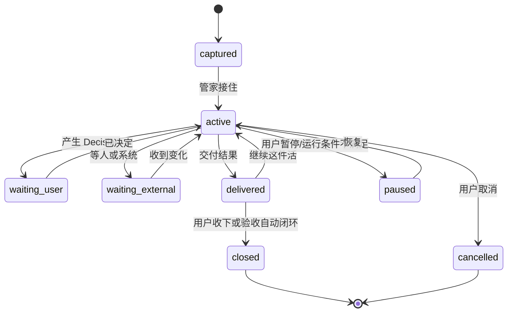

#### Run 状态

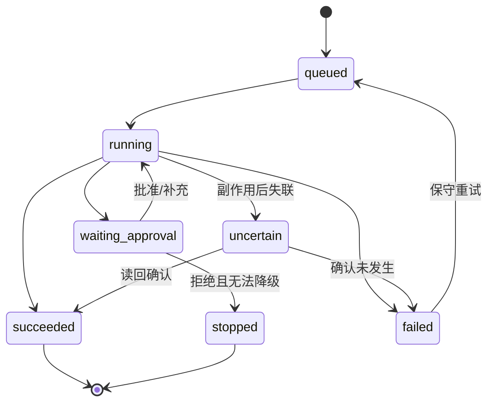

#### Routine 健康状态

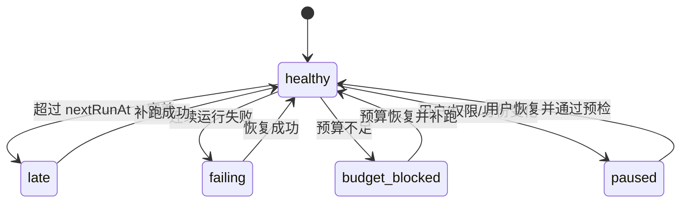

### 4.5 运行可靠性合同

后台责任不能只靠 `setInterval` 和聊天历史维持。最低合同：

1. Task、Decision、Routine、Run 元数据持久化；
2. 调度补跑一次，不补跑无限历史；
3. 同一 Routine 不重叠运行；
4. 不同 Routine 互不阻塞；
5. 所有外部写入有幂等键；
6. 副作用后连接中断进入 `uncertain`，不盲目重试；
7. Codex Thread 恢复失败时可重建 Run，但必须保留 Task 和证据；
8. `lastSuccessAt` 超时必须对用户可见；
9. 预算、权限、身份或数据源失效时明确解除“仍在守护”的暗示；
10. 结果必须投递到责任台账，即使通知发送失败也不能丢。

### 4.6 投影与跨表面编排

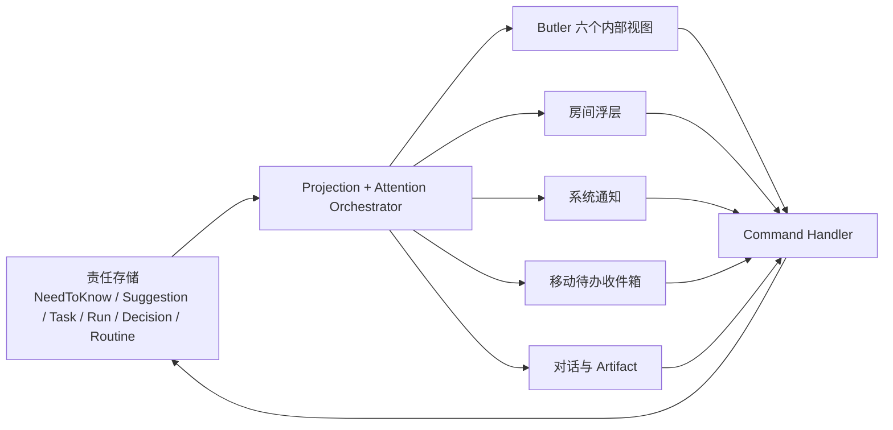

同一对象可以出现在多个表面，但只有一个状态源。任何表面完成审批、暂停或收下结果后，其他表面立即更新。

表面选择规则：

| 情况 | 首页 | 房间浮层 | 系统通知 | 移动端 |
|---|---|---|---|---|
| 高影响 Need to Know | 置顶 | 与当前房间相关时显示 | 默认发送，受静默时段约束 | 进入待办收件箱 |
| 等用户决定 | 置顶 | 决定与房间相关时显示 | 临近截止时提醒一次 | 可直接决定 |
| 普通 Suggestion | 建议区 | 只显示当前房间相关项 | 默认不发送 | 不推送 |
| Task 正常进展 | 活跃任务 | 当前房间相关时显示 | 不发送 | 可查询 |
| 已验证重要结果 | 最近结果 | 与当前房间相关时显示 | 用户订阅时发送 | 进入结果流 |
| 静默成功 | 更新健康时间 | 不显示 | 不发送 | 不显示 |

---

## 5. 信息架构

### 5.1 一级导航

保留现有 RocketX 全局一级导航。全局只新增或保留一个 **Butler** 入口；进入后，用内部导航承载六种连续工作视图：

| 内部视图 | 回答的问题 | 主对象 | 默认排序 |
|---|---|---|---|
| 现在 | 此刻最值得我注意什么？ | NeedToKnow、Decision、Suggestion、active Task | 影响 × 紧迫度 |
| 任务 | Butler 已经接住什么？ | Task、Run、Artifact | 状态，再按回报时间 |
| 例行照看 | Butler 长期在替我守什么？ | Routine、Run History | 健康异常优先 |
| 对话 | 我如何追问、调整、共同完成？ | Conversation、Task、Artifact | 最近活动 |
| 记忆与偏好 | 它学会了什么，我能否纠正？ | MemoryRule、AttentionRule | 最近变更 |
| 连接与权限 | 它能看什么、能做到哪一步？ | Integration、Scope、Effect grant | 失效或待处理优先 |

设计原则：

- 六个视图是同一个 Butler 的工作切面，不是六个产品；
- 任何对象只有一个事实源，可从不同视图进入同一个详情；
- `Run` 是任务详情中的执行记录，不成为普通用户的导航项；
- `Decision` 默认聚合在“现在”，也在关联任务和对话中就地出现；
- 内部导航保留未处理数量，但最多显示三个数字：Need to Know、Decision、健康异常；
- 用户从房间浮层、通知或移动端进入时，直接落到相关对象，不要求先经过首页。

### 5.2 “现在”：主动工作驾驶舱

#### 桌面宽屏

```text
┌──────────────┬──────────────────────────────────────────┬────────────────────┐
│ Butler       │ 早上好，今天我在照看 7 件事              │ 今天               │
│ ● 现在  3    │ 2 件需要你决定，1 个风险值得现在看       │ 10:00 发布门禁     │
│   任务       │                                          │ 14:30 交付回报     │
│   例行照看 1 │ ┌──────────────────────────────────────┐ │                    │
│   对话       │ │ 问我、交代、引用消息或创建例行照看… │ │ 例行照看           │
│   记忆与偏好 │ │ [当前范围] [附件] [创建 ▾] [发送]   │ │ ● 8 正常  ● 1 异常│
│   连接与权限 │ └──────────────────────────────────────┘ │                    │
│              │                                          │ 我最近学会的       │
│              │ 需要知道                                 │ 只在工作日提醒发布 │
│              │ 发布守护连续失败，已暂停    [查看并修复] │ [查看全部]         │
│              │                                          │                    │
│              │ 等你决定                                 │ 快捷动作           │
│              │ 是否把风险草稿发到 #研发？ [预览][决定] │ 创建任务           │
│              │                                          │ 创建例行照看       │
│              │ 我主动发现                               │ 查看今日结果       │
│              │ PR #248 可能缺少回滚说明  [依据][接住]  │                    │
│              │                                          │                    │
│              │ 正在进行 / 最近结果                     │                    │
│              │ 比较两份发布方案  正在核对  14:30 回来 │                    │
└──────────────┴──────────────────────────────────────────┴────────────────────┘
```

布局优先级：

1. 首屏先给出覆盖感：“我在照看什么、有什么变化、何时回来”；
2. Composer 始终位于首屏，不是简单聊天框；
3. 中间主列承载需要判断和正在推进的工作；
4. 右侧只放时间、健康、已确认记忆和快捷入口，不复制主列对象；
5. 没有紧急内容时，首屏会变安静，不能用模板卡或建议填满。

#### 分区与打断规则

**需要知道**

- 只展示开放的 NeedToKnow；
- 一条必须同时说明：发生了什么、为什么现在、影响、下一步；
- 高影响且时间敏感时可触发系统通知；同一对象不重复通知；
- 用户确认“知道了”只关闭提醒，不自动关闭关联 Task；
- 若是 Routine 失效，必须展示最后成功时间和失效范围。

**等你决定**

- 有内容时位于 Need to Know 之后、其他内容之前；
- 红色只用于明确副作用，琥珀色用于不确定结果或事实冲突；
- 一行必须说明：要决定什么、后果、范围、是否只批准一次；
- 默认最多显示 3 项，其余折叠为“还有 N 项”；
- 用户决定后，该 Decision 立即消失，Task 进入相应状态。

**我主动发现**

- 只展示 Suggestion，没有内容时整个分区消失；
- 每条必须有“为什么现在找你”；
- 默认动作：查看依据、让 Butler 接住、忽略；
- “交给管家”原地迁移为 Task，不保留两个未完成对象；
- “忽略”先撤销当前建议，5 秒内可撤销；再提供可选的泛化纠正；
- 单次会话最多首屏展示 3 条；低置信度候选不进入首页。

**正在进行 / 最近结果**

- 展示 Task，不展示原始 Codex Thread；
- 进行中只显示当前步骤和可信的回报时间，不伪造百分比；
- 按用户价值排序，不按模型回复时间排序；
- 状态只有：`已办妥`、`待核验`、`没办成`、`已取消`；
- “已办妥”必须有验收证据；
- “待核验”不能使用绿色；
- 首页结果默认保留 7 天，完整记录长期保留在任务中；
- “继续这件活”复用 Task，创建新 Run。

### 5.3 统一 Composer

Composer 是 Butler 的统一对象操作语言，同一个输入框支持：

| 输入意图 | 示例 | 结果 |
|---|---|---|
| 提问 | “为什么发布守护暂停了？” | 回答并引用相关 Routine/Run |
| 委托 | “把 PR #248 风险查清，三点前给我” | 生成 TaskSpec 预览并接住 |
| 引用 | 拖入消息、PR、文件或 Task | 将 SourceRef 加入当前上下文 |
| 创建 | “每天 9 点看未回复消息，只报真的需要我回的” | 创建 Routine 草稿 |
| 调整 | “这件事别再看测试分支” | 更新 Task/Routine specVersion |
| 继续 | “基于这个报告拟一条群消息” | 在原 Task 下创建新 Run/Artifact |

交互结构：

- 顶部显示可移除的上下文 chips：当前房间、引用对象、时间范围、仓库；
- 左侧 `+` 菜单提供引用消息、上传文件、创建任务、创建例行照看；
- 支持自然语言，但发送前在必要时显示对象预览：目标、范围、回报时间、Effect ceiling；
- 无副作用且范围明确时直接接住，3 秒内回显合同；
- 存在会改变结果的歧义时只问一个最关键问题；
- 草稿自动保留在当前视图，切换视图或对象不丢失；
- `Esc` 关闭弹层而不清空输入，`Ctrl/Cmd+Enter` 发送；
- 语音输入是增强能力，不作为首版验收门槛。

### 5.4 “任务”：责任台账

任务视图不是项目管理看板，而是 Butler 已接住责任的可核验台账。

默认分组：

- 需要我：等待用户输入或决定；
- 正在办：Butler 正在执行；
- 等外部：等待人、构建、审批或时间；
- 已交付：有结果但尚未关闭；
- 已关闭：已验收、取消或明确不再负责。

支持按人员、房间、仓库、来源、Routine 和状态筛选。列表行固定展示标题、责任类型、当前状态、下一次回报、最后有效证据；不展示 token、模型或线程 ID。

#### Task 详情

桌面从右侧打开 `420–560px` 详情面板；需要阅读或编辑 Artifact 时扩展为 `680–820px` 双栏工作面。

固定顺序：

1. **你交代的事**：当前 TaskSpec 版本、目标、边界、验收、截止时间；
2. **现在到哪了**：当前 Run、步骤、预计回报时间；
3. **等你决定**：只展示当前 Task 的 open Decisions；
4. **结果与产物**：摘要、草稿、diff、消息、报告；
5. **验收**：每条 acceptance 的通过、失败或未验证；
6. **发生过什么**：面向人的关键事件时间线；
7. **来源与权限**：来源、作用域、Effect ceiling、已经批准的动作；
8. **原始执行**：Codex Thread、Turn、业务工具请求，仅作诊断。

详情抽屉允许：

- 补充要求；
- 暂停、恢复、取消；
- 解决 Decision；
- 打开来源；
- 预览或下载产物；
- 进入完整对话；
- 在 Codex App 中查看原始执行。

不允许在详情中创建一套与首页不同的状态。

### 5.5 “例行照看”：发现、创建、运行与修复

#### 例行照看首页

顶部先展示健康摘要：`8 个正常 / 1 个需要修复 / 今天静默完成 12 次`。主体分两部分：

1. **正在照看**：按异常、下一次运行、最近成功排序；
2. **为你推荐**：根据近期真实工作模式推荐最多 3 个模板，并说明推荐依据。

Routine 卡片固定显示目的、作用域、上次成功、下次运行、健康、最多 Effect。不能只显示名称和开关。

#### 三种创建入口

- **从真实发现安装**：当相同建议反复出现时，提议“以后要我持续照看吗？”；
- **与 Butler 对话创建**：用户用自然语言描述责任，Butler 生成可审查合同；
- **从模板库安装**：浏览按“沟通、承诺、工程、发布、团队”分类的预置守护。

三种入口最终汇合为同一创建流程：

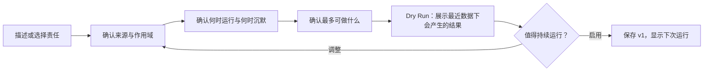

#### Routine 详情

使用四个固定页签：

- **概览**：目的、健康、上次成功、下次运行、最近有价值结果；
- **运行记录**：每次 Run 的输入摘要、是否静默、输出、耗时、证据、失败；
- **配置**：来源、作用域、触发、沉默规则、Effect ceiling、通知策略；
- **版本**：每次修改的差异、原因、创建者，可回退到历史版本。

异常页必须给出“发生了什么、从何时开始、哪些责任未被覆盖、可以怎么恢复”。暂停状态不能继续显示绿色健康。

### 5.6 “对话”：解释、协作与 Artifact

对话视图延续现有 Butler Conversation，但从纯消息流升级为“对话 + 工作成果”：

- 左栏是按 Task 聚合的会话历史，而不是按底层 Thread；
- 中栏是对话，保留来源引用、工具结果摘要和就地 Decision；
- 右栏在存在 Artifact 时打开预览或编辑器；
- 从聊天创建的 Task、Routine、MemoryRule 必须显示明确的对象回执；
- 长输出默认生成 Artifact 摘要卡，不把整份报告塞进气泡；
- 用户对 Artifact 的批注、接受、继续加工都落回同一 Task；
- 打开 Codex App 是诊断和深度执行入口，不是完成普通任务的必经路径。

### 5.7 “记忆与偏好”：可见、可纠正的学习

分为四组：

- 关于我：身份、角色、时区、工作日；
- 如何打扰我：静默时段、提醒阈值、渠道偏好；
- 我如何做决定：用户明确确认过的长期规则；
- 局部规则：按房间、人员、Routine 或 Task 生效。

每条规则展示原句、作用域、来源、最近使用时间，并支持编辑、撤销、查看影响。系统不得从一次忽略、一次点击或模型猜测中静默创建长期记忆。

纠正流程：

```text
用户：“这类测试分支不要提醒我”
  → 立即修正当前结果
  → 预览将形成的规则和作用域
  → 用户确认
  → 保存 MemoryRule
  → 显示“已应用到哪些 Routine / 未来可能少报什么”
  → 5 秒撤销 + 长期可撤销
```

### 5.8 “连接与权限”：能力边界

按连接展示 Rocket.Chat、ADO/GitHub、本地仓库和 Codex：

- 当前身份与可见范围；
- 最近成功同步时间；
- 可读取对象；
- 已允许的 Effect；
- 哪些 Routine/Task 依赖它；
- 失效、重连、缩小范围和断开入口；
- 最近外部动作审计。

权限文案必须描述用户能理解的动作，例如“可以在 #研发 发送已预览消息”，不展示内部 tool mode。`destructive` 和 `publish` 始终逐次批准。

### 5.9 房间浮层、通知与移动端

房间浮层继续只回答“这个房间里有什么需要我知道的”：

- 当前房间关联的 Task；
- 当前房间产生的 Suggestion；
- 当前房间最近一轮问答；
- 当前房间相关的 open Decision；
- “查看全部”回到全局管家；
- 所有对象仍来自统一责任存储。

系统通知只用于高影响 NeedToKnow、临近截止的 open Decision、Routine 健康中断和用户显式订阅的重要结果。每条通知必须可直接确认、决定或打开来源，不发“有新消息”式空通知。

移动端优先做待办收件箱：

- Need to Know；
- 等我决定；
- 已到回报时间的 Task；
- 重要结果；
- 快速确认、批准一次、拒绝、稍后提醒。

复杂配置、Artifact 编辑和权限管理回到桌面；移动端不能因为能力受限而隐藏风险或伪装完成。

---

## 6. 视觉系统

### 6.1 方向

**已确认方向：A「主动工作驾驶舱」**

关键词：

- 工业 / 实用；
- 主动但不吵闹；
- 一体化工作面；
- 高信息可信度；
- 以清晰分区和行式对象为主，卡片只用于可独立决策的内容；
- 颜色表达状态，不表达品牌兴奋感；
- 视觉重点落在“现在为何值得注意、Butler 正在照看什么、结果是否可信”。

这套方向保留现有 RocketX 的品牌和组件语言，但把 Butler 从一个安静列表升级为有节奏的工作驾驶舱。

已确认原型：

- HTML：`C:\Users\lus\.gstack\projects\rocketchatx\designs\butler-town-level-proactivity-20260728\variant-a-work-pulse.html`
- 截图：`C:\Users\lus\.gstack\projects\rocketchatx\designs\butler-town-level-proactivity-20260728\variant-a.png`
- 选择记录：`C:\Users\lus\.gstack\projects\rocketchatx\designs\butler-town-level-proactivity-20260728\approved.json`

### 6.2 排版

继续使用仓库现有系统字体：

```css
-apple-system, BlinkMacSystemFont, "Segoe UI", "PingFang SC",
"Microsoft YaHei", "Helvetica Neue", Arial, sans-serif
```

不引入网络字体和新依赖。

| 用途 | 字号 | 行高 | 字重 |
|---|---:|---:|---:|
| 页面标题 | 24px | 32px | 650 |
| 分区标题 | 16px | 24px | 650 |
| 行标题 | 15px | 23px | 600 |
| 正文 | 15px | 23px | 400 |
| 元信息 | 13px | 20px | 400 |
| 徽章 | 12px | 18px | 600 |

规则：

- 中文成句不小于 13px；
- 不用全大写英文做状态；
- 数字进度使用等宽数字特性；
- 标题最多两行，元信息最多三行，完整内容进入详情。

### 6.3 颜色

直接复用 `apps/web/src/styles.css` 的语义 token。

| 语义 | Light | Dark | 用法 |
|---|---|---|---|
| `surface-3` | `#f8f8f8` | `#212429` | 页面背景 |
| `surface-4` | `#ffffff` | `#292c33` | 输入、抽屉、独立预览 |
| `ink` | `#2c2c2c` | `#e8eaed` | 主文字 |
| `ink-2` | `#666666` | `#a3a8b0` | 元信息 |
| `line` | `#dcdcdc` | `#33363d` | 控件边界 |
| `line-soft` | `#e4e4e4` | `#2a2d34` | 行间分隔 |
| `primary` | `#3370ff` | `#4e83fd` | 进行中、链接、主动作 |
| `danger` | `#f54a45` | `#f54a45` | 必须由用户决定的高风险动作 |
| `warning` | `#ff8800` | `#ff8800` | 待核验、结果不确定 |
| `success` | `#34c724` | `#34c724` | 经过验收的完成 |

规则：

- `danger` 不能表示普通失败或逾期；
- `success` 不能表示模型自报完成；
- 待核验必须用 `warning`；
- 低优先级不是降低到不可读的灰；
- 同一屏有色状态点不超过 7 个，避免变成监控仪表盘。

### 6.4 布局与密度

- Butler 内部导航：`190px`；
- 主工作列：`680–760px`；
- 右侧上下文列：`260–300px`；
- 三列总工作区：`1180–1260px`，在 RocketX 全局导航内居中；
- 详情抽屉：默认 `480px`，范围 `420–560px`；
- Artifact 双栏工作面：`680–820px`；
- 左右页面留白：桌面 `36px`，窄屏 `16px`；
- 分区间距：`32px`；
- 行内垂直内边距：`14–16px`；
- 8px 基础栅格，细节允许 4px 半步；
- 圆角：小控件 `6px`、输入和预览 `10px`、抽屉不使用大圆角；
- 主列表不使用阴影；只有抽屉、浮层和审批草稿预览使用阴影。

### 6.5 Motion

只做帮助理解的状态动画：

- 行迁移、展开、收起：`150–180ms`；
- 抽屉进入：`180–220ms ease-out`；
- 状态替换：轻微淡入，不做位移动画；
- 运行图标可低速旋转；
- 新结果不闪烁、不弹跳；
- 遵守 `prefers-reduced-motion`。

### 6.6 响应式

**宽度 ≥ 1280px**

- 完整内部导航、主工作列和右侧上下文列；
- 详情从右侧抽屉出现；
- 主列表保持原滚动位置。

**宽度 960–1279px**

- 内部导航缩为图标 + tooltip，保留状态数字；
- 右侧上下文列折叠为主列顶部的“今日概况”；
- 详情覆盖主列表 65–75%；
- 点击遮罩或 `Esc` 返回。

**宽度 720–959px**

- 内部导航变为顶部横向标签，可横向滚动但当前项始终可见；
- 主列单列，右侧内容按“日程、Routine、记忆”插入相应视图；
- 详情覆盖 80–90%，Artifact 全屏。

**宽度 < 720px**

- 单列；
- 六个视图进入顶部下拉切换器；
- Composer 固定在安全区底部，向上展开上下文和创建菜单；
- 操作按钮放到行标题下；
- 详情全屏；
- 只保留最关键的两个动作，其他进入“更多”；
- Decision 不依赖 hover；
- 不用横向滚动表达 Task 进度。

### 6.7 可访问性

- 所有状态不能只靠颜色；
- 每个图标按钮有 `aria-label` 和可见 tooltip；
- Decision 进入页面时不自动抢焦点；
- 抽屉打开后焦点进入标题，关闭后返回触发行；
- 状态更新使用克制的 `aria-live="polite"`；
- 危险动作不使用仅图标按钮；
- 键盘可完成查看、批准、拒绝、暂停、恢复和关闭详情；
- 触控目标最小 `44px`。

### 6.8 组件状态矩阵

任何组件进入开发前必须定义以下状态，禁止只实现理想态：

| 功能 | Loading | Empty | Error | Success | Partial |
|---|---|---|---|---|---|
| 现在 | 分区骨架，保留布局 | “目前没有需要你处理的，我仍在照看 N 件事” | 指明失效来源 | 显示真实对象 | 可用来源先显示，并标注缺失范围 |
| Need to Know | 不闪烁占位 | 整个分区消失 | 来源失效仍保留风险摘要 | 确认后平滑移除 | 影响或证据不全时标“待核对” |
| Suggestion | 最多 3 行骨架 | 整个分区消失 | 不生成无依据建议 | 接住后迁移为 Task | 低置信度不展示，进入诊断记录 |
| 任务 | 保留筛选和分组 | 给出委托示例与创建入口 | 原位恢复，不丢责任 | 有证据的交付状态 | 某些来源失败时显示已完成/未完成范围 |
| Routine | 健康摘要骨架 | 推荐 1–3 个有依据模板 | 显示中断起点和修复 | Last success/Next run | 单一来源失败时标降级 |
| 对话 | 消息与 Artifact 分别加载 | 提供可执行开场，不放 Prompt 卡墙 | 输入保留，可重试 | 对象回执可打开 | 工具结果逐步到达，未知部分明确标注 |
| Composer | 发送后锁定一次提交 | 保持自然提示语 | 恢复原稿并说明未接住 | 3 秒内回显合同 | 附件部分失败时允许移除后继续 |
| 记忆 | 保留分组骨架 | 说明“我只记你明确确认的规则” | 不影响任务执行 | 修改后显示影响范围 | 某一作用域不可用时单独标记 |
| 连接与权限 | 每个连接独立加载 | 展示可连接能力 | 单连接原位修复 | 显示最近同步 | 不把部分连接失败扩大成全局离线 |

---

## 7. 核心流程

### 7.1 新用户激活

目标不是让用户配置自动化，而是在 10 分钟内第一次感到“它看见了我真实的工作、接住了一件事，而且没有乱动手”。

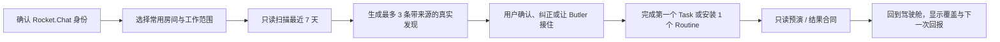

步骤：

1. 确认 Rocket.Chat 账号、时区和工作日；
2. 可选连接 ADO/GitHub、本地仓库；
3. 只读扫描最近 7 天的 @、Todo、PR 和构建；
4. 最多展示 3 条候选：
   - 一个“我答应的”；
   - 一个“我在等的”；
   - 一个工程风险；
5. 每条带来源和“为什么找你”；
6. 用户确认、否认或修改范围；
7. 推荐安装与刚才确认最相关的守护；
8. 先 Dry Run，再启用；
9. 首页显示 Butler 正在照看的责任、Last success / Next run 和下一次回报。

失败时：

- 没有发现就诚实说明“最近没有找到足够确定的责任”；
- 不用通用 Prompt 卡填满空白；
- 数据源不可用时明确说哪个来源没读到。

激活完成标准：

- 用户至少确认过一条真实来源；
- Butler 接住一个 Task 或启用一个 Routine；
- 用户能在首页说出 Butler 此刻在替他照看什么；
- 未授予任何不必要的写权限。

### 7.2 直接委托

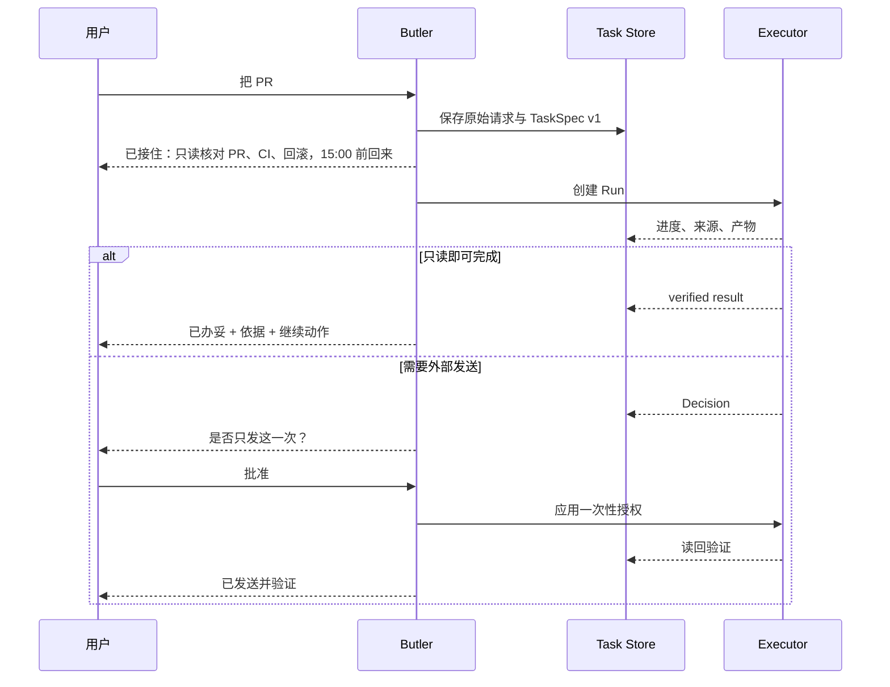

交互合同：

- 输入后先持久化，再启动执行；
- 3 秒内给出“已接住”的结果合同，不等待模型完整计划；
- 有关键歧义时只问会改变架构或副作用的一问；
- 补充要求绑定当前 Task；
- 关闭页面不停止 Run；
- 完成通知只说结果，不倾倒过程。

### 7.3 日常主动循环

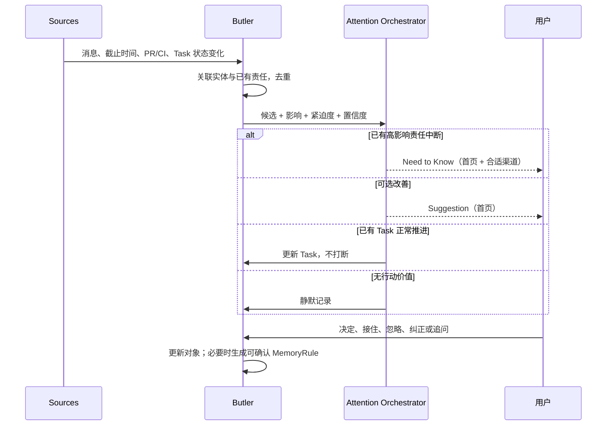

一个工作日的节奏：

- 早晨：展示今日承诺、等待事项、日程冲突和 Routine 健康，不发送空摘要；
- 工作中：重要变化优先在相关房间浮层就地出现，只有高影响事项才通知；
- 回报点：Task 到达承诺回报时间时主动交付结果或说明阻塞；
- 收尾：只在存在未闭环责任时给出简短日终回顾；
- 静默时段：记录变化但不通知，紧急安全或发布风险按显式策略例外。

### 7.4 主动发现转责任

```text
发现：“王五说‘我看看’，可能是对你的承诺”
  → 查看依据
  → 用户选择“交给管家”
  → 创建 waiting-on Task
  → Suggestion 标记 accepted
  → 同一行迁移到“正在替你办”
  → 后续新消息更新 Task，不再生成重复 Suggestion
```

用户选择“不是这回事”：

1. 当前 Suggestion 立即消失；
2. 5 秒内可撤销；
3. 再提供轻量原因：
   - 这句话不算承诺；
   - 少报关于这个人的此类说法；
   - 只把带明确日期的说法算承诺；
4. 用户确认后写入 MemoryRule；
5. 管家管理中可查看和撤销；
6. 下一次运行立即生效。

### 7.5 Need to Know 处理

```text
Need to Know：“发布守护从 09:12 起没有成功”
  → 首屏说明未覆盖的仓库、最后成功时间和潜在影响
  → 用户可选择“查看原因”“现在修复”“暂停这个守护”“我知道了”
  → “我知道了”只确认提醒，不伪装恢复
  → 修复成功后读回验证
  → 原对象转为 resolved，Routine 恢复 healthy
```

如果同一风险从房间浮层、通知和首页同时可见，任一处处理后其他表面同步消失或更新。

### 7.6 Routine 安装与对话创建

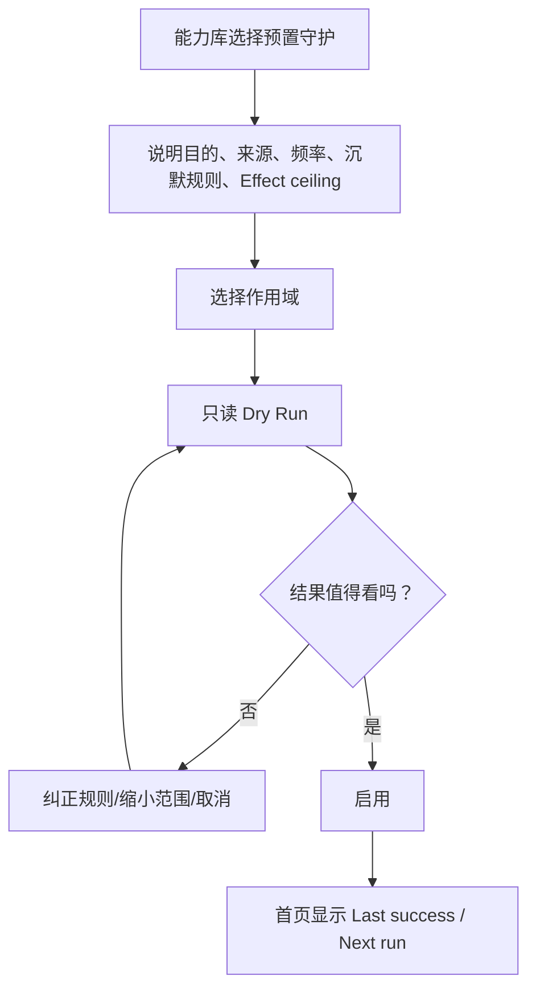

安装页不出现空白 Prompt 编辑器。对话创建时 Butler 必须把自然语言翻译成可读合同：目的、来源、作用域、频率、沉默条件、通知条件和 Effect ceiling。高级用户可以查看生成的规则摘要，但第一阶段不能直接编辑内部系统指令。

### 7.7 Routine 运行

```text
Trigger
  → 本地 Precheck
  → 没变化：记录 silent success，不调用模型
  → 有变化：建立候选 Signal
  → 去重与实体关联
  → 应用 MemoryRule、排除规则和注意力预算
  → 生成 Suggestion / 更新 Task / 产生 Decision / 保持沉默
  → 写 Run History
  → 更新 Last success / Next run
```

“没有结果”不生成首页卡片，但仍更新 Last success。

### 7.8 对话与 Artifact 协作

```text
用户追问某个 Task
  → Butler 自动带入 TaskSpec、最新 Run、来源和未解决 Decision
  → 简短回答；长结果生成 Artifact
  → 用户在 Artifact 上批注或要求修改
  → 创建同一 Task 下的新 Run 和 Artifact version
  → 需要发送/发布时先预览并创建 Decision
  → 执行后读回验证，Artifact 标记 accepted 或 superseded
```

对话切换到另一个 Task 时必须明确更新上下文标题。引用跨 Task 内容时生成显式 SourceRef，不能静默混合上下文。

### 7.9 渐进授权

```text
只读观察
  → 自动整理
  → 自动草拟
  → 单次批准
  → 指定 Routine + 指定作用域授权
  → 低风险外部动作自动执行
```

升级条件：

- 同类动作至少连续 5 次被批准；
- 最近 30 天没有撤销或结果不确定；
- 目标、作用域和效果相同；
- 系统主动提议，用户明确接受；
- 随时可撤销；
- destructive 与 publish 永不因历史批准自动升级。

### 7.10 错误与恢复

| 场景 | 用户看到 | 系统行为 |
|---|---|---|
| 来源暂时不可用 | “ADO 暂时没读到，其他来源已完成” | 局部降级，不把整个 Task 判失败 |
| Codex Thread 丢失 | “没有接上原执行，责任还在” | 创建新 Run，保留 Task 与历史 |
| 外部写后失联 | “结果不确定，不会自动再做一次” | 进入 uncertain，先读回核对 |
| Routine 连续失败 | “这个守护从昨天起没有成功” | 停止暗示仍在守护，提供修复入口 |
| 权限变化 | “作用域已失效，守护已暂停” | fail closed，不扩大范围 |
| 预算耗尽 | “无法继续守护，已暂停” | 不把跳过写成成功 |
| 重复 Webhook | 用户无感 | dedupeKey + idempotencyKey 去重 |

### 7.11 情绪旅程

| 时刻 | 用户可能的感受 | 设计任务 | 成功信号 |
|---|---|---|---|
| 第一次进入 | 怀疑：“又一个聊天机器人？” | 用真实来源和覆盖摘要证明它已理解工作现场 | 用户打开依据并确认一条发现 |
| 第一次委托 | 不确定：“它真的接住了吗？” | 3 秒内给出目标、范围、回报时间 | 用户离开页面也放心 |
| 第一次主动介入 | 警惕：“为什么打扰我？” | 明确 why now、影响和下一步 | 用户能接受、忽略或纠正 |
| 第一次外部动作 | 担心失控 | 预览 Effect、范围和一次性授权 | 用户知道批准了什么 |
| 第一次失败 | 失望或不信任 | 不隐藏、不重复副作用、说明恢复路径 | 责任仍在且可继续 |
| 一个月后 | 依赖但担心黑箱 | 展示 Routine 健康、记忆来源和审计 | 用户能解释 Butler 在守什么 |
| 一年后 | 希望更省心 | 规则可版本化、迁移和复用 | 主动性提高但打断率下降 |

时间尺度验收：

- **5 秒**：用户能看出最重要的一件事，以及 Butler 正在照看多少责任；
- **5 分钟**：用户能完成一次委托、一次判断和一次来源核验；
- **5 年**：任务、Routine、记忆、版本和审计仍能说明系统为何做出一次介入。

---

## 8. 预置守护路线

### 8.1 P0：建立核心体感

#### 1. 待回复守护

- 找到明确需要用户回复但尚未回复的消息；
- 排除仅抄送、已在线下解决、无行动要求和低价值群噪声；
- 输出：谁、要什么、多久、来源、建议动作；
- 默认只建议，可一键生成回复草稿。

#### 2. 我的承诺

- 识别用户明确答应的事项；
- 先作为 Suggestion，确认后进入 `my-commitment` Task；
- 到期前提醒，逾期提供兑现草稿；
- 自动检测兑现证据并建议闭环。

#### 3. 我在等谁

- 识别用户交给别人、仍未得到结果的事项；
- 关联后续消息、Work Item 和 PR 状态；
- 等待超时后提供催促草稿；
- 对方回应后建议销账，不自动假定完成。

#### 4. 今日三件

- 从已有 Task 和可靠 Signal 中选择最多三件；
- 每条说明为什么现在值得注意；
- 没有足够重要的事就少于三件或保持空白；
- 不从零重新生成一套待办。

#### 5. 决策与行动项

- 从会议、长线程和 PR 讨论中提取已形成的决定、负责人和期限；
- 没有明确决定时标记“未定”，不补全；
- 结果直接进入 Task/Suggestion，不生成孤立报告。

### 8.2 P1：工程执行差异化

#### 6. PR / Work Item 等待守护

- 盯评审、阻塞、状态漂移和长期无进展；
- 关联 Rocket.Chat 讨论与工程系统事实；
- 给出下一步和可点击来源。

#### 7. CI 失败处置

- 发现失败后先去重和确认是否已恢复；
- 本地 Codex 诊断；
- 可行时生成修复 diff 并跑验证；
- 用户看到的是“原因 + 草稿 + 验证”，不是日志摘要。

#### 8. 发布守护

- 核对版本、tag、main、Release commit、CI、签名、产物、SHA256、Latest 和 npm（如适用）；
- 所有门禁通过后才允许进入 publish Effect；
- 公开发布仍受独立授权和仓库发布规则约束。

#### 9. 团队进展摘要

- 从真实消息和工程系统生成；
- 不要求团队维护第二份周报；
- 区分事实、风险和建议；
- 没有变化时保持沉默。

### 8.3 每个模板的验收

每个预置守护必须有：

- 10 个以上真实正例；
- 10 个以上高成本反例；
- 历史回放；
- 沉默用例；
- 误报纠正并验证下一次生效；
- 运行失败、预算耗尽和权限变化用例；
- 至少一个结果落到 Task、Draft 或 Artifact 的闭环；
- 重复触发不产生重复 Task 或副作用。

---

## 9. 文案合同

### 9.1 好文案

```text
已接住：只读核对 PR #248、相关 CI 和回滚步骤，15:00 前回来。

需要你决定：是否把这 3 条已核实风险发到 #研发？
只发这一次，不修改 PR，也不附带私密日志。

已办妥：消息已发到 #研发，并读回同一消息 ID。

待核验：查询 Issue 时有 1 个来源超时，因此“没有高优先级 Issue”暂时不能确认。
```

### 9.2 禁止文案

```text
任务处理中，请稍候……
AI 分析完成。
已成功执行。
权限不足。
发生未知错误。
```

每条状态文案必须回答：

- 发生了什么；
- 对责任有什么影响；
- 用户是否需要行动；
- 系统接下来会做什么。

---

## 10. 产品指标

### 10.1 北极星指标

> 每周被管家可靠闭环、且用户无需重新解释背景的真实责任数。

### 10.2 价值

- 被及时发现的真实遗漏数；
- 按时关闭的承诺比例；
- 从发现到可审阅草稿的中位时间；
- 用户一次批准即可完成的事项比例；
- “继续这件活”无需重述背景的比例；
- Butler 实际代劳时间。

### 10.3 信任

- Suggestion 接受率；
- 草稿一次通过率；
- 误报率；
- 漏报回溯率；
- 自动动作撤销率；
- 相同错误重复发生率；
- MemoryRule 查看、修改和撤销率；
- `uncertain` 最终核实率。

### 10.4 可靠性

- Routine 按期运行率；
- Last success 新鲜度；
- Task 恢复率；
- 重复 Task 率；
- 重复副作用率；
- 结果投递成功率；
- Decision 超时率；
- fail-closed 覆盖率。

### 10.5 注意力

- 每日主动打断次数；
- 每次打断的采纳率；
- 被压下的低价值信号数；
- “没用”反馈率；
- 从通知到闭环的步骤数；
- 首页同时可见责任数的 P95。

不能把消息数、模型轮次、Routine 数量或 DAU 当作产品价值。

---

## 11. 实施阶段

### Phase 0：领域合同和迁移设计

目标：

- 确定 Signal、AttentionDecision、NeedToKnow、Suggestion、Task、Run、Decision、Routine、Artifact、MemoryRule schema；
- 建立现有 Todo、ButlerErrandRun、RoutineRun、brief feedback 的迁移映射；
- 定义注意力策略、Effect、幂等和验收器接口；
- 不改变现有 UI。

验证：

- 现有数据可无损读取；
- 同一责任不会因迁移生成两个未完成对象；
- 回滚到旧版本不会破坏原数据。

### Phase 1：主动循环与统一责任核心

目标：

- 建立持续感知、实体关联、候选判断和注意力编排；
- NeedToKnow 与 Suggestion 成为不同对象；
- Task 与 Run 分离；
- Decision 成为审批和不确定结果的统一产品对象；
- 持久化 Run 摘要和恢复状态；
- 首页仍可使用现有视觉，但状态来自新投影。

验证：

- 重启后在办、待决定和结果仍在；
- Run 失败可重建，Task 不丢；
- 同一 Signal 在冷却期内不会重复生成介入；
- NeedToKnow、Suggestion、Task update 和 silent 四种结果可审计；
- 同一 Decision 在首页和房间浮层只处理一次。

### Phase 2：主动工作驾驶舱

目标：

- 落地已确认 A 方向：190px 内部导航、680–760px 主列、260–300px 上下文列；
- 完成“现在”和“任务”视图、统一 Composer、Need to Know、建议、Decision 和 Task 详情；
- 完成键盘、窄屏、深色和 reduced motion；
- 房间浮层、系统通知和移动待办共享同一对象状态。

验证：

- 5 秒内找到最重要事项并说出 Butler 正在照看多少责任；
- 从首页进入详情、查看来源、返回后滚动位置不丢；
- 20 个活跃 Task 下仍能扫读；
- 空态不出现推荐卡片墙；
- 任一表面处理 Decision 后其他表面同步更新。

### Phase 3：例行照看工作台与 P0 模板

目标：

- 新 Routine schema、健康状态和 Dry Run；
- 完成“例行照看”视图、模板库、对话创建、详情四页签和版本回退；
- 上线“待回复守护”“我的承诺”“我在等谁”；
- 现有晨报、晚间回顾和 @ 分诊迁移到新合同。

验证：

- Last run、Last success、Next run 都可见；
- 没变化时本地预检后保持沉默；
- 权限或预算失效时明确暂停；
- 历史回放无重复 Task。

### Phase 4：对话、Artifact、纠正与可见记忆

目标：

- 完成“对话”视图和 Artifact 版本协作；
- Suggestion “忽略/不是这回事”与撤销；
- MemoryRule 可看、可改、可撤；
- 纠正影响下一次运行；
- 纠正原因写入工作日志。

验证：

- 相同输入回放不再产生已纠正误报；
- 撤销 MemoryRule 后恢复旧行为；
- 动态工作事实不会写入长期记忆；
- 长报告、草稿和 diff 可从对话进入 Artifact 并继续加工。

### Phase 5：连接、权限与工程闭环

目标：

- 完成“连接与权限”视图和 Effect 审计；
- PR / Work Item、CI 和发布守护；
- Codex 生成 diff、跑验证、回写 Artifact；
- verified / unverified / failed 验收状态；
- publish Effect 独立门禁。

验证：

- 从 CI Signal 到可审阅 diff 形成同一 Task；
- 测试失败不能显示已办妥；
- 外部写后失联不会重复执行；
- 发布守护不绕过仓库现有发布门禁。

### Phase 6：团队资产化

前提：

- 个人闭环稳定；
- P0/P1 模板误报率达到目标；
- 权限和审计合同经过真实使用验证。

目标：

- 模板与凭据分离；
- Routine 有 owner；
- 团队共享方法，不共享隐式权限；
- 身份和权限变化自动收敛。

---

## 12. 端到端验收

### 12.1 主动发现

Given 用户三天前请李四评审 PR，仍无结果  
When 等待守护运行  
Then 首页只出现一条 Suggestion，说明人员、事项、等待时长和来源  
And 可选择查看依据、让 Butler 接住或忽略  
And 不生成重复 Todo 或通知。

### 12.2 必须知道

Given 发布守护连续失败且最近一次成功已经过期  
When 注意力编排判断该责任已失去覆盖  
Then 创建一条 NeedToKnow，而不是 Suggestion  
And 首页置顶显示最后成功时间、未覆盖范围和下一步  
And 按通知策略只发送一次跨表面提醒  
And 用户“知道了”后不把 Routine 标记为恢复。

### 12.3 转为责任

Given 一条 open Suggestion  
When 用户选择“交给管家”  
Then 创建一个 `waiting-on` Task  
And Suggestion 变为 accepted  
And 同一行迁移到“正在替你办”  
And 来源、人员和时间上下文完整保留。

### 12.4 需要批准

Given Codex 已生成催促草稿  
When Run 请求向 Rocket.Chat 发消息  
Then 首页“等你决定”展示目标、草稿、范围和“一次性”含义  
And 用户批准后 Decision 先落账，再执行发送  
And 发送成功需读回验证  
And 其他表面的同一 Decision 同步失效。

### 12.5 结果不确定

Given 外部发送后连接中断  
When 无法确认副作用是否发生  
Then Run 进入 `uncertain`  
And 首页显示“结果不确定”  
And 系统不会自动再发一次  
And 用户可以查看核对项或确认结果。

### 12.6 Routine 健康

Given Routine 连续两次运行失败  
When 用户打开管家  
Then 例行照看视图和相关责任显示 Last success 已过期  
And 不再暗示该事项仍被可靠守护  
And 提供重试、修复作用域或暂停。

### 12.7 对话创建 Routine

Given 用户在 Composer 输入“每天九点看未回复消息，只报真的需要我回的”  
When Butler 解析请求  
Then 先展示目的、来源、作用域、频率、沉默条件、通知条件和 Effect ceiling  
And 用户可通过一轮对话调整合同  
And Dry Run 使用真实近期数据并说明遗漏来源  
And 启用后显示版本 v1、Last success 和 Next run。

### 12.8 Artifact 协作

Given 一个 Task 产出长报告  
When 用户从对话打开结果  
Then 报告以 Artifact 呈现且保留来源  
And 用户的修改要求创建新 Run 和 Artifact version  
And 旧版本仍可查看  
And 发送或发布必须经过对应 Effect 的 Decision。

### 12.9 纠正闭环

Given 用户对 Suggestion 选择“这句话不算承诺”  
When 用户确认写成规则  
Then MemoryRule 立即可见  
And 相同历史输入回放不再产生 Suggestion  
And 用户撤销规则后行为恢复。

### 12.10 跨表面一致性

Given 同一 Decision 同时出现在 Butler 首页、房间浮层和移动待办  
When 用户在移动端选择“只批准这一次”  
Then Decision 只解析一次  
And 其他表面立即反映已处理状态  
And Task 在原状态机中继续  
And 审计记录批准来源和作用域。

### 12.11 重启恢复

Given 一个 Task 正在运行且一个 Decision 未解决  
When RocketX 重启  
Then Task 和 Decision 仍在正确分区  
And 能恢复原 Run 就恢复  
And 不能恢复时创建新 Run，但不复制 Task。

### 12.12 视觉和可访问性

- Light / Dark 均能区分已办妥、待核验和等你决定；
- 1440px 呈现完整三列，1024px 折叠右栏，768px 使用顶部内部导航，390px 为单列；
- 键盘可完成所有 Decision 操作；
- 200% 缩放无横向滚动；
- reduced motion 下没有循环动画；
- 触控目标不小于 44px；
- 屏幕阅读器能读出状态、后果和操作。

---

## 13. 风险与缓解

| 风险 | 后果 | 缓解 |
|---|---|---|
| 统一模型过大 | 长期地基工程，用户无感 | 每个 Phase 必须交付可见变化，Phase 0/1 不跨两个版本 |
| 与 Todo 重复 | 用户不知道看哪里 | Task 表达责任，Todo 表达个人行动；建立明确映射和去重 |
| 首页信息膨胀 | 驾驶舱变监控台 | NeedToKnow/Suggestion 分流、数量上限、空分区消失、注意力预算 |
| 主动性退化为通知轰炸 | 用户关闭整个 Butler | 表面选择、静默时段、冷却期、每日上限、只对高影响对象通知 |
| 误报过多 | 用户关闭主动能力 | 高成本反例、保持沉默、纠正即时生效 |
| 漏报不可见 | 用户误信仍被守护 | Last success、覆盖范围、健康状态 |
| 记忆黑箱 | 用户不敢纠正和授权 | MemoryRule 可见、可改、可撤、带来源 |
| 外部动作重复 | 重复消息或修改 | Decision 先落账、幂等键、读回验证、uncertain |
| Codex 状态不稳定 | Task 丢失或永久转圈 | Task/Run 分离、心跳、终态错误、重建 Run |
| Routine 规则漂移 | 同一守护表现不一致 | instructionsVersion、stateSchemaVersion、迁移和回滚 |
| 宽屏改版退化为企业仪表盘 | 工作关系被指标淹没 | 主列保持阅读节奏、少色、少卡片、真实空态、右栏不复制对象 |
| 六个视图形成六套状态 | 用户在不同入口看到冲突 | 单一责任存储、投影层、跨表面一致性测试 |

---

## 14. 假设

| 假设 | 置信度 | 来源 |
|---|---|---|
| Butler 继续是唯一 AI 身份 | 高 | `vision.md`、`butler-single-brain.md` |
| 管家首页继续是唯一一级入口 | 高 | `butler-sole-surface.md` |
| 用户需要 Town 级强主动性和交互能力，而非安静台账 | 高 | 用户明确反馈并确认 1A + A 方向 |
| RocketX 的差异化是本地工程执行深度 | 高 | `README.md`、`blueprint.md` |
| 预置守护优先于空白 Builder | 高 | Town 分析和现有能力库 |
| 现有语义色、字体和主题继续复用 | 高 | `styles.css`、`butler-page-design.md` |
| 三列主动工作驾驶舱比单列台账更适合新首页 | 高 | 用户选择视觉方案 A |
| Task 需要独立于 Todo 存储 | 中 | 责任与执行语义差距，需迁移设计验证 |
| 第一阶段仍以单用户为核心 | 高 | `vision.md` |

---

## 15. 偏离策略

实施中遇到边界问题时，默认选择：

- 可逆；
- 最小影响范围；
- 不新增用户心智；
- 不扩大权限；
- 不丢来源和审计；
- 不把不确定结果伪装成成功。

以下情况必须停下重新评审：

- 需要把 Tasks、Approvals、Runs 或 Routines 变成 RocketX 全局一级导航；
- 需要合并 Task 与 Run；
- 需要把 NeedToKnow 与 Suggestion 合并成单一优先级列表；
- 需要让动态工作事实进入长期记忆；
- 需要绕过 Effect 或发布门禁；
- 数据迁移可能丢失现有 Todo、Routine、记忆或 Butler 会话；
- 真实测试证明三列驾驶舱或六个内部视图无法承载目标规模；
- 同一需求累计出现三次偏离，说明本文与实现事实已经不一致。

---

## 16. 实施交接

开始实现时，在 `docs/` 创建：

```markdown
# Implementation notes — Butler 持续工作系统
Plan: docs/butler-continuous-work-system-design.md

## Decisions
## Deviations
## Surprises
## Questions for review
```

每个实施波次必须：

1. 先写“用户打开应用会看到什么变化”；
2. 先补回归测试锁住现有行为；
3. 只修改当前 Phase 必需的对象；
4. 记录 schema、状态机和权限偏离；
5. 用真实桌面路径验证，不只依赖组件快照；
6. 提交前对照本文的端到端验收；
7. 文档、代码和测试一起更新，避免出现两套产品合同。

---

## 17. 相关资料

- [终局设想：替你记着，替你挡着](./vision.md)
- [AI 管家好用性系统框架](./butler-usability-framework.md)
- [管家页面整体设计](./butler-page-design.md)
- [管家是唯一界面](./butler-sole-surface.md)
- [管家单大脑](./butler-single-brain.md)
- [派活 v1](./butler-errands-v1.md)
- [管家主动性设计](./ai-proactivity-design.md)
- [Agent Runtime 可靠性与 Codex 兼容设计](./agent-runtime-reliability-design.md)
- [管家人用体验验收](./butler-ux-acceptance-2026-07-27.md)
- [现有管家交互原型](./prototypes/butler-desk.html)

---

## 18. 设计评审结论

### 18.1 七轮评审

| 评审维度 | 初始 | 当前 | 关键修正 |
|---|---:|---:|---|
| 信息架构 | 5/10 | 9/10 | 从单页四分区改为一个 Butler、六个内部工作视图 |
| 交互状态 | 6/10 | 9/10 | 补齐九类核心功能的 Loading/Empty/Error/Success/Partial |
| 用户旅程 | 4/10 | 9/10 | 增加首次价值、日常主动循环、失败恢复、长期信任与 5 秒/5 分钟/5 年尺度 |
| 反 AI 模板感 | 7/10 | 9/10 | 删除 Prompt 卡墙思路，以真实责任、来源、时间和健康构成动态首页 |
| 视觉系统一致性 | 8/10 | 9/10 | 复用现有字体和语义 token，明确 A 方向三列栅格与组件密度 |
| 响应式与可访问性 | 7/10 | 9/10 | 明确 1280/960/720 断点、移动待办策略和焦点/读屏合同 |
| 决策完整性 | 6/10 | 9/10 | 锁定主动策略、对象边界、Composer、Routine、跨表面和权限合同 |

综合评分：**5/10 → 9/10**。剩余 1 分依赖真实实现后的可用性测试、误报数据和 390/768/1024/1440 四档视觉回归，不能在产品文档阶段虚构。

### 18.2 已有资产复用

- `apps/web/src/styles.css`：语义颜色、字体、明暗主题；
- `ButlerPage`：承接 Butler 单一全局入口；
- `ButlerConversation`：演进为对话 + Artifact 工作面；
- `ButlerRoutines`：演进为例行照看视图；
- `ButlerLearnedPanel`：演进为记忆与偏好视图；
- 现有房间 Butler overlay：承接相关对象的就地介入；
- 现有 Todo、ButlerErrandRun、RoutineRun：通过迁移映射进入统一责任模型。

### 18.3 明确不在本轮范围

- RocketX 营销首页或全局品牌重做；
- 新建通用 Rocket.Chat 后端；
- Email、WhatsApp、Notion、云文档或表格的广覆盖集成；
- 多个 AI 人格或多个对外 Agent 身份；
- 空白自动化画布、节点编排器或脚本 IDE；
- 第一阶段的团队 Routine 市场、跨组织分享和隐式权限继承；
- 用 token、模型名、线程或工具调用作为普通用户主界面。

### 18.4 已锁定的产品决定

1. 一个 Butler 身份，六个内部工作视图；
2. 视觉采用 A「主动工作驾驶舱」；
3. 主动性采用持续感知、平衡判断、克制打断；
4. NeedToKnow 与 Suggestion 是不同对象；
5. Composer 同时承接提问、委托、引用、创建、调整和继续；
6. Routine 采用真实发现、对话创建、模板安装三轨；
7. 对话负责协作，Artifact 承载可继续工作的成果；
8. 所有表面共享统一责任状态；
9. 长期学习只来自用户明确表达或确认过的纠正。

本轮没有遗留产品设计 TODO；需要工程验证的内容已写成实施阶段和端到端验收，不以模糊“后续优化”搁置。

## GSTACK REVIEW REPORT

| 项目 | 结果 |
|---|---|
| Review type | Plan Design Review |
| Initial score | 5/10 |
| Final score | 9/10 |
| Visual direction | A — 主动工作驾驶舱 |
| Decisions resolved | 9 |
| Unresolved design questions | 0 |
| Primary artifact | `docs/butler-continuous-work-system-design.md` |
| Prototype artifact | `C:\Users\lus\.gstack\projects\rocketchatx\designs\butler-town-level-proactivity-20260728\variant-a-work-pulse.html` |
