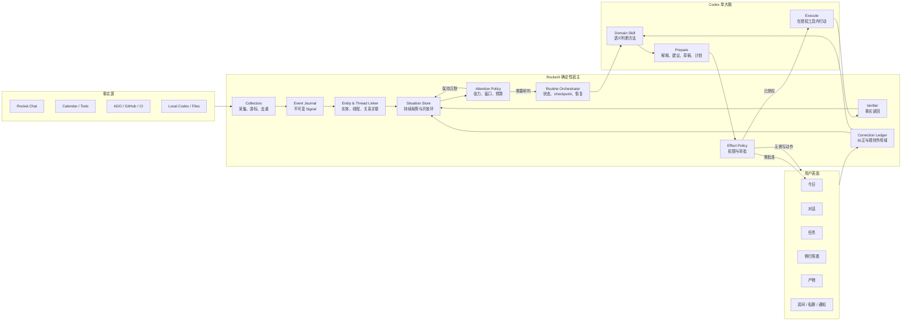
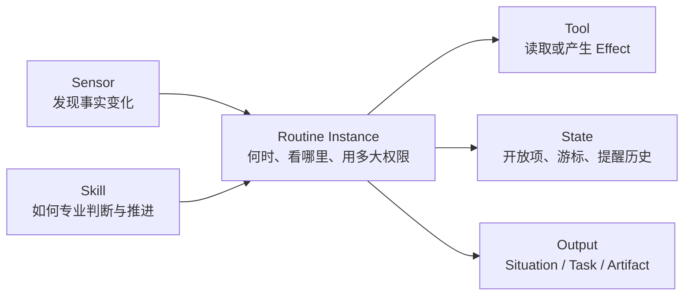
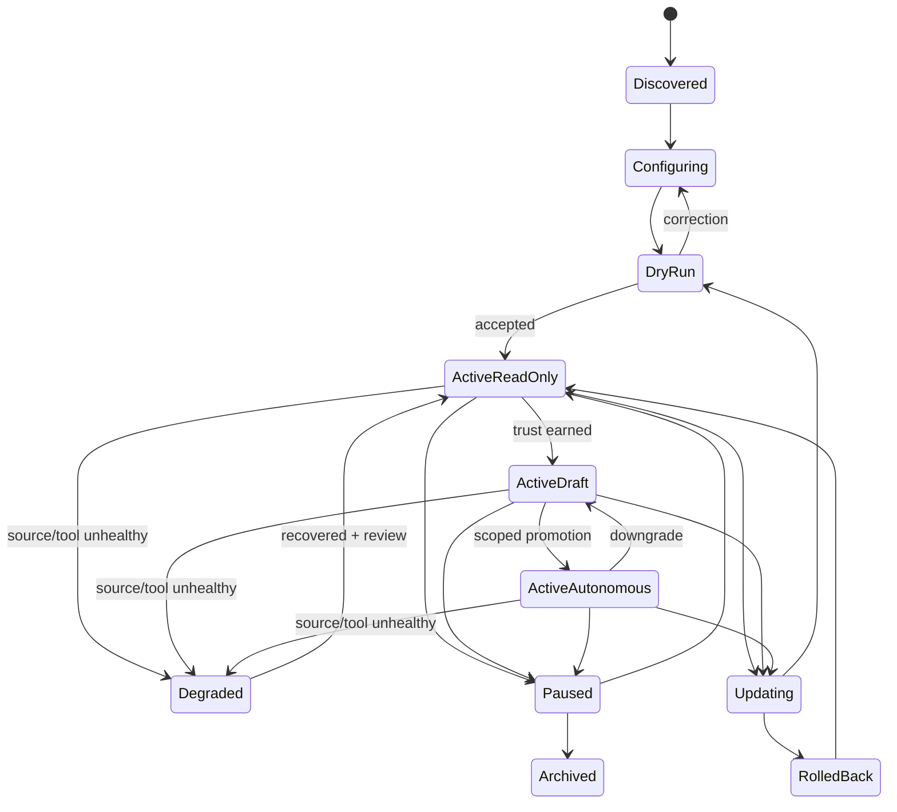

# RocketX Butler · 持续在场的工作伙伴设计

> 状态：产品与系统设计草案
> 日期：2026-07-28
> 范围：先完成产品、交互、领域模型、运行链路与 Skill 合同设计；本轮不修改实现。
> 继承：[Butler 持续工作系统设计](butler-continuous-work-system-design.md)、[管家主动性设计](ai-proactivity-design.md)、[Agent Runtime 可靠性设计](agent-runtime-reliability-design.md)
> 第一批增益闭环：[了解用户、工作分析与小 Skill 自我增益设计](butler-learning-analysis-skill-system-design.md)
> 参考：Town 的 [Profiles](https://www.town.com/docs/features/profiles)、[Routines](https://www.town.com/docs/features/routines)、[Context & Memory](https://www.town.com/docs/features/context-and-memory)、[Triggers](https://www.town.com/docs/routines/custom-routines/triggers)、[Steps & Caching](https://www.town.com/docs/routines/custom-routines/concepts/steps-and-caching)

---

## 0. 最终判断

RocketX 现在缺的不是更多“会定时运行的机器人”，而是一层持续形成工作局势、记住开放关系、判断此刻是否该介入的 **Presence Engine（在场引擎）**。

它要把 Butler 从：

```text
收到命令
  → 找工具
  → 执行
  → 回答
```

升级为：

```text
持续感知
  → 形成局势
  → 维护开放关系与责任
  → 判断当前张力
  → 选择是否介入、何时介入、介入到哪一步
  → 准备或行动
  → 用外部事实验证
  → 从用户纠正中调整以后怎么做
```

产品人格不靠头像、拟人语气或“我一直陪着你”建立，而靠六种稳定行为建立：

1. **记得前因后果**：不是每次都把一条消息当成新任务；
2. **知道谁在等谁**：维护人、承诺、决定、阻塞和期限之间的关系；
3. **能判断现在是否值得打断**：感知持续，但介入克制；
4. **会先做到可用的一步**：不只提醒，还准备下一步、草稿或验证；
5. **没有证据就不装懂**：明确事实、推断、未知和需要确认的部分；
6. **被纠正后真的改变**：同类场景下以后少问、少报、换方式或停止。

因此本设计做出三个核心决定：

- **Skill 不是定时任务，也不是一段 Prompt**。Skill 是一种可复用的专业判断与行动方法。
- **Routine 不是能力本身**。Routine 是用户把某个 Skill 配置到特定触发、范围、节奏和权限后的长期责任实例。
- **Presence Engine 不是大模型人格**。它是宿主拥有的事件、状态、注意力、权限、幂等和恢复系统；Codex 负责需要语义理解的局势判断与产物生成。

一句话产品定义：

> **Butler 是一个持续在场、替用户维护开放工作关系，并在合适时机把事情推进到下一可靠状态的工作伙伴。**

---

## 1. 本轮假设与成功标准

### 1.1 假设

1. 产品仍坚持“一个 Butler、一个身份、一个共享上下文”，不向用户暴露多个 Agent 人格。
2. Rocket.Chat 是首要感知与交互入口，ADO/GitHub、本地 Codex、日历和 Todo 是事实与执行来源。
3. RocketX 应复用当前 Butler 的对话、任务、例行照看、产物、记忆、连接与权限视图，不再增加独立“机器人中心”。
4. RocketX 只承诺在应用运行或驻留时持续感知；完全退出后的后台守护需单独设计 OS service，不在本阶段偷偷承诺。
5. 外部发送、代码修改、发布、删除和权限变更继续受现有审批与仓库门禁约束。
6. 当前原生 Codex Skill 迁移能力需要重新验证；设计不能把尚未验证的原生 Skill 调用当作已交付事实。
7. 用户想要的是“更像人一样感知和行动”，但产品不能假装拥有情绪、意识或未经证据支持的心理洞察。

### 1.2 设计完成标准

本设计只有同时回答以下问题才算完成：

- Butler 感知什么，如何把零散信号合成持续局势？
- 什么由宿主确定性执行，什么交给 Codex 判断？
- 什么时候沉默、什么时候轻提示、什么时候直接问、什么时候准备草稿、什么时候行动？
- Chat、Task、Routine、Run、Skill、Memory、Artifact 各自负责什么？
- 一次触发如何防重、恢复、等待审批并最终验证？
- 用户说“不是这回事”“别再提醒”“以后直接做”后，系统如何改变？
- P0/P1 的每一个 Skill 要如何编写、需要什么工具、保存什么状态、最高能做到什么？
- 正常、误判、无结果、冲突、离线、权限不足、动作结果不确定等场景如何闭环？
- 用哪些端到端用例证明它不是“会说主动话术的机器人”？

### 1.3 非目标

- 不用头像、情绪动画、寒暄频率代替真实在场能力；
- 不建立一个无边界的“通用自主 Agent”；
- 不让模型直接轮询所有系统；
- 不把所有发现都创建成 Todo；
- 不让每个 Skill 各自实现调度、权限、通知、幂等和记忆；
- 不从 Town 复制品牌人格、内部 Prompt 或云端架构；
- 不在一开始做复杂可视化 Workflow Builder；
- 不把“模型说完成”当成事实验证。

---

## 2. Town 参考：Keep / Adapt / Drop

Town 的官方公开产品目前明确将 Profile 作为“决定什么重要、如何代用户表达”的持续上下文，将 Routine 定义为后台重复承担的工作，并提供只读、需批准、自主三档信任控制；它还通过分步缓存让等待批准的运行从原位置恢复。这些是本设计的产品语义参考，不是对其内部实现的推断。

### 2.1 Keep

| 保留原则 | RocketX 中的落点 |
|---|---|
| 一个助理、一个长期身份 | 所有入口都落入同一 Butler Profile 与责任台账 |
| Profile / Memory 随使用变准 | 可见、可改、分作用域的偏好与关系规则 |
| 预置能力先证明价值 | 先交付 5 个 P0 和 4 个 P1 Skill |
| Routine 在后台承担重复责任 | Routine 绑定 Skill、Trigger、Scope、Policy、State |
| 事实、建议、任务、草稿分层 | NeedToKnow、Suggestion、Task、Artifact |
| Read-only → Approval → Autonomous | 基于 Effect 的渐进授权 |
| Dry Run、Run History、Versions | 每个 Routine 可试跑、追溯、比较、回退 |
| 来源和动作可见 | 每个局势与结论保留 SourceRef 和验证状态 |
| 纠正进入未来行为 | 纠正形成有作用域、可撤销的 MemoryRule |
| 等待审批后从原步骤恢复 | Step checkpoint + 幂等键 + first-responder-wins |

### 2.2 Adapt

| Town 结构 | RocketX 重写 |
|---|---|
| 通用办公助理 | 以消息承诺、注意力和工程交付为核心 |
| Task | 升级为有责任关系、等待方、证据和执行结果的开放环 |
| Suggestions 首页 | 汇入“今日”并受注意力预算与场景合并控制 |
| Routine Instructions | 拆成 Skill 方法、Routine 配置和确定性策略 |
| 通用 SaaS 工具 | Rocket.Chat + 工程系统 + 本地 Codex 双执行面 |
| 多渠道触达 | 同一局势可在 Butler 页、房间、私聊和系统通知呈现 |
| 个性化 Townie | 稳定 Butler 身份与“做事方式”，形象仅是弱表达层 |

### 2.3 Drop

- 多 Agent 身份和让用户手工编排 Agent；
- 以 Routine 数量、自动动作数量衡量成功；
- 让审批成为第二个收件箱；
- 用云端 Credits 耗尽后仍声称“我在守护”；
- 将所有 Routine 原始运行日志倾倒给用户；
- 用高频“没有变化”通知证明在线；
- 让 Skill 的 Markdown 决定安全边界；
- 在恢复和幂等未验证前开放全自主。

---

## 3. 从“机器人”到“在场伙伴”的产品模型

### 3.1 关键差别

| 机器人机制 | 持续在场机制 |
|---|---|
| 一条 Trigger 对应一次回答 | 多个 Signal 汇成一个持续 Situation |
| 只看当前消息 | 关联关系、历史、承诺、期限和后续证据 |
| 每次都输出 | 先判断是否值得介入 |
| 提醒就是完成 | 把事情推进到下一可靠状态 |
| 用户忽略后重复报 | 识别沉默、延后、拒绝和场景偏好 |
| 任务完成由模型判断 | 由事实源或用户确认验证 |
| 每个自动化各自一套逻辑 | Skill 方法共享，Routine 只实例化 |
| 人格来自语气 | 人格来自稳定判断、连续记忆和可靠行动 |

### 3.2 “像人”不等于假装是人

允许 Butler 做的：

- 说“我把前后消息连起来看了”；
- 说“这件事还没有可靠完成证据”；
- 记住用户常用表达、关键关系和明确偏好；
- 根据用户当前日程和焦点降低打扰；
- 用自然语言解释为什么现在介入；
- 在已授权边界内先准备好下一步。

不允许 Butler 做的：

- 声称自己有情绪、疲劳、直觉或意识；
- 从少量文字诊断用户或他人的心理状态；
- 把“对方可能不高兴”当事实；
- 为了拟人主动寒暄、刷存在感或虚构观察；
- 隐瞒自己没有持续运行、来源断开或验证失败。

### 3.3 三个时钟

Butler 同时维护三个时钟，而不是只靠 cron：

1. **事件时钟**：新消息、PR 状态、构建、日程变化发生了什么；
2. **责任时钟**：一个承诺、等待、阻塞或决定多久没有可靠推进；
3. **注意力时钟**：用户现在是否适合被打断，下一次自然接触点是什么。

示例：

```text
10:04 张三问“今天能给结论吗？”          事件时钟启动
10:07 用户回复“下午给你”                 责任时钟建立：用户欠张三一个结论
14:00 用户在连续会议中                    注意力时钟判断：不打断
16:20 距工作日结束不足 2 小时，仍无产物   责任张力升高
16:30 日程出现空档                        注意力窗口打开
16:31 Butler 提示并附带已有材料的回复草稿
```

### 3.4 五类持续关系

Presence Engine 只维护与工作推进直接相关的关系，不建立无边界“数字人格画像”：

| 关系 | 问题 |
|---|---|
| `my-commitment` | 我答应了谁什么？ |
| `waiting-on` | 我在等谁给什么？ |
| `decision-open` | 哪个决定已形成、未形成或待确认？ |
| `delivery-risk` | 哪个交付正在失去可靠覆盖？ |
| `attention-candidate` | 什么现在值得用户知道或决定？ |

这些关系统称 **Open Loop（开放环）**。开放环不是普通 Todo：它有双方、证据、等待方向、时间、当前状态和可靠闭环条件。

---

## 4. 领域对象与边界

### 4.1 对象分工

| 对象 | 唯一职责 | 不承担 |
|---|---|---|
| `Signal` | 记录一次外部变化 | 不直接通知用户 |
| `Observation` | 将 Signal 标准化为可引用事实 | 不做长期责任判断 |
| `Situation` | 表达一段持续中的工作局势 | 不等于用户 Task |
| `OpenLoop` | 记录谁欠谁、等什么、风险与闭环条件 | 不保存完整执行日志 |
| `Intervention` | 记录 Butler 为什么、何时、以何种强度介入 | 不承担执行状态 |
| `Task` | 持续推进一个已确认责任 | 不保存所有运行细节 |
| `Routine` | 将 Skill 实例化为长期守护责任 | 不包含通用方法实现 |
| `Skill` | 可复用的专业判断与行动方法 | 不自行调度、授权或持久化 |
| `Run` | 一次执行的事实与 checkpoint | 不替代 Task |
| `Artifact` | 草稿、报告、diff、清单等可审阅产物 | 不等于已生效动作 |
| `MemoryRule` | 用户确认的偏好、关系和纠正 | 不保存动态业务状态 |
| `SourceRef` | 指向消息、线程、PR、构建、日历等证据 | 不复制事实源权限 |

### 4.2 核心数据结构

```ts
type SourceKind =
  | 'rocket-chat-message'
  | 'rocket-chat-thread'
  | 'todo'
  | 'calendar-event'
  | 'work-item'
  | 'pull-request'
  | 'build'
  | 'release'
  | 'local-run'
  | 'user-confirmation';

interface SourceRef {
  kind: SourceKind;
  accountId: string;
  sourceId: string;
  revision?: string;
  observedAt: number;
  deepLink?: string;
}

interface Signal {
  id: string;
  source: SourceRef;
  eventType: string;
  entityKeys: string[];
  occurredAt: number;
  ingestedAt: number;
  payloadDigest: string;
  dedupeKey: string;
}

interface Observation {
  id: string;
  signalIds: string[];
  facts: Array<{
    claim: string;
    sourceRefs: SourceRef[];
    observedAt: number;
  }>;
  untrustedTextRefs: SourceRef[];
  extractionVersion: string;
}
```

```ts
type SituationKind =
  | 'needs-reply'
  | 'my-commitment'
  | 'waiting-on'
  | 'decision-and-action'
  | 'engineering-wait'
  | 'ci-failure'
  | 'release-readiness'
  | 'team-progress'
  | 'focus-conflict';

type SituationStatus =
  | 'forming'
  | 'open'
  | 'waiting'
  | 'at-risk'
  | 'needs-user'
  | 'acting'
  | 'verifying'
  | 'resolved'
  | 'dismissed'
  | 'stale';

interface Situation {
  id: string;
  kind: SituationKind;
  title: string;
  participantKeys: string[];
  entityKeys: string[];
  status: SituationStatus;
  sourceRefs: SourceRef[];
  firstSeenAt: number;
  lastEvidenceAt: number;
  lastProgressAt?: number;
  dueAt?: number;
  confidence: number;
  ambiguityCodes: string[];
  openLoopId?: string;
  taskId?: string;
  routineIds: string[];
  skillName: string;
  skillVersion: string;
}

interface OpenLoop {
  id: string;
  relation: 'user-owes' | 'other-owes' | 'decision-pending' | 'delivery-at-risk';
  creditorKey?: string;
  debtorKey?: string;
  subject: string;
  evidenceRefs: SourceRef[];
  promisedAt?: number;
  dueAt?: number;
  waitingSince?: number;
  nextReliableState: string;
  closurePolicy: 'source-evidence' | 'user-confirmation' | 'both';
  status: 'candidate' | 'confirmed' | 'open' | 'resolved' | 'dismissed';
}
```

### 4.3 局势不是“又一种卡片”

`Situation` 首先是后台连续状态。它只在需要时投影为：

- `NeedToKnow`：应该知道，但不要求采取动作；
- `Suggestion`：建议用户采取一个动作；
- `Task candidate`：可能存在责任，等待用户确认；
- `Task`：已确认、需持续推进；
- `Artifact`：Butler 已准备好的草稿、报告或 diff；
- `PendingAction`：明确需要用户批准、回答或选择；
- `Activity`：已经完成且有验证证据的动作记录。

同一局势不能同时制造多条独立通知。所有投影共享 `situationId`，用户在任意表面处理后其他表面同步收敛。

---

## 5. Presence Engine：完整感知—行动链路

### 5.1 总体架构



### 5.2 十步运行合同

| 步骤 | 所有者 | 输入 | 输出 | 失败时 |
|---|---|---|---|---|
| 1. Sense | Host Collector | 外部事件/轮询 | Signal | 记录连接降级，不造“无变化” |
| 2. Normalize | Host | Signal | Observation | 隔离畸形数据 |
| 3. Link | Host + 规则 | 实体、线程、时间 | Situation 候选 | 保留未关联观察 |
| 4. Understand | Skill + Codex | 证据包、历史、规则 | 分类、未知、候选关系 | 低置信度不升级 |
| 5. Maintain | Host | 判断结果 | Situation/OpenLoop 更新 | 乐观并发失败则重算 |
| 6. Attend | Host policy + Skill rank | 张力、用户焦点、预算 | silence/intervention | 降级进“今日” |
| 7. Prepare | Skill + Codex | Situation、工具 | 解释、建议、草稿、计划 | 显示局部产物 |
| 8. Authorize | Host policy | Effect、目标、身份 | allow/approval/deny | fail closed |
| 9. Act | Tool/Codex | 已批准动作 | checkpoint/result | 状态转 uncertain/failed |
| 10. Verify & Reflect | Host verifier + Rule writer | 事实读回、用户纠正 | verified 状态、MemoryRule | 不宣称完成 |

### 5.3 哪些事不能交给模型

以下能力必须由宿主确定性实现：

- 事件游标、去重、补跑与防重叠；
- `situationId` / `taskId` / `runId` 稳定映射；
- 权限、Effect、审批和目标范围；
- checkpoint、幂等键、重试与恢复；
- 注意力预算、静默时段和渠道路由；
- SourceRef、ACL、身份与账户隔离；
- 运行状态、最后成功、版本和审计；
- 外部写后的事实读回；
- “连接断开时不能说已覆盖”的健康判断。

模型只负责：

- 从上下文判断话语意图、责任关系和排除条件；
- 解释证据与不确定性；
- 对多个候选做领域排序；
- 生成自然语言建议、草稿、计划和修复内容；
- 将用户自然语言纠正提议为结构化规则；
- 在明确工具、范围和 Effect 内执行需要推理的步骤。

### 5.4 运行状态

```ts
type PresenceRunStatus =
  | 'queued'
  | 'gathering'
  | 'understanding'
  | 'maintaining'
  | 'waiting-attention-window'
  | 'preparing'
  | 'waiting-approval'
  | 'waiting-input'
  | 'acting'
  | 'verifying'
  | 'completed'
  | 'completed-silent'
  | 'degraded'
  | 'uncertain'
  | 'failed'
  | 'cancelled';
```

`completed-silent` 是正常成功状态：本次确实检查了，但没有任何值得用户承担注意力的结果。它只进入 Run History，不发送“没有发现”。

### 5.5 幂等与恢复

```text
runKey =
  routineId
  + triggerFingerprint
  + scheduledWindow

stepKey =
  runId
  + stepName
  + inputRevisionDigest

effectKey =
  taskId
  + sessionId
  + toolCallId
  + targetRevision
```

规则：

1. 同一 `runKey` 最多一个活动 Run；
2. 等待批准时保存前序步骤结果，恢复后不重新读取并重复写；
3. 外部动作返回超时但可能已生效时进入 `uncertain`，先查证再决定是否重试；
4. 应用重启后，高频 watcher 只补当前检查，不补 N 次历史轮询；
5. 日报可补跑一次，但不能重复发送；
6. Codex thread 无法恢复时重建 transcript，并明确标记 `transcript-rebuilt`；
7. 未完成写 checkpoint 不因 thread 重建自动重放。

---

## 6. 局势张力与介入策略

### 6.1 张力不是单一优先级

每个 `Situation` 计算一个可解释的 `TensionFrame`：

```ts
interface TensionFrame {
  urgency: number;           // 时间逼近
  obligation: number;        // 责任明确度
  impact: number;            // 对交付/关系的影响
  blockage: number;          // 是否阻塞他人
  freshness: number;         // 是否有新证据
  confidence: number;        // 判断可靠度
  reversibility: number;     // 下一动作可撤销程度
  attentionCost: number;     // 打断与理解成本
  reasonCodes: string[];
}
```

张力评分用于候选排序，不直接决定动作。以下硬规则优先：

- 低置信度不能自动升级责任；
- 外部写不能因高张力绕过审批；
- 没有新信息不能重复催促；
- 已有完成证据必须先关闭或请求确认；
- 用户在静默/专注窗口时，非紧急事项进入下一接触点；
- 同一局势的多信号必须合并。

### 6.2 七级介入阶梯

| Level | 名称 | Butler 行为 | 默认表面 | 示例 |
|---:|---|---|---|---|
| I0 | 安静观察 | 更新局势，不呈现 | Run History | 新消息尚不足以判断 |
| I1 | 私下整理 | 建立候选、关联证据 | 今日的折叠区 | 可能是承诺，待更多证据 |
| I2 | 边缘提示 | 不打断，只显示状态变化 | 今日 / Badge | “这个开放环已有新进展” |
| I3 | 明确建议 | 解释为什么值得处理 | 今日 / 对话 | “张三在等结论，建议今天 4 点前回” |
| I4 | 准备代劳 | 已生成草稿、清单、diff | 产物 + 审批 | “回复我拟好了，确认后发送” |
| I5 | 窄问题 | 只问完成判断所需的一个问题 | 今日待决定 | “这里的‘周五’是本周还是下周？” |
| I6 | 受控行动 | 在授权范围执行并验证 | Activity / Task | 自动加标签、更新内部状态 |

外部沟通、代码提交、发布等即使表现为 I6，也必须服从 Effect Policy；I6 不是“无审批”的同义词。

### 6.3 何时保持沉默

满足任一条件默认 I0/I1：

- 没有新增事实或张力变化；
- 只是 FYI、广播、机器人消息或低价值重复；
- 用户不是责任人；
- 仍在合理等待窗口；
- 用户已回复或来源显示已处理；
- 置信度不足且不需要用户立即澄清；
- 下一步只能是泛泛“关注一下”；
- 相同建议刚被忽略或稍后；
- 连接数据不完整，无法确认是否仍开放；
- 本次只有“正常”“未发现”的结果。

### 6.4 何时必须介入

以下情况至少 I3：

- 用户明确承诺即将到期且没有兑现证据；
- 他人被用户的动作明确阻塞；
- 发布/CI 守护失去覆盖且用户可能误以为正常；
- 外部动作结果不确定，存在重复副作用风险；
- 用户必须做一个不可替代的决定才能继续；
- 高影响事实与用户当前计划冲突；
- 来源权限或连接故障使长期责任不再被可靠守护。

### 6.5 注意力窗口

介入时间由以下顺序选择：

1. 明确紧急且高影响：实时；
2. 用户刚主动打开相关 Task/Thread：就地呈现；
3. 日程空档或当前工作块切换：轻提示；
4. 晨间、午间、下班前三个自然汇总点；
5. 用户设定的“稍后”时间；
6. 下一次打开 Butler 时；
7. 其余保持安静。

每天实时打断预算默认 3 次；同一局势 24 小时默认最多一次主动打断，除非出现新的高影响事实。

---

## 7. 视觉与交互：让“在场”可感知，但不刷存在感

### 7.1 不增加新的一级页面

沿用现有 Butler 工作台：

```text
Butler
├─ 今日
├─ 对话
├─ 任务
├─ 例行照看
├─ 产物
├─ 记忆与偏好
└─ 连接与权限
```

“在场”是一种跨页面状态，不是一个新菜单。只增加两个轻量组件：

- **Presence Strip**：页面顶部一行，显示 Butler 当前覆盖与异常；
- **Situation Lens**：任何卡片、消息、Task 或 Run 可展开查看“我为什么现在提它”。

### 7.2 Presence Strip

正常时：

```text
● 正在照看 7 个开放环 · 暂无需要你处理
```

有事项时：

```text
● 我把今天的变化看过了 · 1 件现在值得你决定 · 2 件已替你准备
```

降级时：

```text
◐ 从 14:20 起无法读取构建状态 · 发布守护目前不完整  [查看]
```

它不滚动播放思考过程，不显示“AI 正在观察你”，也不主动弹出“暂无事项”。

### 7.3 “今日”不是通知流，而是共同工作台

固定顺序：

1. **现在需要你**：批准、澄清、不可替代的决定；
2. **我已经准备好**：回复草稿、行动计划、diff、会议准备；
3. **值得知道**：有影响但不要求动作的事实；
4. **正在替你盯**：已确认开放环的少量状态摘要；
5. **稍后与忽略**：用户主动展开时可见。

不显示：

- 每次 Routine 的“执行成功”；
- 每个 Signal；
- 每个模型判断；
- 多个来源对同一局势的重复卡片；
- “今天没有风险”一类占位。

### 7.4 一张局势卡的交互合同

```text
张三还在等你给发布结论                         今天 16:30 前
你昨天 10:07 说“下午给你”，现在还没有发送或产物证据。

我已经根据最新构建结果拟好一条简短回复。

[查看草稿] [提醒我 16:00] [已在别处处理] [这不是承诺]
为什么现在提：对方明确询问 + 你明确承诺 + 距下班不足 2 小时
来源：消息 2 条 · 构建 #1842
```

必备元素：

- 人话标题；
- 当前关系和下一可靠状态；
- 证据与时间；
- Butler 已经做到哪一步；
- 主要动作不超过 2 个；
- “为什么现在提”；
- 来源入口；
- 纠正、稍后、已处理、忽略至少一种；
- 置信度低时显式说明未知点。

### 7.5 对话中的连续性

用户可以从任意局势继续：

```text
用户：这个先帮我接住。
Butler：好。我把它记为“我欠张三发布结论”，今天 16:30 前。
        我先继续看构建；有可靠结果后把回复准备好。发送前会让你确认。

（构建完成）

Butler：刚才那件有结果了。构建 #1842 已通过，我把回复更新成可以直接发送的版本。
```

连续性规则：

- 代词“这个”“刚才那件”优先绑定当前 `situationId`；
- 新入口仍恢复同一个 Task，而不是创建新聊天任务；
- “帮我接住”必须生成可预览的 TaskSpec，不直接猜期限和目标；
- 一次澄清只问一个阻塞性问题；
- 后续进展用原局势更新，不再次讲完整背景；
- 用户问“为什么”时展示证据链，不回答泛化模型理由。

### 7.6 人性化表达规范

推荐：

- “我把前后消息连起来看了，真正需要你回的是这一条。”
- “这件事我还没有找到可靠的完成证据。”
- “现在不急，我先替你盯到周四下午。”
- “我能先把回复准备好，但发送仍需要你确认。”
- “上次你说这类测试分支不用报，我已经排除了。”

避免：

- “检测到 3 个事件，置信度 0.82。”
- “作为一个 AI，我建议……”
- “主人，我一直默默守护你。”
- “我感觉张三有点生气。”
- “任务已完美完成。”（没有外部验证）
- “暂无异常，一切正常。”（仅因没有读到数据）

### 7.7 用户纠正手势

每种纠正都必须有明确作用：

| 用户表达 | 当前局势 | 未来规则 |
|---|---|---|
| “这不是承诺” | 关闭候选 | 仅在相似表达与同一作用域降权 |
| “已在微信处理” | 请求用户确认后关闭 | 不写成永久规则 |
| “这类都不用提醒” | 关闭 | 提议建立 category/scope 规则 |
| “这个人找我一定提醒” | 保留 | 建立关键联系人规则 |
| “以后先给我草稿” | 保留 | 该 Skill 默认提升到 I4 |
| “以后直接做” | 不立即放权 | 展示 Effect、范围、撤销和试运行 |
| “为什么现在提醒” | 不改变状态 | 展开 Tension reason |
| “晚点” | 保留 | 设置明确 wake 条件 |
| “撤销刚才的规则” | 恢复 | MemoryRule 版本回退 |

纠正不得自动泛化到全局。系统先提出：

```text
你是只想忽略这个线程，还是以后都不提醒 #测试环境 的构建？
```

只有用户确认后才写入对应作用域规则。

---

## 8. Skill、Routine、Tool、Sensor 的正式边界

### 8.1 四者关系



例子：

```text
Skill: butler-reply-guardian
  = 判断一段对话是否真的需要用户回复，以及如何推进

Routine: “工作日 9:00–18:30 照看 #研发 和私聊，老板消息最多等 30 分钟”
  = 一个用户配置的长期责任实例

Sensor: Rocket.Chat message.created / thread.updated
  = 事实触发来源

Tool: list_messages / get_thread / draft_reply / send_message
  = 能读取与行动的能力
```

### 8.2 Skill 不能拥有的权力

Skill 文本不能：

- 自己打开新的数据源；
- 扩大账户、房间、仓库或身份范围；
- 决定跳过审批；
- 修改注意力预算；
- 自己保存长期业务事实到 Memory；
- 直接定义重试和幂等；
- 通过内容中的指令请求额外工具；
- 宣称动作成功而跳过 verifier。

这些全部由 `butler.skill.json`、Routine policy 和宿主 Effect Policy 决定。

### 8.3 推荐文件结构

```text
.agents/skills/
└─ butler-reply-guardian/
   ├─ SKILL.md
   ├─ butler.skill.json
   ├─ references/
   │  ├─ evidence-policy.md
   │  ├─ decision-table.md
   │  ├─ output-contract.md
   │  └─ examples.md
   └─ fixtures/
      ├─ positive.jsonl
      ├─ negative.jsonl
      └─ edge.jsonl
```

职责：

- `SKILL.md`：Codex 读取的方法、判断顺序、沉默条件和交付要求；
- `butler.skill.json`：宿主读取的版本、输入输出、工具、Effect、状态和默认 Routine；
- `references/`：领域证据政策、复杂判断表、输出 schema 和少量高质量例子；
- `fixtures/`：回放测试数据，不加载进日常上下文。

### 8.4 为什么不能只写 SKILL.md

安全与可靠性不能依赖模型遵守 Markdown：

```text
SKILL.md
  负责“应该如何专业地做”

butler.skill.json
  负责“系统允许它在什么边界内做”

Routine instance
  负责“这个用户希望它何时、在哪、以什么节奏做”

Host runtime
  负责“是否真的执行、能否恢复、有没有重复、结果是否验证”
```

### 8.5 `butler.skill.json` 合同

```json
{
  "schemaVersion": 1,
  "name": "butler-reply-guardian",
  "version": "1.0.0",
  "category": "communication",
  "situationKinds": ["needs-reply"],
  "input": {
    "required": ["trigger", "observations", "profile", "memoryRules"],
    "optional": ["existingSituation", "focusFrame"]
  },
  "output": {
    "schema": "butler-skill-decision@1",
    "maxCandidates": 5
  },
  "tools": {
    "requiredRead": ["list_messages", "get_thread"],
    "optionalRead": ["list_calendar", "recall_memory"],
    "optionalWrite": ["create_draft", "send_message"]
  },
  "effects": {
    "defaultCeiling": "draft",
    "autonomousCeiling": "communicate-external",
    "requiresVerifier": true
  },
  "state": {
    "schema": "reply-guardian-state@1",
    "retentionDays": 90
  },
  "defaults": {
    "trigger": "event+catchup",
    "quietHours": "profile",
    "dedupeWindowMinutes": 60
  }
}
```

宿主只接受注册表中的工具标识；Skill 不得在正文中临时声明工具。

### 8.6 所有 Skill 的统一输入

```ts
interface ButlerSkillInput {
  now: number;
  trigger: {
    kind: 'event' | 'schedule' | 'manual' | 'catchup' | 'resume';
    reason: string;
    sourceRefs: SourceRef[];
  };
  scope: {
    accountIds: string[];
    roomIds?: string[];
    repositoryIds?: string[];
    projectIds?: string[];
    timezone: string;
  };
  observations: Observation[];
  existingSituations: Situation[];
  openLoops: OpenLoop[];
  profile: {
    userKey: string;
    role?: string;
    importantPeople: string[];
    workingHours?: string;
  };
  memoryRules: Array<{
    id: string;
    scope: string;
    rule: string;
    source: 'explicit-user' | 'accepted-correction';
  }>;
  focusFrame?: {
    currentContext?: string;
    nextAvailableAt?: number;
    quiet: boolean;
  };
  capabilitySnapshot: {
    availableTools: string[];
    sourceHealth: Record<string, 'healthy' | 'degraded' | 'offline'>;
    effectCeiling: string;
  };
}
```

### 8.7 所有 Skill 的统一输出

```ts
interface ButlerSkillDecision {
  disposition:
    | 'silent'
    | 'maintain'
    | 'need-to-know'
    | 'suggest'
    | 'ask'
    | 'prepare'
    | 'request-action'
    | 'resolve';
  situationPatch?: Partial<Situation>;
  openLoopPatch?: Partial<OpenLoop>;
  facts: Array<{
    claim: string;
    sourceRefs: SourceRef[];
  }>;
  inferences: Array<{
    claim: string;
    confidence: number;
    reasonCodes: string[];
  }>;
  unknowns: string[];
  intervention?: {
    level: 'I0' | 'I1' | 'I2' | 'I3' | 'I4' | 'I5' | 'I6';
    whyNow: string[];
    title: string;
    summary: string;
    proposedActions: string[];
  };
  artifactRequest?: {
    kind: 'reply-draft' | 'plan' | 'report' | 'diff' | 'checklist';
    basedOn: SourceRef[];
  };
  requestedEffects: Array<{
    tool: string;
    target: string;
    intent: string;
    idempotencyHint: string;
  }>;
  verifier?: {
    checks: string[];
    successCondition: string;
  };
  statePatch: Record<string, unknown>;
}
```

输出校验失败、SourceRef 不存在、工具超出 manifest 或动作超过 Effect ceiling 时，宿主拒绝结果并把 Run 标记为 `failed-contract`。

### 8.8 通用 `SKILL.md` 写作模板

每个 Skill 必须按同一顺序回答问题，避免写成泛化角色提示：

```markdown
---
name: <skill-name>
description: <何时必须使用；触发语义；不适用边界>
---

# <人话能力名>

## Promise
你替用户持续承担什么责任。明确不承担什么。

## Use when
- 哪些 Situation / 用户请求 / Routine 使用本 Skill。

## Do not use when
- 哪些相似场景必须交给别的 Skill 或保持沉默。

## Highest-cost mistakes
1. 这个领域最不能犯的错误。

## Required context
- 必须收到的事实、历史状态与健康信息。
- 缺少时怎样降级。

## Workflow
### 1. Gather
### 2. Establish facts
### 3. Apply exclusions
### 4. Link history
### 5. Judge
### 6. Choose intervention
### 7. Prepare or request action
### 8. Define verification

## Evidence and uncertainty
- 什么可以推断，什么绝不推断。
- 责任、期限、完成各需什么证据。

## Silence policy
- 哪些情况下输出 silent。

## Effect policy
- 可自动读、整理、起草什么。
- 哪些动作必须请求批准。

## Output contract
- facts / inferences / unknowns / intervention / verifier。

## Corrections
- 如何将用户纠正提议为有作用域规则。

## References
- 只按需读取 references 中的具体文件。
```

### 8.9 Skill 描述的写法

`description` 决定 Codex 是否选中 Skill，必须同时写触发和排除：

```yaml
description: >
  Use when RocketX must decide whether a Rocket.Chat message or thread
  genuinely requires the user to reply, maintain that need across later
  messages, or prepare a reply. Do not use for broad room summaries,
  FYI-only mentions, engineering status without a reply obligation,
  or sending a message without an established situation.
```

禁止写：

```yaml
description: A useful skill for messages.
```

### 8.10 Skill 版本与迁移

- `SKILL.md`、references 和 manifest 作为一个版本发布；
- 行为变更使用 semver；
- `state.schema` 单独版本化；
- Routine 固定 `skillVersion`，升级先 Dry Run 回放；
- 自动升级只允许 patch 且无 Effect 扩张；
- minor/major 或工具、权限扩张必须用户确认；
- 回退 Skill 时同步使用兼容状态迁移；
- Run 永久记录当时的 Skill、Routine spec 和 MemoryRule 版本。

---

## 9. 默认 Routine 合同

Skill 被安装后不会自动获得全局监视权。用户启用预置能力时创建 Routine：

```ts
interface ButlerRoutineSpec {
  id: string;
  name: string;
  skill: {
    name: string;
    version: string;
  };
  trigger: {
    kinds: Array<'event' | 'schedule' | 'manual'>;
    schedule?: string;
    timezone: string;
    debounceMs: number;
    catchup: 'none' | 'run-once';
  };
  scope: {
    accountIds: string[];
    roomIds?: string[];
    repositoryIds?: string[];
    projectIds?: string[];
    include?: string[];
    exclude?: string[];
  };
  judgmentOverrides: {
    importance?: string[];
    waitingWindow?: string;
    maxItems?: number;
  };
  attention: {
    quietHours: string;
    realtimeBudget: number;
    defaultSurface: 'today' | 'chat' | 'room';
  };
  effects: {
    ceiling: string;
    perToolApproval: Record<string, 'auto' | 'ask' | 'deny'>;
  };
  state: {
    cursor?: string;
    lastSuccessAt?: number;
    lastRunAt?: number;
    health: 'healthy' | 'degraded' | 'paused';
  };
  specVersion: number;
}
```

创建路径：

```text
自然语言：“帮我盯着工作日里真的需要我回复的消息”
  → Butler 识别 butler-reply-guardian
  → 根据当前连接提出 scope / trigger / effect 草稿
  → 用户看到人话预览和 3 个例子
  → Dry Run 最近 7 天历史
  → 展示会报、会忽略、需要确认的样本
  → 用户纠正
  → 生成 specVersion 1
  → 开启只读/草稿模式
  → 连续可靠后才建议扩大授权
```

表单编辑与对话创建必须落到同一个 `ButlerRoutineSpec`，不能形成两套逻辑。

---

## 10. P0 Skill 1：待回复守护

### 10.1 产品合同

| 项 | 定义 |
|---|---|
| Skill | `butler-reply-guardian` |
| 用户承诺 | 真正需要我回复的事不会悄悄漏掉；不需要回的不会变成噪声 |
| Situation | `needs-reply` |
| 默认触发 | 新消息/线程变化 + 工作日每 60 分钟兜底 |
| 必需读取 | `list_messages`、`get_thread`、当前用户身份 |
| 可选读取 | `list_calendar`、`recall_memory`、跨来源已处理声明 |
| 默认 Effect | `observe`；可自动生成 `reply-draft` |
| 最高成本错误 | 把 FYI、机器人通知、群广播或已解决对话当成欠回复 |
| 默认沉默 | 无明确问题/请求、用户不是责任人、用户已最后回复、仍在合理等待 |
| 状态 | thread cursor、候选请求、最后用户回复、最后他人追问、dismiss/snooze 历史 |
| 验证 | 发送后读回消息 ID；关闭前确认线程状态或用户声明 |

### 10.2 `SKILL.md` 草案

```markdown
---
name: butler-reply-guardian
description: Use when RocketX must decide whether a Rocket.Chat message or thread genuinely requires the user to reply, maintain that need across later messages, or prepare a reply. Do not use for broad room summaries, FYI-only mentions, engineering status without a reply obligation, or sending without an established situation.
---

# 待回复守护

## Promise

只接住真正需要用户回应的对话，并把它维护到回应、明确稍后或确认无需回复。
不要把“被提及”等同于“欠回复”，不要为了显得主动而汇报空结果。

## Highest-cost mistakes

1. 把 FYI、抄送、广播、表情、机器人通知当作请求。
2. 忽略用户已在同线程或可信关联渠道回应。
3. 没看上下文就误解“你看一下”指向什么。
4. 在没有新事实时重复提醒。
5. 未经批准代用户对外发送。

## Required context

- 当前用户身份、消息、线程上下文、参与者与时间。
- 已存在的 needs-reply Situation、提醒与纠正历史。
- 来源健康；线程读取不完整时不得断言“仍未回复”。

## Workflow

1. Gather：取得触发消息前后文和线程最新状态，不只看 @ 文本。
2. Establish facts：分别列出谁说了什么、是否明确指向用户、是否有问题/请求/期限。
3. Apply exclusions：排除 FYI、广播、机器人、用户不是责任人、用户已回应、已撤回或已解决。
4. Link history：优先更新同一线程的现有 Situation；不要为追问创建第二项。
5. Judge：只有存在明确回应义务或高概率阻塞他人时才建立候选。
6. Choose intervention：
   - 证据不足且不紧急：maintain 或 silent；
   - 需要用户确认是否接住：ask；
   - 明确且接近期限：suggest；
   - 上下文足够：prepare reply-draft。
7. Define verification：发送后读回消息；用户称已在别处处理时以 user-confirmation 关闭并保留来源说明。

## Evidence and uncertainty

- “@用户”只是注意信号，不是责任证据。
- 明确问题、直接请求、用户承诺回应或对方追问可构成责任证据。
- “有空看看”默认弱请求；除非关键关系、明确期限或阻塞影响，不升级为实时提醒。
- 不推断对方情绪或关系风险。

## Silence policy

没有真实回应义务、没有新进展、刚被忽略/稍后、仍在合理等待窗口时输出 silent。

## Effect policy

可自动读取、关联、排序和起草。任何发送动作都输出 requestedEffects，由宿主按 Routine 权限审批。

## Output contract

说明事实、推断、未知；如介入，给出“谁在等什么、为什么现在、建议下一步、来源”。
最多主动呈现 3 项，其余合并到今日。

## Corrections

“这不是要我回”只作用于当前局势；“这类发布机器人都不用回”可提议为房间+发送者规则，用户确认后再保存。
```

### 10.3 验收场景

- 正例：私聊明确提问，用户 4 小时未回 → I3，附上下文与建议；
- 正例：用户说“下午给你”，对方等待且接近下班 → 关联承诺，可 I4；
- 反例：群里 `@all` 发布公告 → silent；
- 反例：机器人失败通知但没有向用户提问 → 交给 CI Skill，不建欠回复；
- 边界：用户在另一个线程说“刚才那个已处理” → 请求一次绑定确认，关闭原局势；
- 恢复：断线期间消息游标不完整 → 标记 coverage degraded，不断言无人回复。

---

## 11. P0 Skill 2：我的承诺

### 11.1 产品合同

| 项 | 定义 |
|---|---|
| Skill | `butler-my-commitments` |
| 用户承诺 | 我答应别人的事会被持续记住，并在可兑现时推进 |
| Situation | `my-commitment` |
| 默认触发 | 用户发出消息、会议行动项确认、每日兜底 |
| 必需读取 | 用户发送消息、线程、Todo/Task、现有 OpenLoop |
| 可选读取 | 日历、PR/Work Item、Artifact |
| 默认 Effect | 候选确认 + 内部 Task；可自动准备兑现草稿 |
| 最高成本错误 | 把试探、愿望、模糊讨论或他人的责任归到用户 |
| 状态 | 债权人、内容、证据、期限、置信度、兑现条件、提醒历史 |
| 验证 | 来源显示交付、关联产物完成或用户确认；不能仅因到期关闭 |

### 11.2 `SKILL.md` 草案

```markdown
---
name: butler-my-commitments
description: Use when the user may have promised, accepted, or taken ownership of work for another person and RocketX must establish, maintain, prepare, or close that obligation. Do not use for personal ideas, tentative language, tasks assigned to others, or work already tracked without a social commitment.
---

# 我的承诺

## Promise

维护“用户欠谁什么”的开放环，直到有可靠兑现证据或用户明确取消。
先区分承诺候选和已确认承诺，不把所有第一人称计划变成责任。

## Highest-cost mistakes

1. 把“我看看”“也许可以”“我想做”当成明确承诺。
2. 认错责任人、对象或截止时间。
3. 凭常识补全“明天”“周五”的日期。
4. 已兑现后继续提醒。
5. 把动态完成状态写进长期 Memory。

## Required context

- 用户原话、对方、线程上下文、消息绝对时间与时区。
- 现有 OpenLoop、Task、产物和可查询的交付事实。
- 日期歧义、对象歧义和责任人歧义必须保留。

## Workflow

1. Gather：读取完整话轮，识别承诺内容、受益人、期限和接受语气。
2. Establish facts：原话与明确日期单独列出。
3. Apply exclusions：排除愿望、假设、试探、集体“我们”但责任未分配、已被拒绝的请求。
4. Link history：与同一对象/主题的开放环合并；关联 Todo、PR、Work Item 或 Artifact。
5. Judge：
   - 明确“我来/我会/我在 X 前给你”且对象清楚：confirmed；
   - 有责任倾向但对象/期限不清：candidate；
   - 仅个人计划：silent 或交给 Task 捕获。
6. Choose intervention：
   - 低风险候选进入 I1，批量确认；
   - 期限歧义且影响推进时问一个问题；
   - 临近到期时给出兑现路径或草稿；
   - 已有可靠证据时建议闭环。
7. Define verification：交付消息、已合并 PR、完成的 Work Item、可读 Artifact 或用户确认。

## Evidence and uncertainty

- 责任人、对象、内容必须有原始证据。
- 相对日期按消息时区解析并保存原文；存在两种解释就询问。
- “我们”不自动等于用户个人承诺。
- 没有外部完成证据时只能说“可能已完成”。

## Silence policy

个人想法、无受益人计划、重复候选、期限尚远且无风险变化时保持 silent。

## Effect policy

可自动建立 candidate、关联证据和准备草稿；confirmed Task 默认需要用户确认，除非用户已授权明确表达自动捕获。

## Corrections

用户纠正责任、期限或对象时更新当前 OpenLoop；只有“以后‘我看看’都不要算承诺”这类明确规则才提议保存，且保持具体作用域。
```

### 11.3 验收场景

- 正例：“我今天下班前把方案发你” → 承诺候选，日期可确定；
- 正例：“这个我来跟”且上文有明确事项/对象 → 候选，缺期限不猜；
- 反例：“我想下周重构一下” → 个人计划，不建社交承诺；
- 反例：“我们应该给客户回信” → 无个人责任，不确认；
- 边界：“我看看”对关键 blocker → I1 候选，不实时打断；
- 闭环：关联 PR 已合并但仍需通知对方 → 任务进入“待兑现沟通”，不是直接 resolved。

---

## 12. P0 Skill 3：我在等谁

### 12.1 产品合同

| 项 | 定义 |
|---|---|
| Skill | `butler-waiting-on-others` |
| 用户承诺 | 我交出去的事不会无声失踪，也不会过早催促别人 |
| Situation | `waiting-on` |
| 默认触发 | 用户发出委派/请求、对方回复、关联状态变化、每日兜底 |
| 必需读取 | 原始请求、线程、参与者、后续消息 |
| 可选读取 | Work Item、PR、日历、Todo |
| 默认 Effect | 内部开放环 + 催促草稿 |
| 最高成本错误 | 已完成仍催、没有正式请求却建等待、在合理时间内骚扰对方 |
| 状态 | debtor、deliverable、waitingSince、expectedBy、lastNudgeAt、response evidence |
| 验证 | 对方交付事实 + 必要时用户确认结果可用 |

### 12.2 `SKILL.md` 草案

```markdown
---
name: butler-waiting-on-others
description: Use when the user has asked or delegated another person to provide a result and RocketX must maintain the waiting relationship, detect progress, or prepare a considerate follow-up. Do not use for casual questions, unaccepted suggestions, passive mentions, or items already resolved.
---

# 我在等谁

## Promise

维护“谁欠用户什么”的开放环，在合理等待期内安静，在真正失去推进时提供有上下文的下一步。

## Highest-cost mistakes

1. 请求尚未被接收就当成正式委派。
2. 结果已给出但未关联，继续催促。
3. 忽略周末、时区、对方日程和约定期限。
4. 没有新理由重复催促。
5. 自动向对方发送有关系成本的消息。

## Required context

- 用户请求原文、对方是否确认、预期结果、时间与后续消息。
- 关联 PR/Work Item/Artifact 的最新状态。
- 用户对该联系人或场景的催促偏好。

## Workflow

1. Gather：读取请求前后文和后续响应。
2. Establish facts：明确谁请求谁、要什么、是否接受、是否约定时间。
3. Apply exclusions：排除随口咨询、群体广播、未指定责任人、已拒绝、已交付。
4. Link history：将确认、进展、交付和用户反馈关联到同一 OpenLoop。
5. Judge：计算合理等待窗口；有新进展时更新而不催促。
6. Choose intervention：
   - 合理等待：silent；
   - 超时但影响低：I2 汇入今日；
   - 阻塞用户或他人：I3；
   - 上下文足够：I4 催促草稿；
   - 结果存在但是否可用不明：问用户确认，不自动关闭。
7. Define verification：读取交付链接、状态或对方明确答复；只收到“在看”代表 progress，不代表 resolved。

## Evidence and uncertainty

- 接受责任需要对方明确回应、被正式分配或事实系统责任字段。
- 没有期限时按场景默认等待窗口，但必须把它作为策略而非事实。
- 不推断对方态度、动机或工作量。

## Silence policy

合理等待期、仅有进展未到期限、刚催过、用户已稍后、结果已交付时 silent。

## Effect policy

可自动维护内部状态与生成催促草稿；外部发送默认需批准。自动发送只允许用户明确授权的低风险内部范围。

## Corrections

“他通常要两天”可提议为联系人+场景等待规则；“这次不用催”只作用当前 OpenLoop。
```

### 12.3 验收场景

- 正例：用户明确请李四周三前 review，李四回复“好” → confirmed waiting；
- 正例：PR 已 review 但用户还等修改 → 更新下一可靠状态，不关闭；
- 反例：群里问“谁知道这个？” → 无明确债务人；
- 反例：对方 20 分钟前刚接受 → silent；
- 边界：对方回复“晚点看” → progress，刷新等待窗口但保留承诺；
- 防骚扰：无新事实且 24 小时内已催过 → 不再次提议发送。

---

## 13. P0 Skill 4：今日三件

### 13.1 产品合同

| 项 | 定义 |
|---|---|
| Skill | `butler-daily-focus` |
| 用户承诺 | 不给我另一张长清单，只告诉我现在最值得推进的少数事项 |
| Situation | `focus-conflict`，读取其他 Situation/Task |
| 默认触发 | 晨间、午后、日程变化、完成一项后、手动 |
| 必需读取 | 开放 Task、Situation、日历、截止时间、注意力规则 |
| 可选读取 | 工作项、PR、构建、用户当前上下文 |
| 默认 Effect | 私下排序与建议，不自动改业务状态 |
| 最高成本错误 | 把所有待办重新罗列、无证据猜优先级、不断重排让用户失焦 |
| 状态 | 当日 focus set、选择理由、用户锁定/推迟、完成进度 |
| 验证 | 被选事项仍开放且证据新鲜；完成后读回再递补 |

### 13.2 `SKILL.md` 草案

```markdown
---
name: butler-daily-focus
description: Use when RocketX must choose at most three currently valuable items from existing Tasks and Situations, explain why now, or offer the next item after verified progress. Do not use to generate a full todo list, invent new goals, or replace project priority decisions without evidence.
---

# 今日三件

## Promise

从已经存在且有证据的责任中选择最多三件，帮助用户减少切换和遗漏。
少于三件是正常结果；没有足够重要的事就保持空。

## Highest-cost mistakes

1. 把全部待办换个格式再展示。
2. 用模型偏好猜业务优先级。
3. 用户正在推进时因轻微信号频繁换焦点。
4. 把未确认候选当成已承诺工作。
5. 完成状态不新鲜仍继续推荐。

## Required context

- 已确认 Task、开放 Situation、日历、期限、阻塞影响和来源新鲜度。
- 用户锁定的当前焦点、稍后项和静默时间。
- 来源降级时必须降低排序信心。

## Workflow

1. Gather：只读取现有责任，不从消息重新生成完整任务集。
2. Filter：排除已完成、等待他人且无需用户动作、低置信度候选和过时状态。
3. Rank：按明确期限、责任关系、阻塞影响、交付风险、关键关系、日程可行性排序。
4. Stabilize：若当前三件仍合理，不因小变化重排。
5. Choose：最多三件，每件给出 why now 和一个下一动作。
6. Intervene：
   - 晨间给当日焦点；
   - 日中只有高影响变化才替换；
   - 一项可靠完成后建议下一项；
   - 无强项时 silent。
7. Verify：呈现前读回关键动态状态。

## Evidence and uncertainty

排序理由必须可指向期限、责任、阻塞、日历或用户明确优先级。
不得用“看起来重要”“可能很紧急”代替证据。

## Silence policy

当前焦点未变化、用户处于专注时段、候选均弱或状态不完整时 silent。

## Effect policy

只自动整理和建议。修改 Task 优先级、延期或放弃需用户确认。

## Corrections

“今天别排这个项目”是当日规则；“这个客户永远优先”必须请求确认范围与例外后才能保存。
```

### 13.3 验收场景

- 正例：一个承诺今天到期、一个 PR 阻塞两人、下午有客户会议 → 选三件并解释；
- 正例：只有一件真正需要用户动作 → 只显示一件；
- 反例：列出 18 个未完成 Todo → 失败；
- 反例：等待 CI 中且无需用户动作 → 不占一个焦点；
- 稳定性：低影响新消息到达 → 不改已经锁定的三件；
- 递补：首项来源验证已完成 → 移出并建议下一项，不自动声称今天完成。

---

## 14. P0 Skill 5：决策与行动项

### 14.1 产品合同

| 项 | 定义 |
|---|---|
| Skill | `butler-decisions-and-actions` |
| 用户承诺 | 重要讨论不会只剩聊天记录；已决定、未决定和谁要做什么保持清楚 |
| Situation | `decision-and-action` |
| 默认触发 | 长线程静默、会议结束、用户手动“接住这段讨论” |
| 必需读取 | 完整线程/会议记录、参与者、时间 |
| 可选读取 | Work Item、PR、Todo、文档 |
| 默认 Effect | Suggestion/Task candidate/决策 Artifact |
| 最高成本错误 | 把建议当决定、给错责任人、补造期限、忽略后来推翻 |
| 状态 | decision statement、status、owner、action、due、supersedes、source refs |
| 验证 | 明确同意、系统落项或用户确认；后续推翻需版本化 |

### 14.2 `SKILL.md` 草案

```markdown
---
name: butler-decisions-and-actions
description: Use when a Rocket.Chat thread, meeting transcript, PR discussion, or user request may contain decisions, unresolved choices, owners, or action items that need durable follow-through. Do not use for generic summaries, brainstorming without commitment, or inventing owners and dates.
---

# 决策与行动项

## Promise

区分“讨论过”“建议过”“已经决定”和“谁明确接下了什么”，把需要持续推进的部分接入 Task。

## Highest-cost mistakes

1. 把一个人的意见写成团队决定。
2. 认错负责人或把发言者当负责人。
3. 补造截止时间。
4. 忽略决定被后续消息修改或推翻。
5. 生成孤立长报告而没有可推进对象。

## Required context

- 完整讨论时间线、参与者身份和回复关系。
- 已存在的相关 Decision/OpenLoop/Task。
- 若会议转写不完整，必须声明覆盖范围。

## Workflow

1. Gather：读取完整讨论，不以最后一条摘要替代来源。
2. Classify statements：fact / proposal / objection / agreement / decision / assignment / follow-up。
3. Apply decision evidence：只有明确同意、主持人收口、正式状态变更或用户确认才标记 decided。
4. Extract actions：分别提取负责人、动作、对象、期限；缺项保持 unknown。
5. Link history：关联被替代决定和现有 Task，避免重复。
6. Choose intervention：
   - 已决定且行动清楚：prepare decision record + Task candidates；
   - 选择仍开放：need-to-know 或 ask 一个收口问题；
   - 只有讨论无行动：maintain 或 silent。
7. Define verification：任务落入事实系统、负责人确认或用户确认；后续变化创建 supersedes 链。

## Evidence and uncertainty

“可以”“听起来不错”不总是批准；必须结合谁有决策权和后续收口。
责任人和期限不明确时写“未定”，绝不补全。

## Silence policy

纯信息交流、无新决定、重复摘要、没有后续价值时 silent。

## Effect policy

可自动生成内部决策记录和候选行动项；创建外部 Work Item、发送会议纪要或分派他人需批准。

## Corrections

用户纠正决定状态、负责人或期限时保留修订链；只将稳定的决策角色规则写入作用域记忆。
```

### 14.3 验收场景

- 正例：“就按 A，王五周四前改完”且有决策人确认 → decision + action；
- 正例：三种方案未收口 → open decision，说明缺谁决定；
- 反例：“我倾向 A” → proposal，不标 decided；
- 反例：发言者复述“王五可能来做” → owner unknown；
- 变更：后续说“改成 B” → 新版本 supersedes A，不删除来源；
- 落项：创建 Work Item 需批准，成功后读回 ID 并关联原决定。

---

## 15. P1 Skill 6：PR / Work Item 等待守护

### 15.1 产品合同

| 项 | 定义 |
|---|---|
| Skill | `butler-engineering-waiting` |
| 用户承诺 | 工程工作不会因评审、反馈、状态漂移或责任不清而无声停住 |
| Situation | `engineering-wait` |
| 默认触发 | PR/Work Item 变化 + 工作日定时兜底 |
| 必需读取 | PR、review、policy、Work Item、assignment、recent activity |
| 可选读取 | Rocket.Chat 线程、构建、代码 diff 元数据 |
| 默认 Effect | NeedToKnow/Suggestion；可生成催促或处置计划 |
| 最高成本错误 | 仅凭“几天没变”制造噪声，忽略 Draft、等待 CI、休假或明确计划 |
| 状态 | blocker、waitingParty、lastMeaningfulProgress、policy status、nudge history |
| 验证 | 工程系统状态 + 必要的消息确认 |

### 15.2 `SKILL.md` 草案

```markdown
---
name: butler-engineering-waiting
description: Use when a pull request or work item may be stalled by review, feedback, assignment, policy, or an explicit blocker and RocketX must establish who is waiting for whom and propose the next reliable step. Do not use for CI diagnosis, release publication, generic repository summaries, or age-only reminders without blockage evidence.
---

# PR / Work Item 等待守护

## Promise

只报告真正影响工程推进的等待关系，并把 Rocket.Chat 讨论与工程系统事实连在一起。

## Highest-cost mistakes

1. 把“很久没更新”直接等同于阻塞。
2. Draft PR、等待作者修改或等待 CI 时催错人。
3. 忽略已给出的 review、policy exception 或计划日期。
4. 用聊天推测覆盖工程系统当前状态。
5. 自动评论或改变 Work Item。

## Required context

- PR/Work Item 当前 revision、负责人、review vote、policy/build、最近活动。
- 相关 Rocket.Chat 来源和现有 engineering-wait Situation。
- 来源健康与身份权限。

## Workflow

1. Gather：读取当前工程事实，再读取必要的关联讨论。
2. Establish stage：authoring / waiting-ci / waiting-review / changes-requested / waiting-author / ready / completed。
3. Establish relation：谁必须做什么，谁因此被阻塞。
4. Apply exclusions：Draft、明确未来计划、非关键陈旧项、已完成、仅机器人变化。
5. Detect progress：review、commit、状态、评论、policy 变化均可构成进展，但需区分是否解除阻塞。
6. Choose intervention：低影响进入 I2；明确阻塞且超出约定窗口进入 I3；可准备具体催促或修复计划时 I4。
7. Define verification：以工程系统当前状态为主；聊天只补充约定和原因。

## Evidence and uncertainty

不能仅根据 age 判断 owner 或 blocker。工程系统与消息冲突时明确列出冲突并请求确认。

## Silence policy

仍在正常流水线、没有明确阻塞者、刚有实质进展、刚提醒过或来源不完整时 silent/degraded。

## Effect policy

可自动读取、关联和起草；评论 PR、更新 Work Item、分配负责人需批准。

## Corrections

用户可为仓库、分支、标签、团队或个人设置等待窗口；当前 PR 的一次性忽略不得泛化。
```

### 15.3 验收场景

- 正例：非 Draft PR 通过 CI，指定 reviewer 48 小时无动作，阻塞发布 → I3；
- 正例：review 已要求修改，作者 3 天无动作 → 等待方切换为作者；
- 反例：PR 等 CI 运行 10 分钟 → silent；
- 反例：Work Item 很久未更新但明确排在下个 Sprint → 不报阻塞；
- 冲突：聊天说“已 review”但系统无 vote → 展示冲突，不标完成；
- 权限：只能读部分 project → 标 coverage，不把缺失项判作无阻塞。

---

## 16. P1 Skill 7：CI 失败处置

### 16.1 产品合同

| 项 | 定义 |
|---|---|
| Skill | `butler-ci-recovery` |
| 用户承诺 | CI 失败后得到的是原因、可审阅修复和验证，不是日志转述 |
| Situation | `ci-failure` |
| 默认触发 | build.completed(failed/partial) + 手动 |
| 必需读取 | build summary、timeline、失败日志、commit/PR、仓库状态 |
| 可选读取 | 本地 workspace、历史失败、相关 Work Item |
| 默认 Effect | 诊断与 plan；生成 diff 需工作区授权；提交/推送始终更高权限 |
| 最高成本错误 | 未确认最新状态就修已恢复失败、修改用户脏工作区、把相关性当因果 |
| 状态 | build revision、failure fingerprint、diagnosis、workspace、artifact、verification |
| 验证 | 本地复现/定向测试/新 build；每层验证单独标记 |

### 16.2 `SKILL.md` 草案

```markdown
---
name: butler-ci-recovery
description: Use when a CI build has failed and RocketX must confirm the failure is current, diagnose its cause, relate it to changes, prepare a minimal fix, or verify recovery. Do not use for generic build summaries, release publication, speculative refactoring, or modifying a dirty workspace without an explicit safe plan.
---

# CI 失败处置

## Promise

把当前 CI 失败推进到“已确认原因、可审阅修复、明确验证状态”，并诚实区分诊断、局部验证和远端恢复。

## Highest-cost mistakes

1. 对已经恢复或 superseded 的 build 开始修复。
2. 只看日志尾部就断言根因。
3. 覆盖用户未提交改动或修复无关代码。
4. 生成 diff 后未运行相关验证就说已修复。
5. 外部写超时后重复提交、推送或重跑。

## Required context

- 当前 build、timeline、失败步骤和必要日志。
- 触发 commit/PR、关联 diff、分支与最新 build。
- 本地 workspace 路径、dirty 状态、仓库规则、可用验证命令。
- 当前 Effect ceiling 和审批 checkpoint。

## Workflow

1. Confirm current：读回最新 build，检查失败是否仍有效、是否已有更新 build。
2. Fingerprint：提取失败 target、exit code、error type 和最小原始证据。
3. Diagnose：列出事实、最可能原因和能证伪的检查；不要直接改代码。
4. Reproduce：可行时在授权 workspace 运行最窄复现。
5. Plan fix：只修改与根因直接相关的最小范围，保护 dirty worktree。
6. Prepare：获得授权后生成 diff；记录文件、理由和风险。
7. Verify：先定向测试，再必要的类型/lint/build；区分 local-verified 与 remote-verified。
8. Report：输出原因、diff、验证、未验证和下一动作。

## Evidence and uncertainty

最近 commit 只是候选原因。必须通过 diff、复现或错误链建立因果。
无法复现时说“诊断候选”，不说“已确定”。

## Silence policy

失败已被更新成功 build 覆盖且无残留风险时 resolve，不主动产生重复成功通知。

## Effect policy

读取和诊断可自动。文件修改需要 workspace 许可；commit、push、重跑 CI 和 PR 更新遵守独立 Effect 与仓库规则。

## Corrections

用户对根因或测试范围的纠正只更新当前 Situation；稳定仓库命令应写入 AGENTS/项目规则，而非个人 Memory。
```

### 16.3 验收场景

- 正例：最新 build 失败、日志与 diff 指向类型错误 → 诊断 + 最小修复计划；
- 正例：本地定向测试过、全量未跑 → `local-partial-verified`，不说远端恢复；
- 反例：触发后已有新 build 成功 → resolve，不创建修复 Task；
- 安全：工作区 dirty 且重叠文件 → 停在计划/请求用户决定，不覆盖；
- 不确定：重跑请求超时 → 查 build 列表后再决定，不能重复排队；
- 闭环：新 build 成功且 commit 匹配 → `remote-verified`。

---

## 17. P1 Skill 8：发布守护

### 17.1 产品合同

| 项 | 定义 |
|---|---|
| Skill | `butler-release-guardian` |
| 用户承诺 | 发布只在版本、提交、CI、产物和公开状态一致时推进 |
| Situation | `release-readiness` |
| 默认触发 | release request、tag/release/build 变化、定时守护 |
| 必需读取 | version、main SHA、tag、CI、artifacts、checksums、Release |
| 可选读取 | registry/npm、签名、Latest、Issue/PR 修复范围 |
| 默认 Effect | Read-only checklist + NeedToKnow；publish 强门禁 |
| 最高成本错误 | 空发布、版本或 SHA 歧义、漏门禁、局部成功就称已发布 |
| 状态 | release candidate、各 gate 事实、approval、publish checkpoint、public verification |
| 验证 | 每个公开表面独立读回；Latest 与产物哈希必须验证 |

### 17.2 `SKILL.md` 草案

```markdown
---
name: butler-release-guardian
description: Use when RocketX must assess or advance a software release by reconciling version, branch commit, tag, CI, artifacts, signatures or checksums, registries, public release state, and repository-specific gates. Do not use for ordinary CI diagnosis, version brainstorming, or publishing when the release candidate is ambiguous or contains no real change.
---

# 发布守护

## Promise

把“准备好了”“已经打 tag”“产物已上传”“公开 Release 已发布”分开验证，只在所有适用门禁一致时推进下一步。

## Highest-cost mistakes

1. 没有真实修复或变更仍创建空版本。
2. version、tag、main、Release commit 不一致。
3. CI、签名、产物、SHA256、Latest 或 registry 有一项失败仍发布。
4. 把本地文件存在当成公开产物可用。
5. 发布请求结果不确定时重复 publish。
6. 绕过仓库发布规则和受保护环境。

## Required context

- 仓库发布规则、当前 dirty/branch 状态和 release candidate。
- 版本文件、目标 commit、tag、CI、产物清单、checksum/signature。
- GitHub/ADO Release、Latest、npm/registry 等适用公开表面。
- 用户或仓库对发布环境的现有授权。

## Workflow

1. Establish candidate：确认为什么要发、包含哪些真实修复、目标版本和 commit。
2. Read gates：逐项读取，不从一个系统推断另一个系统。
3. Reconcile identity：version = tag = main/release commit = artifact metadata。
4. Verify build：CI、签名、资产、SHA256 及平台矩阵全部通过。
5. Verify public prerequisites：Release draft/state、Latest、registry/npm 适用性。
6. Decide：
   - 任一歧义/失败：need-to-know，停止 publish；
   - 全部通过且授权存在：请求或进入 publish Effect；
   - 无真实变更：保持现有版本，不制造 bump。
7. Publish once：使用稳定 effectKey，保存 checkpoint。
8. Read back：分别验证 tag、Release、assets、checksums、Latest、registry。
9. Report：清楚区分 merged/CI、tagged、assets uploaded、published、latest、registry。

## Evidence and uncertainty

任何门禁都必须有当前来源和时间。无法读取等于 unknown，不等于 pass。

## Silence policy

没有 release candidate、状态无变化或只是重复成功轮询时 silent。

## Effect policy

读取和检查可自动。tag、上传、publish、registry、Latest 变更按仓库规则和 Effect Policy；不可用 Skill 文本绕过。

## Corrections

发布门禁属于仓库规则，长期变更应进入 AGENTS/发布配置并审阅，不写入个人偏好 Memory。
```

### 17.3 验收场景

- 正例：CI/asset/SHA256 都通过但 Latest 未更新 → 未完成发布；
- 正例：Release 已手工发布 → 读回确认，不能再做空 bump；
- 反例：只有 issue 想法、无修复 commit → 不发版；
- 歧义：tag 指向非 main commit → 强制停止；
- 不确定：publish API 超时 → 先查询公开 Release，禁止重发；
- 完成：所有适用门禁读回一致 → 才显示 `published-verified`。

---

## 18. P1 Skill 9：团队进展摘要

### 18.1 产品合同

| 项 | 定义 |
|---|---|
| Skill | `butler-team-progress` |
| 用户承诺 | 不要求团队维护第二套周报，也能看到真实进展、阻塞和待决定事项 |
| Situation | `team-progress` |
| 默认触发 | 日/周节奏、用户手动、关键里程碑变化 |
| 必需读取 | 授权房间、Work Item/PR/build、现有 Task/Decision |
| 可选读取 | 日历、Release、Artifacts |
| 默认 Effect | 内部报告 Artifact；发送团队消息需批准 |
| 最高成本错误 | 把活动量当进展、暴露无权信息、错误归功/归责、生成流水账 |
| 状态 | reporting window、last included source revision、carry-over blockers、corrections |
| 验证 | 每条进展有 SourceRef；发送后读回消息 |

### 18.2 `SKILL.md` 草案

```markdown
---
name: butler-team-progress
description: Use when RocketX must synthesize a bounded team progress view from authorized Rocket.Chat, work items, pull requests, builds, releases, and prior decisions, emphasizing outcomes, blockers, and decisions needed. Do not use for employee evaluation, productivity scoring, unrestricted cross-team aggregation, or raw activity dumps.
---

# 团队进展摘要

## Promise

从真实工作痕迹中提炼“完成了什么、正在推进什么、卡在哪里、需要谁决定”，不要求团队另写一套周报。

## Highest-cost mistakes

1. 把消息数、commit 数或在线时间当产出。
2. 混入用户无权查看的房间、项目或个人信息。
3. 根据片段给个人贴效率、态度或绩效标签。
4. 重复上期内容却不说明没有新证据。
5. 生成长流水账而没有决策价值。

## Required context

- 明确报告范围、时间窗、授权来源和受众。
- 上期摘要、carry-over blocker、当前工程事实和关键讨论。
- 来源健康；缺失来源必须在覆盖说明中列出。

## Workflow

1. Scope：锁定团队、项目、时间窗和受众 ACL。
2. Gather：读取结果事实、关键状态变化、决定和阻塞，不以活动量排序。
3. Reconcile：同一事项跨消息/PR/Work Item 合并；以上游事实状态为准。
4. Compare：区分新完成、新进展、延续阻塞和新风险。
5. Compose：
   - Outcomes；
   - In progress；
   - Blockers / waiting；
   - Decisions needed；
   - Coverage gaps。
6. Limit：每区只保留最高价值少量条目，附来源。
7. Prepare：生成 Artifact；发送或发布前按受众重新检查数据边界。
8. Verify：发送后读回；下期以 source revision 防重复。

## Evidence and uncertainty

只写可引用结果。无法确认负责人或状态时明确 unknown，不做个人判断。

## Silence policy

没有新决策价值时不主动发送；可在用户打开时显示“本期无实质变化”并说明覆盖。

## Effect policy

生成私有 Artifact 可自动。发送到房间、邮件或外部文档需审批与受众 ACL 检查。

## Corrections

用户可纠正项目归属、报告结构和关注范围；不得把一次内容删改推断为绩效规则。
```

### 18.3 验收场景

- 正例：三条消息、一个 PR、一个 Work Item 指向同一交付 → 合并成一个 Outcome；
- 正例：阻塞延续但本周有新 workaround → 写新进展和仍未解除部分；
- 反例：按每人消息数排名 → 禁止；
- 反例：读取不在 Routine scope 的私聊 → 禁止；
- 降级：ADO 断开 → 报告标“工程状态未覆盖”，不写“一切正常”；
- 发送：预览受众与内容，批准后发房间并读回 message ID。

---

## 19. 九个 Skill 的 Manifest 差异矩阵

共享字段不重复，以下矩阵是 `butler.skill.json` 的关键差异：

| Skill | requiredRead | optionalWrite | defaultCeiling | state schema | max output |
|---|---|---|---|---|---:|
| reply-guardian | messages, thread | draft, send-message | draft | reply@1 | 3 |
| my-commitments | sent-messages, thread, tasks | create-task, draft | internal-state | commitment@1 | 5 |
| waiting-on-others | messages, thread | draft, send-message | draft | waiting@1 | 5 |
| daily-focus | tasks, situations, calendar | update-task | organize-private | focus@1 | 3 |
| decisions-and-actions | thread/transcript | create-task/work-item, send | internal-state | decision@1 | 8 |
| engineering-waiting | PR, work-item, policy | comment, update-work-item | draft | eng-wait@1 | 5 |
| ci-recovery | build, logs, repo | file-edit, commit, push, rerun | draft-code | ci-recovery@1 | 1 |
| release-guardian | repo, CI, release, assets | tag, upload, publish | read-only | release@1 | 1 |
| team-progress | messages, work-items, PR, builds | send-message, publish-doc | draft | team-progress@1 | 12 |

注：

- 表中 `optionalWrite` 只是注册能力，不代表默认允许；
- `release-guardian` 默认只读，即使仓库存在自动发布授权也必须先通过独立门禁；
- `ci-recovery` 每次只接住一个 failure fingerprint，避免一个 Run 修改多个不相关故障；
- `team-progress` 的 12 是 Artifact 条目上限，不是 12 条通知。

### 19.1 Skill 如何协作

用户始终只面对一个 Butler。Skill 之间不互相自由调用，而由 Situation Orchestrator 基于 manifest allowlist 组合结构化结果：

```text
reply-guardian
  发现“对方在等发布结论”
      │
      └─ 请求 release-guardian 提供当前门禁事实
             │
             └─ 返回 facts / unknowns / readiness，不直接给用户发第二张卡

Orchestrator
  合并为同一个 Situation / Task
      │
      └─ reply-guardian 生成一条符合当前事实的回复草稿
```

协作规则：

1. 入口 Skill 拥有用户交互叙事，依赖 Skill 只返回结构化事实和产物；
2. 依赖调用深度最多 2，不允许循环；
3. manifest 必须显式列出可依赖 Skill；
4. 子 Skill 不能扩大父 Routine 的 Scope 或 Effect；
5. 多 Skill 输出共享同一 `situationId`，不各建通知；
6. 事实冲突时保留冲突，不由后运行的 Skill 静默覆盖；
7. 最终 Effect 取所有参与 Skill ceiling 的最严格交集；
8. Run History 展示参与 Skill 和版本，用户表面只展示一个连贯结论。

首版允许的依赖：

| 入口 Skill | 可请求 |
|---|---|
| reply-guardian | my-commitments、release-guardian、engineering-waiting |
| my-commitments | ci-recovery、release-guardian、engineering-waiting |
| waiting-on-others | engineering-waiting |
| daily-focus | 读取全部 Skill 已形成的 Situation，不重新运行全部 Skill |
| decisions-and-actions | my-commitments、waiting-on-others |
| engineering-waiting | ci-recovery（只请求当前失败事实） |
| release-guardian | ci-recovery（只请求验证状态） |
| team-progress | 读取已验证 Situation/Artifact，不触发写动作 |

---

## 20. 哪些能力明确不写成 Skill

以下是平台能力，不应伪装成 Skill：

| 能力 | 所属 |
|---|---|
| Signal 采集、cursor、去重 | Collector |
| 实体与线程 ID 关联 | Entity Linker |
| Situation/OpenLoop 持久化 | Situation Store |
| 张力公式、静默时段、打断预算 | Attention Policy |
| 调度、补跑、防重叠 | Routine Orchestrator |
| 权限、审批、Effect ceiling | Effect Policy |
| checkpoint、幂等、恢复 | Runtime |
| 来源 ACL 和账户隔离 | Connection layer |
| 外部动作读回 | Verifier |
| 纠正规则版本、撤销 | Correction Ledger |

也不建立以下“元 Skill”：

- `be-more-human`；
- `be-proactive`；
- `attention-calibrator`；
- `outcome-verifier`；
- `memory-manager`。

这些名字会把平台确定性责任重新推给模型，造成不可测、不可审计的“大脑 Prompt”。

---

## 21. V1 场景目录：完整链路覆盖

本节将“每个场景”限定为首版必须闭环的 24 类产品场景。每类都必须经过 Signal → Situation → Intervention → Action → Verification → Correction，而不是只验证一次模型输出。

| # | 场景 | Signal | 主 Skill | 默认介入 | 可靠终点 |
|---:|---|---|---|---|---|
| S01 | 私聊明确问题未回复 | message.created | reply-guardian | I3/I4 | 已回复并读回 |
| S02 | 群聊 @ 但只是 FYI | message.created | reply-guardian | I0 | silent Run |
| S03 | 用户明确答应交付 | user message | my-commitments | I1/I3 | 交付证据或确认取消 |
| S04 | 模糊“我看看” | user message | my-commitments | I1/I5 | 用户确认/排除 |
| S05 | 用户正式委派他人 | user + reply | waiting-on-others | I1 | 对方交付且结果可用 |
| S06 | 对方仍在合理等待期 | timer | waiting-on-others | I0 | 状态继续维护 |
| S07 | 晨间选择今日三件 | schedule | daily-focus | I3 | 用户锁定/调整焦点 |
| S08 | 专注中出现低影响新事 | event + focus | daily-focus | I0/I2 | 下一接触点呈现 |
| S09 | 讨论形成决定与行动项 | thread settled | decisions-and-actions | I3/I4 | 决策记录 + 已确认责任 |
| S10 | 讨论未收口 | thread settled | decisions-and-actions | I2/I5 | 明确未决问题 |
| S11 | PR 等 review 阻塞 | PR change/timer | engineering-waiting | I3/I4 | review 或状态转移 |
| S12 | PR 正常等待 CI | build running | engineering-waiting | I0 | 状态继续维护 |
| S13 | CI 失败且当前有效 | build failed | ci-recovery | I3/I4 | local/remote verified |
| S14 | CI 失败已被新成功覆盖 | newer build | ci-recovery | resolve | 关闭且不打扰 |
| S15 | 发布门禁不一致 | release change | release-guardian | NeedToKnow | 歧义解除 |
| S16 | 所有门禁通过且已授权 | release request | release-guardian | I6 | public verified |
| S17 | 团队周期摘要 | schedule/manual | team-progress | I4 | Artifact/已发送读回 |
| S18 | 用户直接说“帮我接住” | conversation | 路由到对应 Skill | I5/Task preview | Task confirmed |
| S19 | 多来源事实冲突 | any | 对应 Skill | I5 | 冲突被澄清 |
| S20 | 低置信度且不紧急 | any | 对应 Skill | I0/I1 | 更多证据或过期 |
| S21 | 动作需要审批 | requested effect | 对应 Skill | PendingAction | 批准执行/拒绝结束 |
| S22 | 写动作结果不确定 | tool timeout | 对应 Skill + verifier | NeedToKnow | 读回判定 |
| S23 | 来源断线或权限缩小 | health event | Presence Engine | NeedToKnow | 覆盖恢复/用户接受 |
| S24 | 应用重启与错过触发 | startup catchup | Orchestrator | 依策略 | 一次补跑且不重复 |
| S25 | 用户纠正/忽略/稍后 | user feedback | Correction Ledger | 就地响应 | 当前状态 + 作用域规则 |
| S26 | 没有任何可行动内容 | any | 任意 Skill | I0 | completed-silent |

---

## 22. 场景剧本

### 22.1 S01：明确问题未回复

```text
Given
  张三在私聊问“v0.31.1 今天能发布吗？”
  用户 3 小时未回应，发布状态可读

Sense
  message.created → thread observation

Understand
  reply-guardian 确认是直接问题
  release-guardian 提供当前门禁事实

Maintain
  建立 needs-reply Situation
  如用户随后说“我晚点给你”，升级/关联 my-commitment OpenLoop

Attend
  若发布门禁仍失败：I3，不拟确定性答复
  若门禁清楚且接近约定时间：I4

Prepare
  “还不能发布：Windows 产物 SHA256 未验证。我在继续盯，验证后给你结论。”

Authorize
  发送消息需批准

Verify
  读回 messageId；线程显示用户为最后回复者

Reflect
  用户修改措辞只影响回复风格；用户说“发布问题都先给我门禁清单”可保存为 Skill 规则
```

用户看到：

```text
张三在等发布结论。现在还不能确认：Windows 产物的 SHA256 没有验证。
我拟了一条不误导对方的回复。 [查看草稿] [16:00 再提醒]
```

### 22.2 S02：群聊 @ 但只是 FYI

```text
Signal: “@lus FYI，测试环境今晚维护”
Facts: 提及用户；没有问题、请求或责任
Decision: reply-guardian → silent
State: 可作为低权重 Observation，不建立 OpenLoop
Surface: 不发通知、不建 Todo；用户主动问今日变化时可作为参考事实
Run: completed-silent
```

### 22.3 S03：明确承诺

```text
用户：“我今天 5 点前把修复包发你。”
  → 提取 creditor、deliverable、dueAt、原话
  → 建 my-commitment candidate
  → 若用户已授权明确承诺自动捕获，直接 confirmed；否则在今日批量确认
  → 关联本地构建/Release Artifact
  → 16:00 仍无产物，用户日程刚空闲
  → I3：解释为什么现在
  → 能生成包时先执行只读检查或准备计划
  → 包生成后仍不等于已交付
  → 准备发送草稿/链接
  → 发送读回后 resolved
```

关键分支：

- 构建失败：承诺仍开放，关联 `ci-failure`，给出诚实延期草稿；
- 用户取消承诺：记录 cancellation source，不把“没完成”继续提醒；
- 对方说“不急，下周给”：更新 dueAt，保存对话来源；
- 用户在别处交付：用户确认可作为 closure evidence，但保留“外部确认”标记。

### 22.4 S04：模糊“我看看”

```text
输入：“这个我看看。”
  → 上下文是阻塞两人的生产故障：建立 candidate，I5 问“要把它算作你今天接下的事吗？”
  → 上下文是闲聊建议：I0，不问
  → 用户回答“算，下午给结论”：confirmed + dueAt
  → 用户回答“只是了解一下”：dismissed，仅当前局势
```

系统不应把所有“我看看”统一处理；判断取决于责任对象、阻塞影响和后续接受语气。

### 22.5 S05/S06：委派与合理等待

```text
用户：“李四，麻烦周三前 review #248。”
李四：“好。”
  → waiting-on confirmed，expectedBy=周三
  → 周二没有新进展：silent
  → 周三上午 PR 出现 review：更新 progress
  → review 要求修改：等待关系从 reviewer 切换到 author
  → 周三下午仍无 review，且阻塞 release：
      I3 + 催促草稿
  → 李四回复“晚点看”：
      不关闭；更新 lastProgressAt 和合理等待窗口
  → review 完成：
      读回 vote/policy；若仍有 changes requested，不关闭
```

### 22.6 S07：晨间今日三件

```text
08:30 schedule
  → 读取已确认 Task/Situation、今日日历和动态事实
  → 过滤等待他人且无需用户动作的事项
  → 选：
      1. 10:00 客户会前确认方案（时间+关系）
      2. 回复阻塞两人的 PR review（阻塞）
      3. 兑现今天到期的承诺（责任+期限）
  → 稳定当日 focus set
  → 用户说“第二件下午再看”
  → 设置当日 snooze，递补第四候选（如确有强项）
  → 用户完成第一件
  → 从来源验证后给下一步，不用祝贺式刷屏
```

错误表现：

- “你今天有 16 个 Todo”；
- 只按 deadline 排序；
- 每来一条消息就重排；
- 将 waiting CI 占用用户焦点；
- 为凑数强行给三件。

### 22.7 S08：专注时出现新信号

```text
FocusFrame: 用户正在 90 分钟专注块
Signal: 普通 PR comment
Tension: 中低，非阻塞
Decision: I0，更新 Situation
Wake: 专注块结束或用户主动打开 PR

若 Signal 变为：
  生产发布回滚失败 + 用户是唯一授权者
则硬规则覆盖静默，I3 实时提示一次。
```

### 22.8 S09/S10：决定已形成与尚未形成

已形成：

```text
主持人：“就按方案 B。王五周四前改接口，lus 更新文档。”
王五：“收到。”
  → decision status=decided
  → 两个 action candidate
  → 王五 action 有 owner acceptance
  → 用户 action 是明确分配，进入确认/自动捕获策略
  → 生成短 Decision Artifact
  → 创建 Work Item 需批准
```

未形成：

```text
A 支持方案 A，B 支持方案 B，线程结束
  → status=open
  → 不写“决定采用 A”
  → I2：“这段讨论还差一个明确选择”
  → 若阻塞实施，I5：“由谁在什么时候收口？”
```

后续推翻：

```text
第二天决策人：“兼容性不够，改回 A。”
  → 新 revision supersedes B
  → 受影响 Task 进入 needs-review
  → 不删除原记录
```

### 22.9 S11/S12：工程等待与正常流水线

```text
PR #248 opened
  → Draft=true：silent
Draft=false, CI running
  → stage=waiting-ci：silent
CI pass, reviewers assigned
  → waiting-review，从此刻开始等待窗口
48h 无 review，阻塞 release
  → I3：“#248 已通过 CI，正在等王五 review，已经阻塞发布 1 天”
  → I4 催促草稿
review=changes-requested
  → waiting party 改为 author
new commits pushed
  → 等 CI，silent
approved + policy pass
  → resolved
```

### 22.10 S13/S14：CI 失败与已恢复

当前失败：

```text
build #1842 failed
  → 先查是否有 newer build
  → 提取 failure fingerprint
  → 关联触发 commit/PR
  → 诊断，不立即修改
  → 有安全 workspace 后最窄复现
  → 生成修复 diff
  → 定向测试通过：local-partial-verified
  → 完整门禁通过：local-verified
  → push/重跑需权限
  → build #1843 pass 且 commit 匹配：remote-verified
```

已恢复：

```text
watcher 收到 #1842 失败，但查询时 #1843 已成功
  → 不启动修复
  → 若没有用户已看到的失败卡，completed-silent
  → 若有开放卡，更新 resolved，不另发“成功了”
```

### 22.11 S15/S16：发布守护

门禁不一致：

```text
version=0.31.1
tag=v0.31.1 → SHA A
main → SHA B
Release draft → SHA A
  → NeedToKnow：“版本指向不一致，已停止发布”
  → 不生成新的 tag，不猜正确 SHA
```

全部通过：

```text
真实修复存在
version/tag/main/Release commit 一致
CI、签名、资产、SHA256 通过
Latest/npm/registry 策略适用并已准备
仓库授权允许批准 release 环境
  → 单次 publish checkpoint
  → 分别读回 Release、assets、SHA256、Latest、registry
  → 所有适用项通过才 `published-verified`
```

API 超时：

```text
publish 返回 timeout
  → status=uncertain
  → 先读公开 Release
  → 已发布则继续验证资产
  → 未发布且无 checkpoint 证据才允许人工决定重试
```

### 22.12 S17：团队进展摘要

```text
范围：#研发、ADO Project X、过去 7 天、受众 #管理层
  → ACL 预检
  → 采集 Outcome/Progress/Blocker/Decision
  → 跨来源按 entityKey 合并
  → 与上期 source revisions 比较
  → 生成最多 12 项 Artifact
  → 显示 coverage gaps
  → 用户修改措辞/删敏感内容
  → 发送前再次检查受众
  → 批准发送
  → 读回消息并记录
```

不允许：

- 私聊内容因与项目相关就自动进入团队摘要；
- 用个人消息数、commit 数做排名；
- ADO 断开后写“本周没有阻塞”；
- 上期阻塞原样复制却不说明是否有新进展。

### 22.13 S18：用户直接委托“帮我接住”

```text
用户在消息菜单选择“让 Butler 接住”
  → SourceRef 注入对话
  → 路由到领域 Skill
  → Skill 提取责任、目标、期限、未知和验证条件
  → 展示 TaskSpec：
      “持续确认 #248 的 CI 与 review，全部通过后提醒我决定是否合并”
  → 只问一个阻塞问题，例如“要盯 main 还是当前分支？”
  → 用户确认
  → 建 Task + 初始 Run
  → 有长期触发需求时再建议 Routine，不自动创建永久守护
```

Chat 是表达入口，Task 才是持续责任。委托不能只留在一段对话历史里。

### 22.14 S19：多来源事实冲突

```text
Rocket.Chat：“#248 已 review”
ADO：reviewer vote 仍为 0

Butler：
  “消息里说已经 review，但 ADO 当前还没有 review 记录。
   你是指线下看过，还是还需要在 ADO 提交 review？”

状态：
  facts 保留两边
  status=needs-user
  不自动关闭、不自动催错人
```

若一个来源明确为权威事实系统，使用它决定执行状态，但仍保留交流上下文。

### 22.15 S20：低置信度且不紧急

```text
消息：“之后弄一下这个。”
对象、责任人、期限都不清楚
  → Observation 保存
  → 不建 Task，不问泛化问题
  → 如后续出现“你周五给我”则重新理解并建立候选
  → 超过保留窗口仍无证据则 stale
```

低置信度不是必须弹窗让用户帮模型标注；只有不澄清就会造成高价值开放环丢失时才 I5。

### 22.16 S21：动作等待审批

```text
Skill 输出 requestedEffect
  → Host 校验工具、目标、身份、Routine、Effect ceiling
  → 创建唯一 PendingAction
  → 用户看到：
      将做什么
      对谁/哪个仓库
      依据和预览
      是否可撤销
      批准范围
  → 批准一次 / 拒绝 / 调整
  → first-responder-wins
  → Run 从 checkpoint 恢复
  → 不重复前序读取和草稿
  → 执行后 verifier
```

拒绝动作不等于拒绝整个责任。Task 可继续等待用户用别的方式推进。

### 22.17 S22：动作结果不确定

适用于发送消息、创建 Work Item、push、重跑 CI、发布：

```text
调用已发出
  → 连接超时
  → 状态不是 failed，而是 uncertain
  → 禁止自动重试
  → 使用目标系统查询稳定标识/内容指纹
  → 找到：标 succeeded-readback
  → 未找到且能证明未生效：允许重试
  → 无法证明：NeedToKnow，请用户决定
```

### 22.18 S23：来源断线或权限缩小

```text
ADO token 失效
  → sourceHealth=offline
  → 受影响 Routine health=degraded
  → 已有发布/CI 局势标 coverage incomplete
  → 如果用户可能依赖其安全结论，创建 NeedToKnow 一次
  → Presence Strip 明示最后成功时间和未覆盖范围
  → 连接恢复后补当前状态一次
  → 不补发断线期间每次轮询
```

文案：

```text
从 14:20 起我无法读取 ADO 构建；发布守护现在不能确认是否安全。
我没有把“没读到失败”当作正常。 [重新连接] [查看受影响的照看]
```

### 22.19 S24：应用重启与补跑

```text
启动
  → 恢复 Routine、Run、PendingAction、cursor、Situation
  → 检测 missed schedules
  → 日报：补跑一次，若仍有价值则呈现
  → 高频 watcher：只做当前检查
  → 外部写：永不因 catchup 自动越过审批
  → 同 runKey 已完成：不再执行
  → 等待审批：恢复原 PendingAction，不创建第二条
  → Codex thread 不可恢复：transcript-rebuilt + 写 checkpoint 转审查
```

### 22.20 S25：纠正、忽略与稍后

```text
忽略
  当前卡片消失；不自动学成永久规则。

稍后
  必须得到具体 wakeAt 或事件条件；期间不重复提示。

“别再报测试分支”
  Butler 先确认作用域：
  “只对 CI 失败处置，还是所有工程守护？”
  用户确认后创建 MemoryRule/配置 patch，并展示撤销入口。

“以后直接发”
  Butler 不立即全局自动化：
  展示目标范围、Effect、例子、最近 Dry Run；
  建议先把内部 #项目房间的低风险回复改为自动，
  外部/私聊保持审批。
```

### 22.21 S26：没有可行动内容

```text
Routine 正常采集
  → Skill 排除全部候选
  → state cursor / lastSuccess 正常更新
  → Run=completed-silent
  → 不创建 NeedToKnow、Suggestion、Task、通知
  → Routine Detail 可看到“检查完成，无需介入”
  → Presence Strip 只在用户打开时显示总体覆盖，不弹消息
```

保持沉默是成功能力，不是缺少主动性。

---

## 23. 工具与 Effect 映射

### 23.1 Effect 等级

| Effect | 例子 | 默认策略 |
|---|---|---|
| E0 Observe | 读消息、PR、构建、日历 | 自动 |
| E1 Organize private | 建候选、关联来源、排序 | 自动，可撤销 |
| E2 Draft | 回复、报告、diff、计划 | 自动生成，不自动生效 |
| E3 Change internal | 建 Task、改 Routine、写规则 | 明确合同；关键变更确认 |
| E4 Communicate | 发消息、评论 PR、发纪要 | 默认批准 |
| E5 Mutate engineering | 改文件、commit、push、重跑 | diff + 仓库门禁 |
| E6 Publish/destructive | Release、删除、权限、密钥 | 强确认/既有明确授权 + 独立验证 |

### 23.2 工具注册原则

每个工具必须声明：

```ts
interface ButlerToolPolicy {
  name: string;
  effect: 'E0' | 'E1' | 'E2' | 'E3' | 'E4' | 'E5' | 'E6';
  targetKinds: string[];
  reversible: boolean;
  idempotency: 'native-key' | 'read-before-write' | 'none';
  verification: 'read-back' | 'event' | 'user-confirmation' | 'none';
  untrustedInput: boolean;
  privateData: boolean;
  externalEgress: boolean;
}
```

若同时满足：

```text
privateData + untrustedInput + externalEgress
```

必须升级审批与内容隔离，禁止 Skill 因“这是例行照看”降低门槛。

### 23.3 首版工具映射

| 领域 | 读取 | 草稿/内部 | 外部动作 | 验证 |
|---|---|---|---|---|
| Rocket.Chat | mentions/messages/thread | reply draft/Task candidate | send message | get message/thread |
| Todo | list/get | create/update preview | create/update | get todo revision |
| Calendar | list/get | event draft | create/update event | get event |
| ADO Work | WIQL/get item | patch preview | patch/comment | get revision |
| PR | list/get/reviews/policies | comment draft | comment/vote/merge | get PR revision |
| Build | list/get/timeline/log | rerun preview | queue/cancel | get build |
| Repo | status/diff/read/test | patch Artifact | edit/commit/push | git status/SHA/tests |
| Release | list/assets/registry | checklist | tag/upload/publish | public readback |

所有业务事实来自工具，不把工作目录、模型记忆或旧聊天摘要当作当前事实系统。

---

## 24. Profile、Memory 与纠正闭环

`Profile.md` 的文件合同、持续更新证据、工作分析与重复操作提效闭环见
[了解用户、工作分析与小 Skill 自我增益设计](butler-learning-analysis-skill-system-design.md)。

### 24.1 三类长期信息

| 类型 | 示例 | 存储位置 | 更新方式 |
|---|---|---|---|
| Profile fact | 用户角色、时区、关键联系人 | Profile | 连接推断后可见确认/用户编辑 |
| Preference | “回复尽量短”“上午不打断” | MemoryRule | 用户明确表达或确认纠正 |
| Routine rule | “CI 不看测试分支” | Routine spec / scoped rule | 在具体 Routine 中确认 |

动态事实不进入 Memory：

- 当前 PR 状态；
- 今天的日历；
- 某个构建失败；
- 开放 Work Item；
- 某次待回复；
- 某个承诺是否已完成。

它们属于事实源、Situation、Task 和 Run。

### 24.2 规则结构

```ts
interface MemoryRule {
  id: string;
  ruleType: 'preference' | 'relationship' | 'communication-style' | 'routine-override';
  scope: {
    global?: boolean;
    skillName?: string;
    routineId?: string;
    accountId?: string;
    roomId?: string;
    repositoryId?: string;
    personKey?: string;
  };
  condition: string;
  behavior: string;
  sourceRef: SourceRef;
  confidence: 1;
  status: 'active' | 'superseded' | 'revoked';
  createdAt: number;
  version: number;
}
```

只有用户明确确认的规则 `confidence=1`。模型可以提出规则草稿，不能自行把行为相关性写成事实。

### 24.3 纠正的四步

```text
用户纠正
  → 立即修当前 Situation
  → 判断是一次性事实还是可复用偏好
  → 如需泛化，展示作用域和预期变化
  → 用户确认后保存，并提供撤销
```

例：

```text
用户：“测试分支失败不用提醒。”
Butler：“我可以只调整‘CI 失败处置’：
         以后忽略 refs/heads/test/*，但发布守护仍会检查它们涉及的正式产物。
         这样对吗？”
```

### 24.4 Dismiss、Undo、Forget

- `Dismiss`：关闭当前投影，默认不学习；
- `Dismiss similar`：展示候选规则，确认后保存；
- `Undo`：撤销刚才动作或规则，若动作不可撤销则说明；
- `Forget`：删除长期规则，不删除事实系统和审计记录；
- `Resolve`：开放环有闭环证据；
- `Archive`：不再活跃但保留历史；
- `Delete`：仅用于允许删除的私有对象，不能删外部证据。

---

## 25. Skill 与 Routine 生命周期

### 25.1 生命周期



### 25.2 安装

安装时显示人话承诺，而不是技术字段：

```text
待回复守护
它会：
  ✓ 看你选择的私聊和房间
  ✓ 只挑真正等你回应的内容
  ✓ 自动准备回复草稿

它不会：
  ✗ 因为被 @ 就一定提醒
  ✗ 自动发送消息
  ✗ 读取未选择的私聊或房间

默认：工作日 9:00–18:30 · 只在“今日”呈现 · 最多 3 项
[用最近 7 天试跑]
```

### 25.3 Dry Run

Dry Run 不是“执行一次但不写”，而是可比较的历史回放：

- 固定事实快照；
- 显示会建立哪些 Situation；
- 显示被排除的代表性样本和原因；
- 显示会问什么、会准备什么；
- 所有 requestedEffect 只预览；
- 不写生产 cursor、Task、MemoryRule 和外部系统；
- 允许用户将样本标为“应该报/不该报/正确但时机不对”；
- 根据纠正生成 spec diff；
- 再跑同一快照，结果可比较。

### 25.4 信任升级

系统不得因“用户批准过 N 次”直接自动放权。只能提出：

```text
过去 14 次“内部 #研发 房间的低风险催促草稿”中，
你发送了 13 次，只改过语气，没有改对象或事实。

要不要只对：
  - #研发
  - 已确认的 waiting-on 事项
  - 无附件、无外部成员
自动发送？

其他消息仍需确认。 [查看样本] [保持现状]
```

升级条件：

- 样本数达到场景阈值；
- 无目标、事实或权限纠正；
- 作用域具体；
- 动作可验证；
- 无来源健康异常；
- 用户明确同意；
- 可一键降级。

### 25.5 更新与回退

更新预览必须回答：

- 哪些包含/排除规则变化；
- 哪些工具或 Effect 变化；
- 过去事实快照会多报/少报什么；
- 状态 schema 如何迁移；
- 是否影响现有 PendingAction；
- 如何回退。

升级后前 3 次 Run 在详情页标记“新版本观察期”，但不额外通知用户。

---

## 26. 运行可见性与故障恢复

### 26.1 Routine 详情

保留四个标签：

1. **Overview**：承诺、范围、当前健康、下一次接触点；
2. **Runs**：每次检查、silent 原因、步骤、耗时、来源覆盖；
3. **Configuration**：Trigger、Scope、Skill、Attention、Effect；
4. **Versions**：Spec/Skill/规则差异、回放结果、回退。

Overview 文案：

```text
待回复守护 · 正常
正在照看：工作账号的私聊、#研发、#产品
最后成功：10:42
下次：新消息到达时；最晚 11:42 兜底
当前开放：2 项（1 项稍后，1 项在合理等待）
自动化边界：只读 + 自动起草，发送前确认
```

### 26.2 Run 详情

默认人话层：

```text
10:42 因 #研发 新消息运行
读取 1 条新消息和 8 条线程上下文
排除：机器人通知 1 条
更新：已有“等待 review”局势 1 项
没有值得打断你的变化
完成 · 1.8s
```

高级层才显示：

- runKey / stepKey；
- Skill、Routine、MemoryRule 版本；
- token/工具预算；
- SourceRef；
- contract validation；
- checkpoint；
- Codex thread compatibility；
- 原始错误摘要。

### 26.3 健康状态

```ts
type RoutineHealth =
  | 'healthy'
  | 'delayed'
  | 'degraded-source'
  | 'degraded-capability'
  | 'waiting-user'
  | 'paused-policy'
  | 'failed-repeatedly';
```

健康不是 `lastRun=success`：

```text
healthy =
  required sources healthy
  AND scheduler within SLA
  AND state persisted
  AND latest required verification succeeded
  AND no unresolved uncertain effect
```

### 26.4 失败分类

| 类别 | 行为 |
|---|---|
| transient source | 有界重试，不通知单次抖动 |
| auth/permission | 立即停止相关读取，显示覆盖缺口 |
| contract invalid | 拒绝模型输出，记录 Skill 版本 |
| budget/timeout | 保存部分步骤，下次从安全 checkpoint 恢复 |
| tool denied | 保持 Task，说明动作未做 |
| effect uncertain | 禁止重试，先 read-back |
| verifier failed | 标 unverified/failed，不宣称完成 |
| repeated failure | Routine degraded，一条 NeedToKnow |
| state migration | 回退旧版本，暂停新版本 |

---

## 27. 当前 RocketX 能力的迁移映射

当前 `butlerAbilityTemplates.ts` 有四个偏 Prompt/定时器模板：

| 现有模板 | 新设计去向 | 处理 |
|---|---|---|
| `mention-triage` | `butler-reply-guardian` 的 Signal + 初级判断 | 迁移，不保留独立长期能力 |
| `room-digest` | decisions-and-actions / team-progress | 根据目的拆分，不再“一份摘要解决所有问题” |
| `morning-brief` | daily-focus 的晨间表面 | 保留节奏，改成现有责任排序 |
| `evening-review` | daily-focus + commitment/waiting 的收尾接触点 | 保留表面，不作为独立 Skill |

当前 `loadButlerSkill` 与 workspace 原生 Skill 机制：

- 可作为渐进迁移入口；
- 必须重新验证原生 `{ type: 'skill' }` 调用、镜像顺序和运行时版本；
- legacy Skill 继续兼容，但新 P0/P1 不再以字符串正文内联到 Routine；
- `azure-devops-server` 保持“工具/领域访问 Skill”，由 engineering/CI/release Skill 按需依赖；
- 不把 `azure-devops-server` 复制九份，也不让九个 Skill 各自手写 REST。

当前持续工作系统的 Task、Routine、Run、Artifact、MemoryRule 和 Attention 设计继续复用。本设计新增或强化的是：

- Signal/Event Journal；
- Situation/OpenLoop；
- 三时钟与 TensionFrame；
- Presence Strip / Situation Lens；
- `butler.skill.json`；
- Skill 回放 fixtures；
- 统一 Correction Ledger；
- outcome verifier 与 coverage health。

### 27.1 兼容原则

1. 先为现有 Routine 增加适配层，不一次删除旧 schema；
2. 旧 Routine Run History 保持可读；
3. 旧晨报/晚回顾可先调用新 daily-focus Skill，再逐步迁移 UI；
4. 旧 mention cursor 可迁入 reply-guardian state；
5. 不将旧 Prompt 自动伪装成 native Skill；
6. 迁移失败时保持旧 Routine paused，而不是静默丢失守护；
7. 每个迁移 Routine 都用历史快照 Dry Run 对比。

---

## 28. 测试体系

### 28.1 四层测试

| 层 | 验证什么 | 是否调用模型 |
|---|---|---|
| Contract | manifest、schema、Effect、SourceRef、输出校验 | 否 |
| Fixture replay | Skill 在固定历史上的包含/排除/未知 | 可固定模型/录制结果 |
| Runtime integration | 触发、状态、审批、恢复、幂等、读回 | 可 |
| Product E2E | 用户从发现到纠正/完成的真实交互 | 可 |

### 28.2 每个 Skill 的最小 fixture

每个 Skill 至少：

- 10 个正例；
- 15 个最高成本错误反例；
- 5 个低置信度例；
- 5 个冲突来源例；
- 5 个状态延续/闭环例；
- 3 个来源降级例；
- 3 个用户纠正后重跑例。

首版 9 个 Skill 至少 414 个 fixture，不追求文案逐字一致，断言结构化决定与关键 reason code。

### 28.3 Skill 关键断言

| Skill | 必须命中 | 必须不命中 |
|---|---|---|
| reply-guardian | 直接问题、明确请求、真实追问 | FYI、@all、机器人、已回复 |
| my-commitments | 明确承担+对象 | 愿望、假设、模糊“我们” |
| waiting-on-others | 请求+接受/正式分配 | 随口咨询、合理等待、已交付 |
| daily-focus | 有证据的最多三项 | 长清单、弱候选、等待中无动作 |
| decisions-actions | 明确决定/owner/action | 建议当决定、猜 owner/date |
| engineering-waiting | 明确 stage/blocker/party | age-only、Draft、正常 CI |
| ci-recovery | current failure + evidence | superseded build、无复现即定因 |
| release-guardian | 全门禁一致 | 空发布、unknown 当 pass |
| team-progress | outcome/blocker/decision | 活动量排名、越权来源 |

### 28.4 端到端门禁

必须自动化：

1. 多个 Signal 合并为一个 Situation；
2. 同一线程追问不创建第二个 Task；
3. `completed-silent` 不生成用户投影；
4. 稍后期间不重复介入，到点只唤醒一次；
5. 用户在房间处理后 Butler 页同步 resolved；
6. 等待审批重启后只出现一个 PendingAction；
7. 批准恢复不重复前序步骤；
8. 写动作超时先 read-back，不重复执行；
9. 来源断线后健康降级并停止可靠性声明；
10. Codex thread 重建后不重放写 checkpoint；
11. Skill 升级 Dry Run 能显示行为 diff；
12. 用户撤销规则后同一 fixture 恢复原行为；
13. ACL 变化后旧 Artifact 不被发给新受众；
14. 发布只有全门禁 read-back 后显示 verified；
15. 当前工作区 dirty 时 CI Skill 不覆盖用户改动。

### 28.5 评估指标

#### 价值

- `open_loop_recovered_rate`：用户原本可能漏掉、被 Butler 成功接住的比例；
- `prepared_action_acceptance`：草稿/计划直接采纳或小改后采纳；
- `time_to_next_reliable_state`：从局势形成到下一可靠状态的时间；
- `verified_completion_rate`：显示完成的对象中有事实验证的比例。

#### 注意力

- `interrupt_precision`：实时打断中用户认为值得的比例；
- `false_obligation_rate`：错误建立责任的比例；
- `duplicate_intervention_rate`；
- `silent_success_rate`；
- `snooze_respected_rate`；
- `items_per_contact`：每次接触承载多少已合并价值。

#### 信任

- `correction_rate` 按事实/对象/时机/语气分类；
- `permission_downgrade_rate`；
- `undo_success_rate`；
- `uncertain_effect_recovered_without_duplicate`；
- `source_coverage_disclosure_rate`。

#### 可靠性

- trigger-to-situation latency；
- scheduler SLA；
- recovery success；
- duplicate effect count（目标 0）；
- stale situation rate；
- verifier pass/fail/unknown；
- Routine health false-positive（目标 0）。

不以以下指标作为北极星：

- 通知数；
- 自动动作数；
- Routine 数；
- 对话轮数；
- Token 消耗；
- “AI 活跃时长”。

---

## 29. 分阶段实施计划

### Phase 0：合同、回放与边界验证

目标：

- 定义 Signal、Situation、OpenLoop、SkillDecision、manifest schema；
- 建 fixture replay harness；
- 验证当前 Codex 原生 Skill 调用和 legacy fallback；
- 验证消息/ADO SourceRef、ACL、thread linking；
- 验证 crash-resume、approval reissue 和 uncertain effect read-back。

交付：

- schema 与 contract tests；
- `butler.skill.json` loader；
- Skill registry；
- 历史快照脱敏/回放工具；
- Codex minimum/baseline/current 兼容矩阵。

门禁：

- 无 schema 外动作；
- 重启不重复 PendingAction；
- 写动作不确定场景无重复副作用；
- 现有 Routine 仍可运行。

### Phase 1A：了解用户、工作分析与提效发现

目标：

- ProfileFactStore 与用户可读、可编辑的 `Profile.md`；
- 只记录 RocketX 语义操作的 OperationReceipt；
- Profile 策展、工作节奏、注意力摩擦和协作开放环分析；
- 重复操作发现与 Profile/Rule/Routine/Preset/Skill 分类；
- 小 Skill 历史 Dry Run；
- `butler-reply-guardian` 作为首个行动价值证明。

门禁：

- 行为观察只形成候选，不静默写入 Profile；
- 不记录键盘、鼠标、屏幕或未授权来源；
- 数据不足时不生成通用分析；
- 已有 Skill/Routine 可复用时不生成新 Skill；
- Dry Run 零业务副作用；
- 至少一个真实案例可证明减少用户步骤。

详细合同见
[了解用户、工作分析与小 Skill 自我增益设计](butler-learning-analysis-skill-system-design.md)。

### Phase 1B：在场底座 + 两个开放环

目标：

- Event Journal、Entity Linker、Situation Store；
- Presence Strip、Situation Lens；
- `butler-reply-guardian`；
- `butler-my-commitments`；
- `butler-waiting-on-others`；
- completed-silent 与 attention budget。

门禁：

- 同一消息链只形成一个持续局势；
- FYI/机器人/已回复误报达到离线阈值；
- 承诺和等待能跨重启持续；
- “稍后”“已处理”“不是承诺”闭环；
- 没有可行动内容时不通知。

这是责任守护阶段真正产生“像一个人在替我记着”的体感。

### Phase 2：共同工作节奏

目标：

- `butler-daily-focus`；
- `butler-decisions-and-actions`；
- 三时钟与 focus frame；
- Correction Ledger、规则预览与撤销；
- Routine Dry Run、Versions、行为 diff。

门禁：

- 今日最多三件且有 why now；
- 小变化不频繁重排；
- 提案不被写成决定；
- 纠正规则可限制作用域并撤销；
- Skill 更新可历史回放。

### Phase 3：工程推进

目标：

- `butler-engineering-waiting`；
- `butler-ci-recovery`；
- Rocket.Chat 与 ADO/GitHub entity link；
- diff Artifact、本地验证和远端验证分层；
- dirty workspace 保护。

门禁：

- 正常 CI 等待不误报；
- 当前失败才启动诊断；
- 诊断、local verified、remote verified 分开；
- 未授权不修改/推送；
- 工程动作可恢复且无重复。

### Phase 4：发布与团队

目标：

- `butler-release-guardian`；
- `butler-team-progress`；
- 发布门禁 read-back；
- 受众 ACL 与发送前复检；
- 团队 Routine 模板化。

门禁：

- 空发布被阻止；
- tag/main/Release SHA 歧义强制停止；
- Latest/registry 与公开资产独立验证；
- 团队摘要不使用活动量评价个人；
- 来源缺失显式展示。

### Phase 5：受控代劳

前提：

- 前四阶段的误报、恢复、ACL 和 verifier 达标；
- 具体场景有足够用户采纳样本；
- Effect 范围可精确描述。

目标：

- 场景级授权建议；
- 自动发送的窄范围 allowlist；
- 规则与权限审计；
- 一键降级；
- 多入口同一责任连续性。

门禁：

- 不存在全局“完全自主”捷径；
- 每个自动动作可解释、可追溯、可验证；
- 权限缩小时即时 fail closed；
- 用户撤销后立即生效。

---

## 30. 实施顺序中的未知优先

先验证最可能推翻设计的事实：

1. Rocket.Chat 是否能稳定提供线程、编辑、删除、已读和身份信息，足以判断已回复；
2. ADO/GitHub 当前连接能否提供 review/policy/build 的稳定 revision；
3. 应用重启后 Codex approval 是否会重新发出，还是必须依赖 RocketX PendingAction；
4. native Skill 输入在仓库固定的 Codex 版本中是否稳定；
5. 外部写工具是否有原生幂等键，哪些只能 read-before-write；
6. 当前 Butler 的 Task/Routine/Artifact 未提交改造是否已包含等价 Situation 字段；
7. 应用退出后用户实际期望的守护 SLA；
8. 多账户/多房间的 ACL 是否能在 Artifact 发送时重新验证。

### 30.1 会推翻哪些决定

| 发现 | 调整 |
|---|---|
| Rocket.Chat 无法可靠关联跨线程已处理 | V1 明确仅支持同线程 + 用户确认，不假装全局闭环 |
| native Skill 调用不稳定 | 先用注册 manifest + legacy loader，保持相同合同 |
| 当前 Task 模型已有 Situation 等价字段 | 复用并改名，不建第二套存储 |
| 应用退出后必须守护 | 单独设计 OS service，不能靠前端定时器 |
| 外部工具没有可靠 read-back | 该动作不开放 autonomous |
| 团队 ACL 无法发送前复检 | team-progress 只生成私有 Artifact |

---

## 31. Deviation policy

实现者可以自行调整：

- 类型和文件命名；
- 存储拆分方式；
- UI 组件内部结构；
- fixture 文件格式；
- 日志与指标实现；
- 一次性迁移脚本。

以下偏离必须回到产品/架构评审：

- 删除 Situation/OpenLoop 层，退回 Trigger → Prompt → Notification；
- 让 Skill Markdown 决定权限、调度或幂等；
- 将 P0/P1 Skill 合并成一个万能 Skill；
- 新增多个 Butler/Agent 身份；
- 将动态业务状态写入长期 Memory；
- 允许未验证动作显示 completed；
- 扩大外部 Effect 或自动发送范围；
- 新建独立审批收件箱；
- 取消 SourceRef、Run version 或纠正撤销；
- 在没有恢复门禁时开启 Autonomous。

---

## 32. Mechanical work

实现阶段可低审阅处理：

- schema 类型生成；
- manifest registry 与静态校验；
- Skill 目录脚手架；
- fixture loader；
- SourceRef deep link 适配；
- Routine detail 新字段展示；
- run reason code 翻译；
- 旧模板 ID 到新 Skill 的映射；
- 埋点；
- 快照脱敏；
- 文档链接和示例更新。

高审阅工作：

- Situation 合并规则；
- 责任与完成证据政策；
- attention/interrupt policy；
- Effect ceiling；
- uncertain effect 恢复；
- ACL 与跨账户边界；
- Skill fixture 及误报阈值；
- 发布门禁。

---

## 33. 最终验收故事

首版不是看 Butler 会不会说“我一直在帮你盯”，而是用下面这条连续故事验收：

```text
上午
  用户在 #研发 答应下午给发布结论。
  Butler 建立承诺，但不立即打扰。

中午
  CI 失败。
  Butler 将失败关联到该承诺，确认失败仍当前有效，
  给出原因候选和最小修复计划，不覆盖 dirty workspace。

下午
  用户批准生成修复。
  Butler 保存 checkpoint，生成 diff，跑定向验证。
  应用重启后从验证步骤恢复，没有重复修改。

16:00
  本地验证通过，远端尚未通过。
  Butler 不说“已修复”，而是给张三准备一条诚实进度回复。

16:30
  新 build 成功。
  发布守护发现 tag/main/Release commit 尚不一致，停止发布，
  但更新承诺草稿，说明还差什么。

17:00
  门禁全部一致，仓库既有授权允许继续发布。
  Butler 单次执行并分别读回 Release、资产、SHA256、Latest 和 registry。

17:05
  Butler 将原承诺标记为已兑现，
  在同一 Task 下保存发布 Artifact 和验证来源，
  向用户呈现一条简短结果，而不是六条成功通知。

用户纠正
  “测试分支以后不要触发 CI 处置，但发布守护仍要检查。”
  Butler 复述作用域，用户确认后保存规则。
  下次同类测试分支失败只留下 silent Run，正式发布仍受门禁保护。
```

这条故事同时证明：

- 持续感知；
- 局势合并；
- 责任连续；
- 时机判断；
- Skill 协作但单一 Butler 身份；
- 草稿与动作分离；
- 权限；
- checkpoint 恢复；
- 外部验证；
- 少打扰；
- 纠正复利。

如果只能完成“CI 失败后发一条摘要”，仍然是机器人；只有整条责任链保持连续并最终可靠闭环，才是持续在场的工作伙伴。

---

## 34. Implementation notes（留给实现阶段）

### Decisions

- 尚未记录。

### Deviations

- 尚未记录。

### Surprises

- 尚未记录。

### Questions for review

- 尚未记录。
