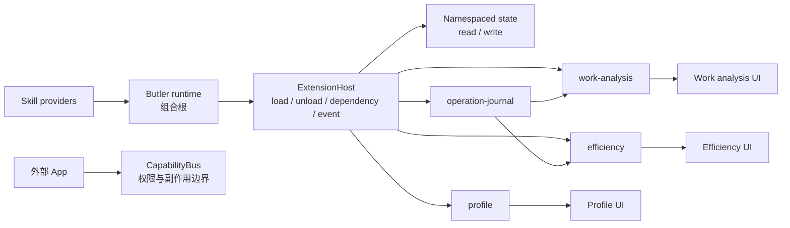
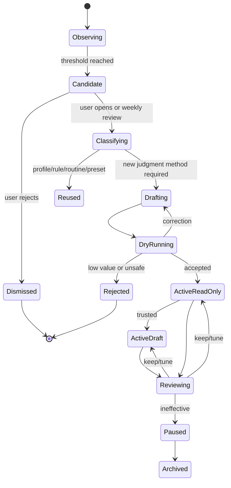

# RocketX Butler · 了解用户、工作分析与小 Skill 自我增益设计

> 文档状态：**已废弃**。旧 `Profile.md`、学习 Extension 和自建小 Skill 闭环已退出；当前只使用 Codex 原生 Memory 与 Skills/Plugins，见[Memory](specs/memory.md)和[Skills、Plugins 与 Apps](specs/skills-and-plugins.md)。
>
> 原记录状态：第一批能力已实现并完成 dogfooding
> 日期：2026-07-28
> 范围：Profile、工作分析、重复操作发现、小 Skill 提议、试跑和效果复盘。
> 上位设计：[持续在场的工作伙伴设计](butler-human-presence-system-design.md)

---

## 0. 结论

用户提出的三个方向应该成为第一批能力：

1. **了解用户**：维护一个用户可读、可改、持续变准的 `Profile.md`；
2. **提供工作分析**：用真实工作证据说明节奏、注意力损耗、开放环和协作阻塞；
3. **发现重复操作**：识别用户反复做的动作，判断应该写规则、建 Routine，还是生成一个小 Skill。

但需要增加第四、第五步，才能形成真正的产品闭环：

4. **先试跑再启用**：用历史实例验证建议是否真能节省工作；
5. **持续复盘**：看 Skill 是否被采用、经常被纠正、实际有没有减少步骤。

完整飞轮：

```text
Observe
  观察用户明确授权范围内的工作事实和语义化操作
      ↓
Understand
  形成 Profile 候选，不推断敏感人格
      ↓
Analyze
  输出有证据、可行动的工作洞察
      ↓
Discover
  找到稳定重复模式和摩擦点
      ↓
Classify
  判断应改 Profile / MemoryRule / Routine / Tool preset / Skill
      ↓
Design
  生成最小 Skill 或 Routine 草稿
      ↓
Dry Run
  用过去真实实例回放，显示命中、误判、风险和预计节省
      ↓
Adopt
  用户确认后以只读或草稿模式运行
      ↓
Review
  根据采纳、纠正、结果和节省调整、暂停或删除
      └──────────────────────→ 回到 Understand
```

这套能力的产品承诺不是“AI 越来越了解你”，而是：

> **Butler 能说清自己从哪里了解你、哪些只是候选；能从你的真实工作中找到摩擦，并把可重复的改进变成小而可靠的能力。**

第一批不能只有画像和分析。那会让 Butler 仍像一个分析机器人。首批必须同时启用一个直接节省操作的既有能力，推荐 `butler-reply-guardian`，让用户在第一周就经历：

```text
它观察到了我的工作方式
  → 给了一个我认可的分析
  → 发现一段重复操作
  → 生成一个小 Skill / Routine
  → 真的替我少做了几步
  → 我纠正后它下次做得更准
```

### 0.1 请优先审阅的五个决定

| 决定 | 推荐 | 置信度 |
|---|---|---|
| `Profile.md` 的地位 | 用户可读、可编辑投影；结构化 FactStore 是运行时事实源 | 高 |
| 行为观察范围 | 只记录 RocketX 语义操作，不记录键盘、鼠标、屏幕 | 高 |
| 首批 Skill | 7 个内部 micro Skill + reply-guardian 行动证明 | 中 |
| 重复操作去向 | Profile/Rule/Routine/Preset 优先，新 Skill 最后 | 高 |
| 观察结果更新 Profile | 一律先成为 candidate；显式用户输入才直接确认 | 高 |

详细的“什么会推翻这些决定”见 [§26](#26-最可能调整的决定)。

### 0.2 实现架构修订：Pi 风格的薄内核与可信扩展

第一批实现采用 Pi Agent 的分层思路，而不是把 Profile、分析和 Skill
形成逻辑继续堆进 Butler 页面或全局状态。参考：

- [Pi agent loop](https://github.com/badlogic/pi-mono/blob/main/packages/agent/src/agent-loop.ts)：
  内核只维持稳定的运行循环和工具执行；
- [Pi extensions](https://github.com/badlogic/pi-mono/blob/main/packages/coding-agent/docs/extensions.md)：
  业务能力通过扩展订阅事件、暴露命令并维护自己的状态；
- [Pi packages](https://github.com/badlogic/pi-mono/blob/main/packages/coding-agent/docs/packages.md)：
  可组合能力保持清晰的包边界。

RocketX 不照搬 Pi 的终端交互形态，只采用其最重要的结构约束：

> **内核只提供机制，不知道业务名词；能力拥有自己的领域模型、状态、事件处理和 UI。**



#### 内核唯一职责

- 校验扩展 ID 和依赖加载顺序；
- 加载、查找和逆序卸载可信内部扩展；
- 提供进程内事件分发；
- 为每个扩展提供独立状态命名空间；
- 隔离扩展激活、事件监听和清理错误。

#### 内核明确不负责

- 不认识 Profile、OperationReceipt、Insight、Routine 或 Skill；
- 不包含任何业务阈值、提示词、文件格式或 UI；
- 不直接访问 Rocket.Chat、日历、仓库或桌面文件；
- 不替代外部 App 的权限与副作用控制；
- 不规定扩展状态的业务 schema。

第一批可信内部扩展如下：

| 扩展 | 依赖 | 自有能力 |
|---|---|---|
| `rocketx.butler.operation-journal` | 无 | 记录隐私收敛后的语义操作回执 |
| `rocketx.butler.profile` | 无 | 管理 ProfileFact、投影/监听 `Profile.md` |
| `rocketx.butler.work-analysis` | operation-journal | 生成有证据的节奏、注意力与协作洞察 |
| `rocketx.butler.efficiency` | operation-journal | 发现重复模式、分流、预演并启用改进 |

`runtime.ts` 是唯一组合根：它选择要安装的扩展、注册 Skill provider，并在
Archive hydration 后发送 `host.storage-ready`。页面只消费扩展 API，不参与扩展
装配。外部、不可信或可能产生副作用的 App 仍必须走既有 `CapabilityBus`，
不能借内部扩展宿主绕过授权。

为防止架构腐化，回归测试会扫描内核源码，确保 Profile、Routine、Skill 等业务
名词不会回流到 `kernel/butlerExtensions.ts`。增加下一批能力时，默认答案应是
“新增一个扩展或资源 provider”，而不是修改内核。

---

## 1. 现状前提核对

### 1.1 实现前基线中 `Profile.md` 并不存在

实现前基线是：

- persona 存在 Butler profile storage；
- persona 被镜像进 Butler 工作区的 `AGENTS.md`；
- 活动长期记忆独立存储为 Memory V2 JSON；
- Skill 被镜像到 `.agents/skills/<name>/SKILL.md`；
- 当前 workspace writer 只创建 `memory/`、`.agents/`、`.agents/skills/` 和 `scratch/`；
- 没有 `Profile.md` 的 renderer、parser、版本、来源或同步机制。

所以本批实现不是“让模型持续修改一个既有 Profile.md”，而是正式引入一个新的产品对象和文件投影。

### 1.2 `AGENTS.md`、`Profile.md`、Memory 不能混用

| 对象 | 回答的问题 | 示例 |
|---|---|---|
| `AGENTS.md` | Butler 应怎样工作、遵守什么宿主边界 | 业务事实只能来自工具；写动作要审批 |
| `Profile.md` | 用户是谁、长期职责、偏好和稳定工作方式 | 时区、关键角色、沟通与注意力偏好 |
| `MemoryRule` | 某种具体场景以后应如何处理 | CI 分析忽略测试分支 |
| `Situation/Task` | 当前正在发生什么、谁欠谁什么 | PR #248 正等 review |
| `Run` | 某一次实际做了什么 | 10:30 检查并排除 2 条 FYI |

动态 PR、构建、日程和待办不能写进 Profile；Butler 的系统行为也不能写进用户 Profile。

### 1.3 当前 Skill 能力还不足以承担自我增益

当前 Skill 主要是 `name + description + body`，适合承载方法说明，但缺少：

- 结构化输入输出合同；
- ProfilePatch / WorkInsight / RepetitionCandidate schema；
- 所需来源与 Effect；
- 状态、版本和 verifier；
- 历史 fixture 和 Dry Run；
- 运行效果指标；
- Skill 之间的复用/替代判断。

因此“自动生成小 Skill”必须以 [持续在场设计中的 `butler.skill.json` 合同](butler-human-presence-system-design.md#8-skillroutinetoolsensor-的正式边界) 为前提，不能只往 Skill 列表里塞一段新 Markdown。

---

## 2. 产品原则

### 2.1 了解用户，不监视用户

允许观察：

- 用户明确告诉 Butler 的事实和偏好；
- 用户对 Butler 结果的接受、修改、拒绝和纠正；
- RocketX 内部产生的语义化操作回执；
- 用户授权范围内的消息、日历、Task、PR、构建状态；
- Skill/Routine 的运行与结果。

默认不观察：

- 全局键盘输入；
- 原始鼠标轨迹；
- 屏幕录制；
- 非 RocketX 应用的使用历史；
- 未授权房间、账号或仓库；
- 为画像目的无边界扫描私人消息；
- 与工作改进无关的敏感个人属性。

### 2.2 分析工作，不评价人格

允许说：

- “过去两周，你有 6 个承诺在下午 4 点后形成，其中 3 个顺延。”
- “你通常在晨会后连续检查 @消息、PR 和失败构建。”
- “这三类 review 等待平均占用了交付周期的 38%。”

禁止说：

- “你是一个拖延的人。”
- “你的工作效率只有 62 分。”
- “王五不积极。”
- “你周二情绪低落。”
- “消息少的人贡献低。”

结论描述工作系统和可改变的行为，不给人贴稳定心理或绩效标签。

### 2.3 先复用，再生成

发现重复操作后的判定顺序必须固定：

```text
这是一次性任务？
  └─ 是 → Task，不建 Skill

只是稳定偏好？
  └─ 是 → Profile / MemoryRule

已有 Skill，只是触发、范围或时间不同？
  └─ 是 → 新建或修改 Routine

只是确定性的工具参数组合？
  └─ 是 → Tool preset / saved view

需要反复使用一套独立判断方法？
  └─ 是 → 提议新 micro Skill
```

“生成 Skill”是最后一步，不是默认答案。

### 2.4 小 Skill 必须真的小

一个 micro Skill 只有同时满足以下条件才成立：

- 只承诺一个明确结果；
- 最多读取 1–3 类来源；
- 有自己的最高成本错误；
- 有清楚的沉默条件；
- 默认 Effect 不超过 Draft；
- 可用 10–30 个历史实例验证；
- 与现有 Skill 不重叠；
- 正文目标小于 150 行；
- references 只放复杂判断表，不复制大段通用规则；
- 可单独停用和回退。

不满足这些条件，优先做 Routine、规则或现有 Skill 的参数化。

### 2.5 学习必须可见、可改、可撤销

任何长期改变都必须回答：

- Butler 学到了什么？
- 从哪些证据得出？
- 是事实、偏好，还是候选？
- 作用于哪里？
- 哪些地方明确不适用？
- 用户如何修改、删除或撤销？
- 哪些 Skill 正在使用它？

---

## 3. 第一批产品链路

### 3.1 首次使用

```text
连接 Rocket.Chat / 日历 / ADO
  → 用户选择可用于“了解我”的来源和时间范围
  → 读取明确身份元数据、用户发出的工作消息和语义操作回执
  → 生成 Profile v0 草稿
  → 展示“确认的”“候选的”“不会记录的”
  → 用户 2 分钟内完成纠正
  → Profile v1 生效
  → 用最近 7–14 天生成最多 3 条工作洞察
  → 找到最多 1 个重复模式候选
  → 展示它应成为规则、Routine 还是 Skill
  → 用户选择试跑
  → 历史回放
  → 启用只读/草稿模式
```

如果数据不足：

```text
我现在只确认了你的时区、角色和两个明确偏好。
工作节奏还需要至少 3 个工作日的证据，我不会先给一份通用人格分析。

这几天我会只记录 RocketX 内部的语义操作，不记录键盘、鼠标或屏幕。
```

### 3.2 日常增益

```text
用户工作
  → OperationReceipt
  → 重复模式增量更新
  → 达到候选阈值
  → 不立即打断
  → 周度“我观察到一个可以省步骤的地方”
  → 用户查看 3 个真实实例
  → 选择“试跑 / 忽略 / 这不是同一类”
  → Dry Run
  → 启用
  → 5 次有效 Run 后效果复盘
```

### 3.3 纠正闭环

```text
Butler：“你通常在晨会后检查 @消息、待 review PR 和失败构建。
         要不要做成一个‘晨会后交付检查’？”

用户：“PR 只看分配给我的，不看我自己开的。”

系统：
  → 立即修正 RepetitionCandidate
  → 判断这是 Routine scope，不是全局 Profile
  → 重新回放过去实例
  → 显示命中从 12 项降为 5 项、误报从 4 降为 0
  → 用户确认后保存 specVersion 2
```

---

## 4. `Profile.md` 产品合同

### 4.1 双层结构

推荐：

```text
ProfileFactStore
  = 运行时事实源，保存 ID、类型、证据、作用域、状态和版本

Profile.md
  = 用户可读、可编辑的当前投影，供 Butler 和用户共同查看
```

不建议让任意 Markdown 成为唯一运行时数据库。原因：

- 无法可靠表示来源、冲突、候选和撤销；
- 模型或用户编辑容易破坏结构；
- 并发更新和版本迁移困难；
- 无法按 Skill 做最小 ProfileSlice；
- 敏感字段和动态事实难以执行确定性限制。

`Profile.md` 仍然是产品上的“我的 Profile”，但运行时只使用通过 schema 校验的事实。

### 4.2 数据模型

```ts
type ProfileFactKind =
  | 'identity'
  | 'role'
  | 'responsibility'
  | 'relationship'
  | 'communication'
  | 'work-rhythm'
  | 'attention'
  | 'decision-style'
  | 'tool-habit'
  | 'automation-boundary'
  | 'explicit-exclusion';

type ProfileFactStatus =
  | 'candidate'
  | 'confirmed'
  | 'contested'
  | 'stale'
  | 'superseded'
  | 'revoked';

interface ProfileFact {
  id: string;
  kind: ProfileFactKind;
  subject: string;
  value: string;
  scope: {
    global?: boolean;
    accountId?: string;
    roomId?: string;
    repositoryId?: string;
    personKey?: string;
    skillName?: string;
  };
  status: ProfileFactStatus;
  confidence: number;
  evidenceRefs: SourceRef[];
  origin:
    | 'explicit-user'
    | 'profile-ui-edit'
    | 'external-file-edit'
    | 'accepted-correction'
    | 'connected-metadata'
    | 'observed-pattern';
  firstSeenAt: number;
  lastConfirmedAt?: number;
  lastEvidenceAt: number;
  reviewAt?: number;
  version: number;
}
```

### 4.3 `Profile.md` 结构

```markdown
# 我的工作 Profile

> 最后更新：2026-07-28 16:30
> 已确认 18 项 · 候选 2 项 · 待复核 1 项

## 我是谁

- 时区：Asia/Shanghai
- 角色：RocketX 产品与工程负责人

## 我的长期职责

- 负责 RocketX 的版本质量和发布结果。
- 重要发布必须核对 CI、产物、SHA256、Latest 和 registry。

## 重要的人与协作关系

- 王五：核心 reviewer；普通 review 合理等待窗口为 2 个工作日。

## 我的沟通方式

- 默认使用中文，先给结论。
- 回复草稿尽量短，保留事实来源。

## 我的工作节奏

- 工作日 08:30 开始整理当天工作。
- 会议密集时，非紧急提醒延后到下一个空档。

## 我的注意力偏好

- 实时只打断明确阻塞或发布风险。
- 普通 @消息汇入“今日”。

## 我的工具与习惯

- 发布判断以仓库和公开 Release 事实为准。

## 自动化边界

- 回复可以自动起草，但默认不能自动发送。
- 发布动作必须通过仓库门禁。

## 明确不记录或不推断

- 不根据消息量评价个人绩效。
- 不推断情绪、健康、政治、宗教或其他敏感属性。
```

`Profile.md` 只呈现 confirmed 事实。candidate、contested 和 stale 在 UI 的“待确认”区域展示，不混入正文制造既成事实。

### 4.4 更新来源与策略

| 来源 | 默认处理 | 例子 |
|---|---|---|
| 用户明确陈述 | 直接形成 confirmed patch，可撤销 | “以后都用中文回复” |
| RocketX Profile 编辑器 | 作为 profile-ui-edit patch，校验后直接生效 | 修改工作时间 |
| 外部编辑 Profile.md | 作为 external-file-edit candidate，用户确认后生效 | 编辑器/Agent/其他进程修改 |
| 用户纠正 Butler | 先修当前结果，再提议作用域 | “测试分支不用报” |
| 连接账号元数据 | candidate 或首次引导确认 | 姓名、时区、角色 |
| 重复稳定行为 | candidate，不自动写入 | 连续两周下午才处理 review |
| 单次行为 | 不更新 | 今天临时晚下班 |
| 动态业务状态 | 永不进入 | PR #248 正在 review |
| 敏感推断 | 拒绝 | 情绪、健康、宗教、绩效人格 |

### 4.5 ProfilePatch

```ts
interface ProfilePatch {
  id: string;
  operations: Array<
    | { op: 'add'; fact: ProfileFact }
    | { op: 'replace'; factId: string; next: ProfileFact }
    | { op: 'revoke'; factId: string; reason: string }
  >;
  summary: string;
  evidenceRefs: SourceRef[];
  proposedBy: 'user' | 'butler-profile-curator';
  requiresConfirmation: boolean;
  createdAt: number;
}
```

规则：

1. 显式用户陈述和 RocketX Profile 编辑器修改可立即生效；
2. 行为观察和外部文件修改产生的 patch 必须确认；
3. 删除或扩大作用域必须展示 diff；
4. 冲突不做 last-write-wins，而是进入 contested；
5. 每个 patch 可撤销；
6. Profile renderer 原子写入；
7. 每次运行记录读取的 Profile version。

### 4.6 直接编辑 `Profile.md`

```text
用户修改 Profile.md
  → 文件 watcher 读取 diff
  → 只解析受支持章节和列表
  → 形成 origin=external-file-edit 的 ProfilePatch
  → schema / 敏感字段 / 动态事实校验
  → 在 RocketX 中显示具体 diff 和写入来源，等待用户确认
  → 用户确认后写入 FactStore，重渲染规范格式
  → 有歧义：在 UI 显示一条具体问题
  → 不支持字段：保留用户原文到“自定义备注”，不让模型猜类型
```

RocketX Profile 编辑器中的用户操作具有最高事实权威。外部文件变化无法可靠区分是用户、Agent
还是其他进程写入，因此默认只是候选；用户确认后才获得同等权威。任何文件编辑都不能借此改变宿主
安全策略，例如在 Profile 写“允许自动发布”不能绕过 Effect Policy 和仓库门禁。

### 4.7 ProfileSlice

Skill 不默认读取完整 Profile：

```ts
interface ProfileSliceRequest {
  skillName: string;
  factKinds: ProfileFactKind[];
  scopes: string[];
  reason: string;
}
```

例：

- `reply-guardian` 读取 communication、relationship、attention；
- `work-rhythm-analyzer` 读取 work-rhythm、attention；
- `release-guardian` 读取 responsibility、automation-boundary、explicit-exclusion；
- 不相关 Skill 不能读取全部重要联系人和其他账号信息。

---

## 5. OperationReceipt：只记录有意义的操作

### 5.1 为什么不能用原始点击流

原始点击、键盘和鼠标轨迹：

- 噪声大；
- 隐私风险高；
- 跨版本 UI 不稳定；
- 很难判断用户意图；
- 容易把探索、误点和真实流程混为一谈。

第一批只记录 RocketX 已经知道语义的动作结果：

```ts
type OperationKind =
  | 'open-source'
  | 'search'
  | 'filter'
  | 'compare'
  | 'summarize'
  | 'create-draft'
  | 'edit-draft'
  | 'approve'
  | 'reject'
  | 'create-task'
  | 'update-task'
  | 'run-skill'
  | 'run-routine'
  | 'run-command'
  | 'verify'
  | 'send'
  | 'publish';

interface OperationReceipt {
  id: string;
  actor: 'user' | 'butler';
  kind: OperationKind;
  intentKey?: string;
  targetKind: string;
  targetScope: string;
  parameterShape: string;
  startedAt: number;
  completedAt?: number;
  outcome: 'completed' | 'cancelled' | 'failed' | 'uncertain';
  effect: 'E0' | 'E1' | 'E2' | 'E3' | 'E4' | 'E5' | 'E6';
  sourceRefs: SourceRef[];
  sessionId?: string;
  taskId?: string;
  userCorrection?: string;
}
```

`parameterShape` 只保存可聚类形状，不保存凭据、消息全文或敏感输入。例如：

```text
search: messages + room-scope + last-24h
compare: pull-request + two-ids
draft: rocket-chat-reply + internal-room
```

### 5.2 序列

```ts
interface OperationSequence {
  id: string;
  receiptIds: string[];
  startedAt: number;
  endedAt: number;
  contextKey: string;
  outcome?: string;
}
```

序列边界：

- 同一 Task/Session；
- 30 分钟内连续；
- 目标实体相关；
- 用户切换到不相关目标时结束；
- 只保留语义步骤，不保留光标移动。

### 5.3 用户控制

用户可以：

- 查看最近记录的语义操作；
- 暂停“发现重复操作”；
- 排除某个账号、房间、仓库或时间段；
- 删除操作历史；
- 保留 Profile 但删除操作分析；
- 选择只在本地分析；
- 禁止某类高敏 Effect 进入模式发现。

---

## 6. WorkInsight：工作分析不是一份大报告

### 6.1 数据模型

```ts
type WorkInsightKind =
  | 'rhythm'
  | 'attention-friction'
  | 'open-loop-health'
  | 'collaboration-bottleneck'
  | 'repetition-opportunity';

interface WorkInsight {
  id: string;
  kind: WorkInsightKind;
  title: string;
  observation: string;
  evidenceRefs: SourceRef[];
  window: {
    from: number;
    to: number;
  };
  sampleSize: number;
  confidence: number;
  impact: {
    kind: 'time' | 'attention' | 'delay' | 'risk';
    estimate?: string;
    explanation: string;
  };
  alternatives: string[];
  suggestedExperiment?: {
    title: string;
    durationDays: number;
    successMeasure: string;
  };
  status:
    | 'candidate'
    | 'shown'
    | 'accepted'
    | 'dismissed'
    | 'experimenting'
    | 'validated'
    | 'rejected';
}
```

### 6.2 展示合同

每次最多 3 条：

```text
你在晨会后重复做一轮交付检查

过去 10 个工作日里，有 7 天在晨会结束后 30 分钟内，
你依次查看 @消息、待 review PR 和失败构建。

可能的改进
把它做成一个 9:45 的“晨会后交付检查”，只给你真正需要动作的项目。

依据：7 个操作序列 · 3 个数据来源
[看实例] [试跑一次] [这不是同一类] [不再分析这个]
```

每条必须包含：

- 可证伪的观察；
- 时间范围和样本量；
- 为什么可能有价值；
- 不是唯一解释时列出替代解释；
- 一个最小实验，而不是永久改变；
- 来源和隐私范围；
- 拒绝与不再分析入口。

### 6.3 冷启动

冷启动不生成“通用效率建议”。最低证据：

- 节奏洞察：至少 5 个工作日；
- 注意力摩擦：至少 20 个语义操作、3 个不同工作日；
- 协作阻塞：至少 5 个可闭环开放环；
- 重复序列：至少 3 次、跨 2 个不同日期；
- 高风险动作：即使重复，也只提示流程改进，不建议自动执行。

---

## 7. 第一批小 Skill 总览

建议第一批交付 7 个内部 micro Skill，并复用 `butler-reply-guardian` 作为用户可直接感知的行动 Skill：

| # | Skill | 单一结果 | 默认 Effect |
|---:|---|---|---|
| M1 | `butler-profile-curator` | 生成有证据的 ProfilePatch | E1，观察候选需确认 |
| M2 | `butler-work-rhythm-analyzer` | 找到稳定工作节奏与时间冲突 | E0/E1 |
| M3 | `butler-attention-friction-analyzer` | 找到重复切换、重查和被打断的摩擦 | E0/E1 |
| M4 | `butler-collaboration-loop-analyzer` | 找到承诺、等待和协作交接的系统性阻塞 | E0/E1 |
| M5 | `butler-repetition-miner` | 产出稳定重复模式候选 | E1 |
| M6 | `butler-micro-skill-designer` | 将候选分类并生成最小 Routine/Skill 草稿 | E2 |
| M7 | `butler-skill-effectiveness-reviewer` | 判断已启用 Skill 应保留、调整、降级或停用 | E1/E2 |
| Proof | `butler-reply-guardian` | 直接减少漏回复与反复检查 | E2 |

这些 Skill 不各自调度。Profile refresh、周度分析和重复模式扫描都是 Routine 实例。

---

## 8. M1：`butler-profile-curator`

### 8.1 合同

| 项 | 定义 |
|---|---|
| 输入 | 显式用户陈述、纠正、连接元数据、稳定模式候选、当前 Profile |
| 输出 | ProfilePatch 或 silent |
| 必需读取 | 当前 ProfileFact、候选证据 |
| 写入 | 只能提出/应用结构化 ProfilePatch |
| 默认 | 用户明确陈述可直接确认；观察模式必须确认 |
| 最高成本错误 | 把一次行为或敏感推断写成稳定用户事实 |
| 沉默 | 无新稳定证据、只是动态业务状态、与现有事实重复 |

### 8.2 `SKILL.md` 草案

```markdown
---
name: butler-profile-curator
description: Use when RocketX must turn explicit user statements, accepted corrections, connected metadata, or stable observed work patterns into a scoped ProfilePatch. Do not use for current tasks, PR/build status, psychological or sensitive inference, or changing host permissions.
---

# 用户 Profile 策展

## Promise

只把稳定、长期有用且有来源的用户事实与偏好提议到 Profile。
动态工作状态进入 Situation/Task，具体行为规则优先进入 MemoryRule/Routine。

## Highest-cost mistakes

1. 把一次行为写成长期习惯。
2. 推断情绪、健康、政治、宗教、绩效或人格。
3. 将一个账号/房间偏好扩大为全局。
4. 覆盖用户直接编辑或明确确认的事实。
5. 用 Profile 文本扩大工具权限或自动化 Effect。

## Workflow

1. Classify source：explicit-user / profile-ui-edit / external-file-edit / correction / metadata / observed-pattern。
2. Reject forbidden content：动态事实、敏感推断、无来源评价。
3. Choose destination：ProfileFact / MemoryRule / Routine override / no-op。
4. Check scope：全局、账号、房间、仓库、联系人或 Skill。
5. Compare current Profile：重复则 silent；冲突则 contested，不覆盖。
6. Build ProfilePatch：说明新增、替换或撤销，附证据和复核时间。
7. Set confirmation：
   - explicit-user / file edit：可直接生效；
   - observed-pattern / metadata：必须确认。

## Evidence

行为模式至少跨 3 个不同日期，且只作为候选。
用户直接陈述优先级最高，但不能改宿主安全边界。

## Silence policy

没有长期价值、只有单次事件、与现有事实重复或来源不足时 silent。

## Output

只输出结构化 ProfilePatch、拒绝原因或 silent；不要重写整个 Profile.md。

## Corrections

用户撤销后生成 revoke patch，并检查哪些 Skill 使用该事实；不删除历史审计。
```

### 8.3 例子

| 输入 | 结果 |
|---|---|
| “以后都用中文回复” | confirmed communication fact |
| 连续 7 天 18:30 后处理 review | work-rhythm candidate，需确认 |
| 今天下午临时不开会 | 不进 Profile |
| “测试分支 CI 不用报” | Routine/MemoryRule，不是全局 Profile |
| 模型认为用户焦虑 | 拒绝 |
| RocketX Profile 编辑器将工作时间改为 10:00–19:00 | profile-ui-edit confirmed patch |
| 外部进程修改 Profile.md | external-file-edit candidate，需用户确认 |

---

## 9. M2：`butler-work-rhythm-analyzer`

### 9.1 合同

| 项 | 定义 |
|---|---|
| 输入 | 日历、Task/Situation 时间、OperationReceipt、工作时段 ProfileSlice |
| 输出 | 最多 3 个 rhythm WorkInsight |
| 必需读取 | 至少 5 个工作日 |
| 默认 Effect | 只读分析；实验建议 |
| 最高成本错误 | 把短期异常当稳定节奏，或强加“最佳工作时间” |
| 沉默 | 数据不足、假期/事故周、没有可行动差异 |

### 9.2 `SKILL.md` 草案

```markdown
---
name: butler-work-rhythm-analyzer
description: Use when RocketX must analyze calendar, task timing, open-loop events, and semantic operation receipts to find stable work rhythms, timing conflicts, or better contact windows. Do not use for productivity scoring, personality claims, single-day conclusions, or changing the user's schedule automatically.
---

# 工作节奏分析

## Promise

发现“什么时候做什么、什么节奏经常冲突”，给出可验证的小实验。

## Highest-cost mistakes

1. 用一天或异常周推断稳定习惯。
2. 把日历占用等同于有效工作。
3. 忽略时区、假期、值班和明确特殊事件。
4. 给出通用早起、番茄钟等无证据建议。
5. 自动修改日历。

## Workflow

1. Establish window：默认最近 10 个工作日，排除假期和异常标记。
2. Build rhythm facts：会议密度、开放环形成/兑现时间、语义操作分布。
3. Compare days：要求跨日期重复，不只看总量。
4. Find friction：承诺形成太晚、会议与交付冲突、重复检查窗口等。
5. Test alternatives：至少列一个其他解释。
6. Propose experiment：持续 5–10 个工作日，有清楚成功指标。
7. Limit：最多 3 条，无强洞察则 silent。

## Evidence

每条写样本量、时间窗、来源和置信度。不得推断精力或情绪。

## Effect policy

只能分析和提议。创建日历块、提醒或 Routine 需用户确认。

## Output

WorkInsight(kind=rhythm)，包含 observation、evidence、alternative、experiment。
```

### 9.3 可产生的洞察

- 会议日的承诺顺延明显增加；
- 用户固定在晨会后做一轮交付检查；
- 下午 4 点后形成的外部承诺兑现率下降；
- 周五发布检查经常与其他会议冲突；
- 用户的自然处理窗口与当前提醒时间不匹配。

---

## 10. M3：`butler-attention-friction-analyzer`

### 10.1 合同

| 项 | 定义 |
|---|---|
| 输入 | OperationSequence、通知/介入记录、Task 切换、重复读取 |
| 输出 | attention-friction WorkInsight |
| 必需读取 | 至少 20 个语义操作、3 个工作日 |
| 默认 Effect | 只读；建议合并、静默或快捷入口 |
| 最高成本错误 | 把必要核对当浪费，或用原始点击监视用户 |
| 沉默 | 样本不足、序列目的不同、预估节省不足 |

### 10.2 `SKILL.md` 草案

```markdown
---
name: butler-attention-friction-analyzer
description: Use when RocketX must identify repeated context switching, duplicate checking, re-searching, or Butler interruptions from semantic operation receipts. Do not use raw keystrokes, mouse tracking, screen capture, employee monitoring, or infer mental state.
---

# 注意力摩擦分析

## Promise

找出可以通过汇聚、保留上下文或减少重复检查来降低的操作摩擦。

## Highest-cost mistakes

1. 将必要验证标成无效重复。
2. 将相似目标但不同意图合并。
3. 依赖原始点击、键盘或屏幕数据。
4. 把“切换多”解释为注意力缺陷。
5. 为小收益制造新的自动化负担。

## Workflow

1. Read semantic sequences only。
2. Group by intentKey、targetKind、scope 和 outcome。
3. Distinguish verification from accidental repeat。
4. Measure repeat count、re-search、context rebuild 和 Butler interruption。
5. Estimate conservative saving，包含设置/检查成本。
6. Propose one smallest change：saved view、Routine、context carry-over 或 micro Skill。
7. Require examples from at least 3 occurrences。

## Evidence

说明哪些步骤重复、为何认为意图相同、哪些例子不纳入。

## Silence policy

目的不同、必要验证、收益低于配置成本或证据不足时 silent。

## Output

WorkInsight(kind=attention-friction)，不得给用户或同事做效率评分。
```

### 10.3 可产生的洞察

- 每天多次重新查询同一组 mentions；
- 从消息切到 ADO 后需要重新搜索同一个 PR；
- Butler 对同一 Situation 在多个表面重复提醒；
- 用户反复把相同结果复制成相同格式的回复；
- 每次发布都重新拼一份相同的门禁检查列表。

---

## 11. M4：`butler-collaboration-loop-analyzer`

### 11.1 合同

| 项 | 定义 |
|---|---|
| 输入 | 已确认承诺、waiting-on、decision、PR/Work Item 状态 |
| 输出 | open-loop-health / collaboration-bottleneck WorkInsight |
| 必需读取 | 至少 5 个有闭环结果的开放环 |
| 默认 Effect | 只读；建议调整等待窗口或守护 |
| 最高成本错误 | 将个人归责给错误的人，或把少量延迟当团队问题 |
| 沉默 | 样本不足、来源不完整、无法区分系统等待与人员等待 |

### 11.2 `SKILL.md` 草案

```markdown
---
name: butler-collaboration-loop-analyzer
description: Use when RocketX must analyze confirmed commitments, waiting relationships, decisions, pull requests, and work items to find recurring handoff or closure bottlenecks. Do not use for individual performance evaluation, blame assignment, or age-only conclusions.
---

# 协作开放环分析

## Promise

分析“事情在哪个交接点反复停住”，提出流程改进，不评价个人。

## Highest-cost mistakes

1. 把系统等待、排期或休假归责给个人。
2. 把 PR 年龄直接解释为 review 问题。
3. 用聊天活跃度评价贡献。
4. 忽略已形成但未关联的完成证据。
5. 从未授权私聊输出团队结论。

## Workflow

1. Use confirmed OpenLoops only。
2. Split lifecycle：request → accepted → progress → delivered → accepted/closed。
3. Measure dwell time by stage，不按人排名。
4. Reconcile messages with engineering fact systems。
5. Find repeated stage bottlenecks across at least 5 loops。
6. State coverage gaps and alternative explanations。
7. Propose a process or Butler guardrail experiment。

## Evidence

每个结论必须能回到开放环和来源。不能写“某人慢”，只能写“review acceptance 到 first review 的等待占比”。

## Effect policy

只分析和提出实验。改变分派、提醒他人或团队流程需用户决定。

## Output

WorkInsight(kind=open-loop-health or collaboration-bottleneck)。
```

### 11.3 可产生的洞察

- 请求发出后经常缺少明确接受，导致“以为有人接了”；
- 决策已形成但 Work Item 建立平均延后两天；
- PR 在 CI 通过后才开始找 reviewer；
- 交付完成后没有通知债权人，承诺一直保持开放；
- 失败构建恢复后相关 Task 没有自动闭环。

---

## 12. RepetitionCandidate：什么才算值得提效的重复

### 12.1 数据模型

```ts
type ImprovementDestination =
  | 'task'
  | 'profile'
  | 'memory-rule'
  | 'routine'
  | 'tool-preset'
  | 'micro-skill'
  | 'no-op';

interface RepetitionCandidate {
  id: string;
  patternKey: string;
  title: string;
  intent: string;
  sequenceShape: string[];
  exampleSequenceIds: string[];
  occurrenceCount: number;
  distinctDays: number;
  firstSeenAt: number;
  lastSeenAt: number;
  regularity: number;
  parameterStability: number;
  outcomeConsistency: number;
  exceptionRate: number;
  estimatedManualSeconds: number;
  estimatedSavingSeconds: number;
  maxObservedEffect: 'E0' | 'E1' | 'E2' | 'E3' | 'E4' | 'E5' | 'E6';
  confidence: number;
  recommendedDestination?: ImprovementDestination;
  existingSkillMatches: Array<{
    skillName: string;
    match: number;
    reusableParts: string[];
  }>;
  status:
    | 'forming'
    | 'candidate'
    | 'shown'
    | 'dismissed'
    | 'designing'
    | 'dry-running'
    | 'adopted'
    | 'rejected'
    | 'expired';
}
```

### 12.2 候选阈值

必须同时满足：

- 至少 3 次；
- 至少跨 2 个不同日期；
- 序列意图与主要目标一致；
- 结局一致或可解释；
- 预计累计节省大于设置、检查和维护成本；
- 例外率低于 30%，否则先分析例外；
- 至少有 3 个可展示实例；
- 没有包含凭据或不允许建模的数据。

展示频率：

- 默认每周最多 1 个提效建议；
- 用户主动打开“工作分析”可看更多候选；
- 被拒绝后 30 天内不以相同 patternKey 重提；
- 出现本质新证据或用户主动询问时可重新打开。

### 12.3 保守价值评分

宿主计算候选排序，不由模型自由打分：

```text
grossValue =
  occurrenceCount
  × conservativeManualTime
  × parameterStability
  × outcomeConsistency

cost =
  setupTime
  + reviewTime
  + expectedExceptionCost
  + maintenanceCost
  + effectRiskCost

candidateValue = grossValue - cost
```

模型可以解释每项证据，不能私自改变风险权重。

高风险动作处理：

- E0–E2：可建议 Routine / Skill + Dry Run；
- E3：可建议，但启用前需明确内部状态变化；
- E4：默认只生成草稿；
- E5：只建议诊断、diff 或命令计划，不自动执行；
- E6：可以发现重复发布检查，但不能建议跳过发布门禁或自动授权。

---

## 13. M5：`butler-repetition-miner`

### 13.1 合同

| 项 | 定义 |
|---|---|
| 输入 | OperationSequence、Run history、Skill/Routine registry |
| 输出 | RepetitionCandidate 或 silent |
| 必需读取 | 至少 3 个可比序列、当前隐私设置 |
| 默认 Effect | E1，建立私有候选 |
| 最高成本错误 | 把相似外观、不同意图的操作错误合并 |
| 沉默 | 一次性、例外多、收益低、已有 Routine、敏感范围 |

### 13.2 `SKILL.md` 草案

```markdown
---
name: butler-repetition-miner
description: Use when RocketX must determine whether semantic operation sequences represent a stable repeated intent worth improving. Do not use raw clicks, keystrokes, screen capture, one-off work, sensitive content, or create a Skill directly.
---

# 重复操作发现

## Promise

从语义化操作中找到真正重复的意图，保留实例与例外，不直接生成或启用自动化。

## Highest-cost mistakes

1. 只因步骤相似就合并不同意图。
2. 忽略参数、目标、结果和例外差异。
3. 把探索、排错或事故响应当日常流程。
4. 重复建议已有 Routine 正在承担的工作。
5. 从敏感或未授权范围提取模式。

## Workflow

1. Filter eligible receipts by privacy and scope。
2. Build sequences by Task/Session/entity continuity。
3. Cluster by intentKey、sequence shape、target kind、parameter shape。
4. Split clusters when outcomes or exceptions differ。
5. Compare existing Skills、Routines、rules and presets。
6. Compute evidence fields；宿主提供价值与风险分数。
7. Produce at most one candidate with three representative examples。

## Evidence

至少 3 次、跨 2 天。说明纳入和排除的实例，保留相反证据。

## Silence policy

一次性、事故周、例外率高、已有能力覆盖、收益低或作用域敏感时 silent。

## Effect policy

只能建立私有 RepetitionCandidate；不能创建 Skill、Routine、规则或外部动作。

## Output

说明重复的意图、步骤、实例、差异、预计节省、风险和可能目的地。
```

### 13.3 正反例

正例：

```text
7 个工作日晨会后：
  查 @我的消息
  → 查待我 review PR
  → 查失败构建
  → 给自己排前三件
```

反例：

```text
三次都打开构建日志：
  第一次是诊断类型错误
  第二次是验证网络超时
  第三次是发布审计

外观相似，意图不同，不应形成一个 Skill。
```

---

## 14. M6：`butler-micro-skill-designer`

### 14.1 合同

| 项 | 定义 |
|---|---|
| 输入 | RepetitionCandidate、现有 Profile/Rule/Routine/Skill registry、Tool contracts |
| 输出 | ImprovementProposal；必要时 SkillDraft |
| 默认 Effect | E2，仅生成草稿与历史回放配置 |
| 最高成本错误 | 为每个重复模式新建 Skill，造成能力重叠和权限膨胀 |
| 沉默/拒绝 | 已有能力可配置、收益不足、无法可靠验证、Effect 过高 |

### 14.2 分类器

```ts
interface ImprovementProposal {
  id: string;
  candidateId: string;
  destination: ImprovementDestination;
  reason: string;
  reuse?: {
    skillName?: string;
    routineId?: string;
    profileFactIds?: string[];
    memoryRuleIds?: string[];
  };
  proposedDiff: Record<string, unknown>;
  skillDraft?: {
    name: string;
    description: string;
    skillMarkdown: string;
    manifest: Record<string, unknown>;
    fixturePlan: string[];
  };
  dryRun: {
    exampleSequenceIds: string[];
    expectedOutputs: string[];
    forbiddenEffects: string[];
  };
  status: 'draft' | 'ready-for-dry-run' | 'rejected';
}
```

分类规则：

| 模式 | 目的地 |
|---|---|
| 用户明确长期偏好 | Profile |
| 某 Skill 的具体排除/包含 | MemoryRule / Routine override |
| 已有方法，只缺时间与范围 | Routine |
| 一组固定参数或视图 | Tool preset |
| 一次性目标 | Task |
| 独立、可复用的判断方法 | micro Skill |
| 收益低/风险高/证据不足 | no-op |

### 14.3 `SKILL.md` 草案

```markdown
---
name: butler-micro-skill-designer
description: Use when RocketX has a validated RepetitionCandidate and must decide whether it belongs in Profile, MemoryRule, Routine, Tool preset, Task, or a new micro Skill, then produce the smallest reviewable draft. Do not install, enable, or expand permissions.
---

# 小 Skill 设计

## Promise

优先复用现有能力；只有独立判断方法反复出现时才设计一个最小 Skill。

## Highest-cost mistakes

1. 为每个候选生成新 Skill。
2. 复制现有 Skill，只改名称或时间。
3. 把触发、范围或参数写死进 SKILL.md。
4. 在 Skill 文本中扩大工具或 Effect。
5. 没有 fixture 和 verifier 就建议启用。

## Workflow

1. Restate the repeated intent and highest-cost error。
2. Search existing Profile facts、MemoryRules、Routines、Skills and tool presets。
3. Classify destination using the fixed order。
4. If reusing：produce the smallest config diff。
5. If micro Skill：
   - one outcome；
   - 1–3 source kinds；
   - explicit exclusions and silence；
   - default effect <= Draft；
   - typed output and verifier；
   - no schedule/scope/permission in Markdown；
   - fixtures from real examples and negatives。
6. Prepare Dry Run over historical examples。
7. Show why a new Skill is necessary and what existing ability was rejected。

## Effect policy

Only produce ImprovementProposal and draft files in an Artifact.
Installation, Routine activation, Profile changes, and permissions require separate confirmation.

## Output

Return destination, reuse decision, proposed diff, rejected alternatives, Dry Run plan, and if needed SKILL.md + manifest drafts.
```

### 14.4 示例：不生成新 Skill

重复模式：

```text
每天 8:30 执行 morning-brief，但只想看 #研发 和 ADO Project X。
```

结论：

```text
destination=routine
reuse=butler-daily-focus
diff=trigger 08:30 + scope rooms/project
```

### 14.5 示例：生成新 micro Skill

重复模式：

```text
每次收到客户兼容性问题，用户都会：
  查对应版本支持矩阵
  → 查最近相关 issue
  → 区分已支持/计划/未知
  → 写一条有版本证据的回复
```

现有 Skill 不包含“兼容性结论证据政策”，可生成：

```text
butler-compatibility-answer-draft
```

它只负责形成兼容性事实和回复草稿；触发、客户范围和发送权限留给 Routine。

---

## 15. M7：`butler-skill-effectiveness-reviewer`

### 15.1 合同

| 项 | 定义 |
|---|---|
| 输入 | Skill/Routine Run、用户采纳/修改/拒绝、结果验证、人工耗时估计 |
| 输出 | keep / tune / downgrade / pause / retire Proposal |
| 最小窗口 | 5 次有效 Run 或 7 天；高风险至少 10 次审批样本 |
| 默认 Effect | E1/E2，只提议 |
| 最高成本错误 | 用运行次数或自动动作数假装有效 |
| 沉默 | 样本不足、来源降级、结果未验证 |

### 15.2 `SKILL.md` 草案

```markdown
---
name: butler-skill-effectiveness-reviewer
description: Use when an enabled Skill or Routine has enough runs to assess whether it saves work, produces accepted outputs, respects attention, and reaches verified outcomes. Do not score effectiveness from run count, token usage, or unverified completion.
---

# Skill 效果复盘

## Promise

判断一个 Skill 是否真的减少用户工作，并提出保留、微调、降级、暂停或移除。

## Highest-cost mistakes

1. 用运行次数、通知数或自动动作数当价值。
2. 把用户没反馈当采纳。
3. 忽略事实、对象、时机和语气的不同纠正。
4. 在来源降级时误判准确率。
5. 为追求自动化率建议扩大权限。

## Workflow

1. Establish evaluation window and source health。
2. Measure：
   - useful outcomes；
   - accepted vs edited vs rejected；
   - fact/target/timing/tone corrections；
   - verified completion；
   - duplicate interventions；
   - conservative time saved。
3. Read representative failures, not only aggregates。
4. Choose the smallest response：
   - keep；
   - tune a specific rule/scope；
   - downgrade Effect；
   - pause；
   - retire duplicate Skill。
5. Prepare a behavior diff and historical replay。

## Evidence

至少 5 次有效 Run。未验证结果不能计入成功。

## Effect policy

只能生成改进 Proposal。不能自动升级权限；自动降级只允许安全故障策略执行。

## Output

Recommendation、evidence、failure examples、proposed diff、replay result、rollback path。
```

### 15.3 复盘文案

```text
“晨会后交付检查”运行了 8 次：

- 6 次你直接采用；
- 1 次因把自己创建的 PR 算成待 review 被纠正；
- 1 次来源断线，没有输出；
- 平均少做 4 次查询，估计每天节省 3–5 分钟；
- 没有重复提醒。

建议：保留，并把 PR 范围固定为“明确分配给我的 review”。
权限保持只读，不需要升级。

[查看 8 次实例] [应用调整] [保持现状] [暂停]
```

---

## 16. 哪些能力不是 Skill

| 能力 | 原因 | 所属 |
|---|---|---|
| OperationReceipt 采集 | 必须确定性、低开销、可停用 | Host instrumentation |
| 序列切分与脱敏 | 不能依赖模型随意解释 | Host |
| 候选最低阈值和价值公式 | 避免模型为展示价值而改分 | Host policy |
| ProfileFact 存储与版本 | 需要一致性和撤销 | Profile store |
| Profile.md renderer/parser | 文件合同 | Workspace mirror |
| 敏感字段禁止清单 | 安全策略 | Host policy |
| Skill registry 去重 | 需要稳定名称、版本和依赖图 | Registry |
| Dry Run sandbox | 必须保证无副作用 | Runtime |
| Effect ceiling | 安全边界 | Effect Policy |
| 效果指标采集 | 需要统一口径 | Analytics |

不创建：

- `understand-user` 万能 Skill；
- `make-user-efficient` 万能 Skill；
- `self-improve` 自动改写 Skill；
- `watch-everything` 全局传感 Skill；
- `productivity-score` 用户评分 Skill。

---

## 17. 从重复操作到小 Skill 的完整生命周期

### 17.1 状态机



### 17.2 用户必须看见的四件事

创建前：

```text
我为什么认为它重复：
  7 个工作日中的 5 天都出现

我认为它的目的：
  晨会后确认有没有影响今天交付的消息、PR 和构建

我建议的最小改进：
  不需要新 Skill。复用“今日三件”，增加一个 9:45 的 Routine 和范围。

预计变化：
  少做 3 次查询；只读；无外部动作
```

Dry Run 后：

```text
用过去 5 次实例试跑：
  ✓ 4 次结果符合
  △ 1 次把你自己创建的 PR 算成待 review

根据你的纠正，已把范围改为“明确分配给我的 review”。
重新试跑：5/5 符合。
```

启用前：

```text
触发：工作日晨会结束后
范围：#研发、ADO Project X
读取：@消息、PR、构建
动作：只在“今日”生成最多 3 项
权限：只读
```

复盘时：

```text
运行 8 次，6 次直接采用，1 次修改，1 次来源断线。
建议保持只读并修正 PR 范围，不扩大权限。
```

### 17.3 不允许的自我修改

Butler 不能：

- 因为一个 Skill 常被使用就自行改写正文；
- 因为用户多次批准就自动提升 Effect；
- 在后台生成并启用隐藏 Skill；
- 删除低使用 Skill 而不通知；
- 将用户拒绝解释为“需要更强自动化”；
- 让新 Skill 依赖未授权来源；
- 生成 Skill 调用任意命令绕过工具合同。

---

## 18. 一个真正的 micro Skill 示例

重复模式：

```text
用户多次回答“某版本是否支持某功能”：
  查版本支持矩阵
  → 查相关 issue / release note
  → 区分“已支持、计划支持、没有证据”
  → 写一条带版本依据的回复
```

它不是简单 Routine，因为存在独立、可复用的证据判断方法；也不应塞进通用回复 Skill。

### 18.1 `SKILL.md`

```markdown
---
name: butler-compatibility-answer-draft
description: Use when RocketX must answer whether a specific product version supports a named capability by checking an authorized support matrix, release evidence, and related issues, then prepare a sourced reply. Do not use for general product advice, roadmap promises, or answers without a specific version and capability.
---

# 兼容性答复草稿

## Promise

只基于可引用的版本证据，把结论分成“已支持、明确不支持、计划中、没有足够证据”，并准备简短答复。

## Highest-cost mistakes

1. 把 roadmap 或 issue 讨论写成已发布支持。
2. 用最新版本事实回答旧版本。
3. 找不到证据时按常识猜。
4. 忽略版本范围、平台或配置条件。
5. 自动发送给客户。

## Required context

- 明确的产品、版本、能力和适用平台。
- 授权的支持矩阵、release notes 和 issue/release 来源。
- 当前回复对象和沟通风格 ProfileSlice。

## Workflow

1. Normalize product、version、capability and platform。
2. Read the support matrix for the exact version。
3. Read release evidence and related issue only when needed。
4. Classify：
   - supported；
   - unsupported；
   - planned-not-released；
   - unknown。
5. Preserve conditions and conflicting evidence。
6. Draft a short reply with source links。
7. Define verification as source revision read-back；sending remains separate。

## Evidence

Release/支持矩阵优先于讨论。Issue 关闭不自动等于已发布。
没有精确版本证据时输出 unknown。

## Silence policy

产品、版本或能力不明确且无法从当前线程确定时，问一个具体问题；没有证据时不要生成肯定答复。

## Effect policy

只读和生成回复草稿。发送必须由宿主审批。

## Output

结论、适用条件、证据、未知、回复草稿和 verifier。
```

### 18.2 manifest 核心

```json
{
  "schemaVersion": 1,
  "name": "butler-compatibility-answer-draft",
  "version": "1.0.0",
  "inputKinds": ["product", "version", "capability", "platform"],
  "requiredRead": ["support-matrix", "release-evidence"],
  "optionalRead": ["issue"],
  "optionalWrite": ["reply-draft"],
  "defaultEffectCeiling": "E2",
  "maxOutputItems": 1,
  "requiresVerifier": true
}
```

### 18.3 fixtures

至少包括：

- 精确版本明确支持；
- 功能只在下一个版本发布；
- issue closed 但 release note 无证据；
- 支持但仅某平台；
- 支持矩阵与讨论冲突；
- 版本缺失；
- 功能名称有两个候选；
- 来源断线；
- 用户纠正平台；
- 发送动作永远只到 draft。

---

## 19. 产品界面

### 19.1 不增加新的一级导航

复用：

```text
记忆与偏好
├─ Profile
├─ 我教过它的规则
├─ 待确认的了解
└─ 版本与撤销

今日
├─ 现在需要你
├─ 我已经准备好
├─ 工作观察
└─ 可以省步骤的地方

例行照看
├─ 已启用
├─ 建议试跑
└─ Skill / Routine 详情
```

### 19.2 Profile 页面

```text
我的 Profile                                      [直接编辑]

Butler 使用这些信息判断什么重要、什么时候打断，以及如何起草。
18 项已确认 · 2 项待确认 · 上次更新 2 小时前

已确认
  沟通方式
    默认使用中文，先给结论                     [来源] [修改]

  注意力
    非紧急事项在会议结束后再提醒               [来源] [修改]

待确认
  我观察到你通常在晨会后检查交付状态。
  依据：过去 10 天中 7 天出现                  [是] [不是] [只限工作日]

最近变化
  7 月 28 日：CI 测试分支排除只应用于失败处置  [撤销]
```

### 19.3 工作分析

不是“季度效率报告”，而是最多三张证据卡：

```text
工作观察

你在下午 4 点后形成的外部承诺更容易顺延
过去两周 6 个此类承诺中，3 个顺延；上午形成的 8 个中只有 1 个顺延。

可能还有别的解释：这两周正好在发版。

可以试 7 天：
下午 4 点后答应新交付时，让 Butler 先检查当天余量并建议更现实的时间。

[查看 14 个实例] [试 7 天] [发版周不算] [没帮助]
```

### 19.4 重复操作建议

```text
我发现一个可以省步骤的地方

过去 7 个工作日，你有 5 天在晨会后依次：
看 @消息 → 看待 review PR → 看失败构建。

不用写新 Skill。
可以复用“今日三件”，建一个 9:45 的只读 Routine。

预计每天少做 3 次查询。
[用过去 5 次试跑] [看实例] [忽略 30 天]
```

### 19.5 Skill 草稿

只有确实需要新 Skill 才显示：

```text
建议新建：兼容性答复草稿

为什么不是已有 Skill：
  回复守护知道“需要回”，但不知道版本兼容性的证据优先级。

它会：
  ✓ 查支持矩阵和版本发布证据
  ✓ 区分已支持、计划和未知
  ✓ 生成带来源的回复草稿

它不会：
  ✗ 承诺 roadmap
  ✗ 自动发送
  ✗ 读取未选择的客户或项目

[查看 SKILL.md] [历史试跑] [编辑] [不需要]
```

---

## 20. 第一批端到端场景

### U01：用户明确教 Butler

```text
用户：“以后回复都用中文，先说结论。”
  → profile-curator 分类为显式 communication preference
  → confirmed ProfilePatch
  → Profile.md 更新
  → 后续 reply Skill 只读取 communication ProfileSlice
  → 用户撤销后立即停止使用
```

验收：

- 不需要第二次确认；
- 有来源和版本；
- 不扩大到外部语言翻译规则；
- 可撤销。

### U02：观察到候选习惯

```text
连续 7 个工作日，用户在晨会后做交付检查
  → work-rhythm-analyzer 形成 WorkInsight
  → profile-curator 只生成 work-rhythm candidate
  → 用户确认“只限工作日”
  → ProfileFact scope=workdays
```

验收：

- 未确认前不进入 Profile.md 正文；
- 显示样本量；
- 用户可说“只是这周发版”，候选立即关闭。

### U03：数据不足

```text
新用户只有 1 天数据
  → analyzer silent
  → UI 明示还需要哪些证据
  → 不生成通用建议
```

### U04：直接编辑 Profile.md

```text
用户把工作时间改成 10:00–19:00
  → external file diff → external-file-edit ProfilePatch
  → schema 通过
  → RocketX 展示 diff 和来源，用户确认
  → FactStore 更新并规范化重渲染
  → 受影响的 quiet-hours / daily-focus 下次运行使用新版本
```

冲突：

```text
Profile.md 写 10:00–19:00
但日历账号元数据仍是 09:00–18:00
  → 用户编辑优先
  → connected metadata 标 stale，不覆盖
```

### U05：发现重复查询

```text
5 天重复执行同一组消息查询
  → repetition-miner 形成 candidate
  → designer 发现已有 reply-guardian
  → destination=routine
  → Dry Run
  → 用户确认
```

验收：没有生成重复 Skill。

### U06：发现重复固定参数

```text
用户反复筛选 ADO Project X + Assigned To Me + Active
  → intent/参数完全固定
  → destination=tool-preset
  → 生成“我的 Project X 活动项”保存视图
```

验收：不使用模型 Skill 做一个确定性过滤器。

### U07：确实需要新判断方法

```text
重复处理版本兼容性问题
  → 现有 Skill 无法覆盖证据优先级
  → designer 生成 compatibility-answer-draft
  → 10 个历史实例回放
  → 用户纠正平台条件
  → 重新回放
  → 启用 Draft
```

### U08：重复高风险发布操作

```text
用户 4 次执行相同发布流程
  → miner 可以发现重复
  → designer 优先复用 release-guardian
  → 只建议“发布检查 Routine + checklist”
  → 不建议自动批准、tag 或 publish
```

### U09：相似外观、不同意图

```text
三次查看构建日志，原因分别为诊断、审计、发布
  → cluster 被 outcome/intent 拆分
  → 各自不足阈值
  → silent
```

### U10：用户拒绝建议

```text
用户：“这几次只是临时发版，不是日常。”
  → candidate=dismissed
  → 保留 pattern fingerprint 30 天用于防重提
  → 不写 Profile
  → 不降低其他分析能力
```

### U11：Skill 效果不好

```text
新 Skill 运行 6 次：
  2 次采用
  3 次事实纠正
  1 次来源断线
  → reviewer 建议 pause，不建议扩大权限
  → 展示失败实例
  → 用户可调规则后重新 Dry Run
```

### U12：连接撤销

```text
用户撤销日历分析权限
  → 新分析立即停止读取
  → 依赖日历的 WorkInsight 标 coverage changed
  → Profile 中由用户确认的事实保留
  → 仅来自日历推断且未确认的 candidate 删除
  → 已确认事实可由用户主动删除
```

### U13：用户要求删除分析历史

```text
用户删除 OperationReceipt / WorkInsight 历史
  → 原始 receipts 删除
  → sequence 和 candidate 失去来源则删除
  → Profile confirmed facts 不自动删除，单独询问
  → 审计只保留删除动作本身，不保留内容
```

### U14：Skill 与已有能力重叠

```text
新草稿与 daily-focus 82% 重叠
  → designer 必须拒绝新 Skill
  → 生成已有 Skill 的 Routine diff
  → 用户仍可查看拒绝理由
```

### U15：用户说“以后直接做”

```text
重复模式已验证
  → 系统展示 Effect 范围
  → E0/E1 可建议自动
  → E2 自动产草稿
  → E4+ 不因重复而自动升级
  → 仍走主设计的渐进授权合同
```

---

## 21. 隐私、保留与作用域

### 21.1 默认保留

| 数据 | 默认保留 | 用户控制 |
|---|---:|---|
| OperationReceipt | 30 天 | 可缩短/删除/暂停 |
| OperationSequence | 60 天 | 删除来源后级联删除 |
| RepetitionCandidate | 活跃 90 天 | 可忽略/删除 |
| Dismiss fingerprint | 30 天 | 可立即删除 |
| WorkInsight | 90 天 | 可归档/删除 |
| confirmed ProfileFact | 直到撤销/过期 | 可编辑/删除 |
| candidate ProfileFact | 30 天 | 到期自动删除 |
| Skill Run | 沿用 Routine 审计策略 | 可按产品策略清理 |

这些是产品默认建议，企业策略可以缩短；延长必须可见。

### 21.2 作用域

用户分别授权：

- 哪些账号可用于 Profile；
- 哪些账号只用于当前工作、不用于学习；
- 哪些房间/仓库可用于工作分析；
- 哪些 OperationKind 可记录；
- 是否允许跨来源关联；
- 是否允许生成 Skill 草稿；
- 分析是否只在本地完成。

“连接了数据源”不等于“同意用它了解我”。

### 21.3 敏感字段

硬拒绝进入 Profile 或分析：

- 健康与残障推断；
- 政治、宗教、性取向；
- 情绪/心理诊断；
- 薪酬与绩效推断；
- 家庭和私人关系推断；
- 密钥、token、密码；
- 未授权私人消息；
- 用于员工监控的个人排名。

用户主动要求保存敏感信息时，也应提示风险并默认使用更窄、可撤销的普通 Memory，而不是 Profile 自动学习。

---

## 22. 验证体系

### 22.1 Contract tests

必须验证：

- ProfilePatch 只能写允许的 fact kind；
- observed-pattern 不能直接 confirmed；
- 动态业务状态被拒绝；
- 敏感字段被拒绝；
- Profile.md renderer/parser 往返稳定；
- Profile UI 或外部文件编辑都不能改变 Effect Policy；
- ProfileSlice 只返回声明字段；
- OperationReceipt 不含原始消息全文、凭据和按键；
- candidate 阈值由宿主执行；
- micro-skill-designer 不能安装或启用；
- M1–M7 输出符合各自 typed schema。

### 22.2 Profile fixtures

至少覆盖：

| 类别 | 数量 | 例子 |
|---|---:|---|
| 显式事实 | 10 | 时区、角色、语言 |
| 稳定偏好 | 10 | 提醒、沟通、工作时段 |
| 动态事实排除 | 15 | PR、构建、今天日程 |
| 敏感推断排除 | 15 | 情绪、健康、绩效 |
| 作用域 | 10 | 全局/房间/仓库/Skill |
| 冲突 | 10 | 用户编辑 vs 元数据 |
| 撤销/版本 | 10 | replace/revoke/restore |
| Profile.md round-trip | 10 | 编辑、未知章节、格式 |

### 22.3 WorkInsight fixtures

每个 analyzer 至少：

- 10 个足够证据正例；
- 15 个样本不足或替代解释反例；
- 10 个异常周/假期/发布周；
- 10 个来源降级；
- 10 个用户纠正；
- 5 个跨账号隔离；
- 5 个敏感/绩效拒绝。

断言结构化 observation、sampleSize、alternative、experiment 和 sourceRefs，不断言固定文案。

### 22.4 Repetition fixtures

至少验证：

- 相同意图、相同序列；
- 相同意图、参数略变；
- 相同步骤、不同意图；
- 必要验证不算浪费；
- 事故响应不算日常；
- 已有 Routine 去重；
- 已有 Skill + 新 scope → Routine；
- 固定过滤 → Tool preset；
- 稳定偏好 → Profile/MemoryRule；
- 独立判断方法 → micro Skill；
- 高 Effect 不建议自动化；
- dismissed fingerprint 防重提。

### 22.5 Dry Run

```text
Given 10 个历史实例和 8 个反例
When 对候选生成 ImprovementProposal
Then：
  - 所有动作只预览；
  - 不写 Profile/Rule/Routine/Skill registry；
  - 显示命中、误判、漏报和例外；
  - 用户纠正后产生明确 spec diff；
  - 相同快照重跑可比较；
  - 旧结果保留版本；
  - 没有 verified outcome 不计成功。
```

### 22.6 产品 E2E

1. 用户明确偏好后 Profile.md 立即更新并可撤销；
2. 观察模式只进入待确认，不进入正文；
3. 外部编辑 Profile.md 经用户确认后，运行时读取新 version；
4. Profile.md 写“允许自动发布”不会扩大权限；
5. 数据不足时不生成泛化洞察；
6. 日历撤权后相关分析停止且覆盖可见；
7. 原始 OperationReceipt 不包含内容/凭据；
8. 三次外观相似、意图不同的操作不会形成候选；
9. 已有 Skill 可复用时不会生成新 Skill；
10. 新 micro Skill 至少有正反 fixture 和 verifier；
11. Dry Run 无业务副作用；
12. 用户拒绝候选后不在 30 天内重复出现；
13. Skill 连续事实纠正时建议 pause；
14. 效果复盘不以运行次数作为价值；
15. reply-guardian 实际减少一次用户重复检查，形成首个闭环证明。

---

## 23. 产品指标

### 23.1 了解用户

- `profile_fact_confirmation_rate`；
- `profile_fact_correction_rate`；
- `profile_candidate_expiry_rate`；
- `profile_fact_with_source_rate`，目标 100%；
- `profile_undo_success_rate`；
- `profile_slice_minimization_rate`；
- `forbidden_inference_count`，目标 0。

### 23.2 工作分析

- `insight_evidence_open_rate`；
- `insight_accepted_as_useful_rate`；
- `insight_experiment_start_rate`；
- `insight_validated_rate`；
- `generic_or_unsupported_insight_rate`，目标接近 0；
- `analysis_coverage_disclosure_rate`，目标 100%。

### 23.3 重复与 Skill

- `candidate_false_cluster_rate`；
- `candidate_reuse_rate`：落到现有 Profile/Rule/Routine/Preset 的比例；
- `new_skill_ratio`：应该低，不作为增长目标；
- `dry_run_correction_rate`；
- `skill_duplicate_rejection_rate`；
- `skill_verified_time_saved`；
- `skill_pause_or_retire_rate`；
- `effect_upgrade_without_explicit_consent`，目标 0。

### 23.4 第一批北极星

```text
在用户认可的提效建议中，
有多少真正变成了可验证地减少步骤、
且没有增加打扰或权限风险的持续能力。
```

不以 Profile 字数、洞察数量、候选数量或 Skill 数量作为成功。

---

## 24. 第一批交付范围

### 24.1 必须交付

底座：

- ProfileFact / ProfilePatch / ProfileSlice；
- `Profile.md` renderer、受限 parser、版本与撤销；
- OperationReceipt / OperationSequence；
- WorkInsight / RepetitionCandidate / ImprovementProposal；
- 分析授权、保留与删除；
- Dry Run replay；
- Skill/Routine registry 相似度与去重；
- 来源健康和 ACL。

Skill：

- M1 `butler-profile-curator`；
- M2 `butler-work-rhythm-analyzer`；
- M3 `butler-attention-friction-analyzer`；
- M4 `butler-collaboration-loop-analyzer`；
- M5 `butler-repetition-miner`；
- M6 `butler-micro-skill-designer`；
- M7 `butler-skill-effectiveness-reviewer`，先潜伏到满足样本；
- Proof：`butler-reply-guardian`。

表面：

- 记忆与偏好的 Profile / 待确认 / 规则 / 历史；
- 今日的“工作观察”和“可以省步骤的地方”；
- Dry Run 对比；
- Skill 效果复盘；
- 分析范围和隐私设置。

### 24.2 明确不做

- 跨系统原始行为监控；
- 自动扫描全部私人消息建立人格；
- 通用员工效率评分；
- 自动启用或自动改写 Skill；
- 自动扩大 Effect；
- Skill 可视化流程编排器；
- Skill 市场/团队分享；
- 复杂机器学习序列模型；
- 同时生成几十个候选；
- Profile 自动包含当前项目流水账。

---

## 25. 实施计划

### Phase L0：可行性与合同

先验证最可能推翻设计的事实：

1. 当前 UI/Tool 层能否低成本产生语义 OperationReceipt；
2. Tauri workspace mirror 能否可靠 watch `Profile.md` 且避免自写回环；
3. 原生 Skill 调用与 extraRoots 在当前 Codex 版本是否稳定；
4. Rocket.Chat/ADO 历史是否足以生成 7–14 天回放；
5. ProfileFact 与现有 Memory V2 能否复用来源、版本和撤销结构；
6. 现有未提交 Butler 工作台是否已有等价 Profile/Insight store。

交付：

- schema；
- 20 条脱敏 OperationReceipt spike；
- Profile.md round-trip spike；
- native/legacy Skill compatibility spike；
- 10 个候选分类 fixture。

门禁：

- receipt 无原文/凭据；
- renderer 不覆盖用户未知章节；
- watcher 无写回死循环；
- Skill 调用失败可回退；
- 不修改现有 Memory 语义。

### Phase L1：了解用户

目标：

- ProfileFactStore；
- Profile.md；
- M1 profile-curator；
- Profile 页面；
- explicit/candidate/contested/stale/revoked；
- ProfileSlice。

门禁：

- 显式偏好实时生效；
- 观察候选不静默确认；
- 动态事实和敏感推断被拒绝；
- 直接编辑可回写且可撤销；
- Skill 只读需要的 slice。

### Phase L2：工作分析

目标：

- OperationReceipt / Sequence；
- M2/M3/M4；
- 工作观察卡；
- 分析范围、保留、删除；
- coverage disclosure。

门禁：

- 数据不足保持沉默；
- 每次最多三条；
- 无人格/绩效结论；
- 每条有样本、替代解释和实验；
- 撤权立即停止。

### Phase L3：重复操作与提效建议

目标：

- M5 repetition-miner；
- 候选价值与风险公式；
- M6 micro-skill-designer；
- Profile/Rule/Routine/Preset/Skill 分类；
- Dry Run；
- 复用/去重。

门禁：

- 已有能力优先复用；
- 一次性和事故流程不生成候选；
- 高 Effect 不升级自动化；
- Dry Run 零业务副作用；
- 被拒候选不重复打扰。

### Phase L4：首个真实闭环

目标：

- 接入 `butler-reply-guardian`；
- 用真实重复检查候选生成/调整一个 Routine；
- 用户从分析进入试跑；
- 运行至少 5 次；
- M7 效果复盘。

门禁：

- 至少一个案例可证明实际减少步骤；
- 无重复通知；
- 事实纠正会改变规则；
- 不扩大回复发送权限；
- 效果不好可 pause/retire。

### Phase L5：与责任型 Skill 融合

前提：

- L1–L4 的隐私、误聚类、Profile 纠正和效果指标达标。

目标：

- 将 ProfileSlice 和 WorkInsight 接入承诺、等待、今日三件等主设计 Skill；
- 将重复操作候选转成 Routine 而非新 Skill；
- 将 Profile/Routine/Skill 版本写入 Run。

---

## 26. 最可能调整的决定

### 26.1 `Profile.md` 是投影，不是唯一数据库

**决定**：ProfileFactStore 是运行时事实源，`Profile.md` 是用户可读、可编辑、双向同步的投影。

**置信度：高**

**什么会推翻它**：如果现有 Codex/Butler runtime 已有成熟、原子、带来源的 Markdown memory contract，可以直接复用而不建新 store。

### 26.2 只记录语义操作，不记录原始点击

**决定**：第一批仅在 RocketX 内记录 OperationReceipt。

**置信度：高**

**什么会推翻它**：用户明确要求跨应用个人自动化，并且提供可审计、本地化、细粒度授权的 Computer Use event contract；即便如此也应单独设计。

### 26.3 第一批是 7 个内部 micro Skill + 1 个行动证明

**决定**：M1–M7 形成自我增益闭环，reply-guardian 证明实际价值。

**置信度：中**

**什么会推翻它**：fixture 显示 M2/M3/M4 高度重叠且无法独立评估；届时可共享实现，但仍保留独立输出合同。

### 26.4 生成 Skill 是最后选择

**决定**：优先 Profile、MemoryRule、Routine 和 Tool preset。

**置信度：高**

**什么会推翻它**：Codex 原生 Skill 的参数化、版本和组合成本显著低于 Routine/Rule，且不会造成选择冲突；当前没有此证据。

### 26.5 Profile 的观察更新必须确认

**决定**：只有用户明确陈述/编辑可直接确认，行为推断均为 candidate。

**置信度：高**

**什么会推翻它**：只可能对完全无争议、低敏且用户显式授权的字段开放自动更新，例如当前时区；仍需可见和撤销。

---

## 27. Assumptions

| 假设 | 置信度 | 来源 |
|---|---|---|
| 用户希望 `Profile.md` 持续更新 | 高 | 用户本轮明确提出 |
| 用户接受在明确范围内分析工作行为 | 中 | 方向性表达；具体隐私默认仍需产品确认 |
| 当前不存在 Profile.md | 高 | 仓库代码与文件检索 |
| persona 当前镜像到 AGENTS.md | 高 | `butlerArchive.ts` / tests |
| Memory V2 与 Profile 应保持分离 | 高 | 当前隔离合同与动态事实限制 |
| 语义 OperationReceipt 可在现有交互层产生 | 中 | 需 Phase L0 spike |
| 7–14 天历史足够形成第一批洞察 | 中 | 产品假设，需真实数据验证 |
| 原生 Skill 可承载 M1–M7 | 中低 | 当前迁移仍需兼容验证 |
| 用户更重视少而准的建议 | 高 | 既有注意力管理方向 |

---

## 28. Deviation policy

实现中可以自行调整：

- 类型名和文件拆分；
- renderer 的具体 Markdown 格式；
- OperationSequence 窗口；
- UI 组件布局；
- fixture 文件格式；
- WorkInsight 内部排序；
- 数据保留更短的默认值。

遇到边界时选择：

```text
更少采集
  > 更多采集

候选待确认
  > 自动写 Profile

复用现有能力
  > 新建 Skill

只读/草稿
  > 扩大 Effect

暴露未知
  > 给泛化结论

暂停
  > 在来源降级时继续学习
```

必须停止并回到评审：

- 需要记录键盘、鼠标、屏幕或跨应用历史；
- 需要推断敏感属性；
- Profile.md 要成为无 schema 的唯一数据库；
- 自动启用、改写或提权 Skill；
- 改变现有 Memory 的安全边界；
- 引入员工监控/绩效评分；
- 无法保证直接文件编辑不产生写回循环或数据覆盖；
- Dry Run 无法保证零副作用。

---

## 29. Mechanical work

低审阅价值，可由实现者按现有风格完成：

- schema 类型与 validator；
- Profile.md renderer；
- workspace directory/mirror plumbing；
- receipt event adapters；
- retention jobs；
- fixture loader；
- WorkInsight card skeleton；
- candidate fingerprint；
- Skill registry similarity index；
- metric events；
- docs 和空状态文案。

高审阅价值：

- Profile 允许/禁止字段；
- observed-pattern 确认政策；
- direct file edit 冲突；
- receipt 脱敏；
- repetition clustering；
- 目的地分类；
- Effect ceiling；
- 团队/多账号 ACL；
- 效果与时间节省口径。

---

## 30. Handoff

实现应从 Phase L0 开始，不能直接生成 M1–M7 文件并声称闭环已完成。首先用真实但脱敏的操作样本证明：

- 有足够语义事件可分析；
- Profile.md 能可靠双向同步；
- 同意范围可执行；
- 重复模式能区分相似外观和相同意图；
- Dry Run 确实无副作用；
- native Skill 路径可用或有 legacy fallback。

实现阶段维护：

```markdown
# Implementation notes — Butler learning and micro-skill system

Plan: docs/butler-learning-analysis-skill-system-design.md

## Decisions
## Deviations
## Surprises
## Questions for review
```

第三次偏离或任何 Surprise 推翻核心假设时，停止继续堆补丁，重新核对设计与实际机制。
