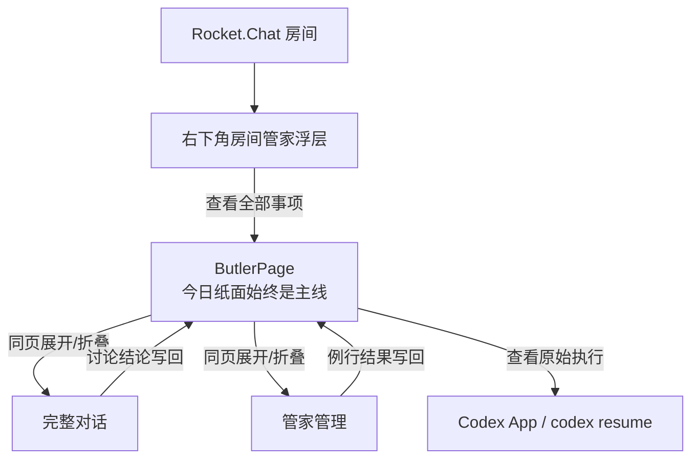

# 管家页面整体设计（实施前定稿）

> 状态：已确认并完成首轮实现。用户已确认一页化、折叠层级、小图标与行内快操作方向。
>
> 相关技术切片：[butler-sole-surface.md](./butler-sole-surface.md)

## 一句话定义

**管家不是聊天软件、任务仪表盘或执行控制台，而是每天自动整理的一张纸。**

用户平时只看今天仍需注意的事；需要追溯时进入完整对话，需要配置时进入管家管理，需要验原始执行时交给 Codex App 或 `codex resume`。

## 设计判断

当前版本的问题不是局部样式，而是表面之间没有统一边界：

- 今日简报、派活、审批和临时问答被当成彼此独立的组件，页面容易退化为卡片集合。
- 临时问答被放进“今天”，把即时对话误写成了日报内容。
- 完整对话的双方方向不清晰，用户需要反复依赖“你 / 管家”标签判断是谁在说话。
- 例行事务、记忆、技能、审计已有能力，但缺少一个明确的管理归宿。
- CodexPage 的独立模块注册仍保留“执行间”这一套用户心智。

因此这次不在现有页面上继续补组件，而是先把所有表面收敛为同一个系统。

## 信息架构

管家只有一个页面，页面内有三层内容和一个房间镜像：

1. **今日纸面**：永远是页面主线。
2. **完整对话**：需要多轮讨论或追溯原话时在同页展开的二级深度。
3. **管家管理**：例行事务、记忆、技能和最近动作在同页展开的管理深度。
4. **房间浮层**：从房间右下角唤起、只显示当前房间相关事项的上下文镜像。

不再存在用户可见的“执行间”。底层 Codex 线程、审批、停止和恢复能力继续保留，但通过纸面行内状态、Codex App 和 `codex resume` 分层到达。

### 一页化规则

- 不为完整对话或管理能力新增路由、一级导航或独立模块。
- 页头的小图标按钮原地展开对应内容；同一时间只展开一个二级区域，避免页面同时堆满。
- 收起只改变 UI 状态，不调用 `reset`、`newConversation`、`stop`，也不丢失输入草稿和滚动上下文。
- 折叠摘要只显示数量和最重要状态，例如“2 个会话”“3 件在盯”“1 项要确认”。
- 能在当前行完成的动作不打开弹窗：批准、拒绝、追问、停止、收下、复制、立即运行、暂停和忘掉都使用小按钮快速处理。
- 快捷按钮优先使用 14–16px 图标；含义可能误解或具有风险时同时保留短文字，并始终提供 `title` / `aria-label`。
- 动画只表达状态：运行图标缓慢旋转、展开箭头旋转、内容区轻微淡入；遵守 reduced motion，不做循环装饰动画。

## 表面一：今日纸面

### 固定结构

从上到下只有：

1. 日期、前后翻页、星期。
2. 右上角“完整对话”和“管理”两个小图标折叠按钮。
3. `等你点头`。
4. `在办`。
5. `待办`。
6. `今天`。
7. 一次临时问答。
8. 输入区与一句安静的状态脚注。

正文区为空时直接消失，不保留空框、空标题或推荐卡片。

### 等你点头

- 页面唯一使用红色的区域。
- 审批永远展开，不要求用户先点卡片。
- 只展示做决定所需的最小信息：要做什么、关键命令或影响、预计耗时/风险。
- 操作使用行内文字：`让它跑`、`这次不行`、`为什么？`。
- 用户决定后，该项进入“在办”或从纸面消失。

### 在办

同时容纳两类状态：

- **正在做**：默认收起，只显示标题、当前状态、耗时；展开后显示 Codex TODO、当前步骤、最多两行过程尾部、`叫停` 和 `codex resume`。
- **回话了**：默认收起，只显示标题和一句结果提示；展开后显示完整结论与 `收下`。只有用户收下后才归档。

默认展示人话，原始过程只作为第二层证据。窗口可用高度低于 720px 时默认隐藏过程尾部，只保留 TODO 和恢复入口。

### 待办

- 直接读取现有未完成待办，不能因为派活或 AI 简报为空就把纸面判成“没事”。
- 最多显示 5 项，截止日优先，其后按创建时间倒序；其余通过一个小按钮进入完整待办页。
- 标题、截止状态和来源默认可见，圆形小按钮可直接完成；编辑和删除仍留在完整待办页。
- AI 简报命中同一待办时不重复生成“今天”条目，而是折叠到该行的“查看原因与建议”。

### 今天

- 只收录已经形成意义的简报和结论，不收录过程。
- 最多 5 条，按重要性而不是时间流排序。
- 来源可用低对比度短标签表示，例如“晨报”“晚间回顾”。
- 每项默认只显示标题；点击小箭头后原位展开原因和建议动作，再次点击收起，不生成详情卡。

### 临时问答

- 临时问答不属于“今天”，在 DOM、视觉间距和可访问性分区上都必须独立。
- 页面只保留最近一问一答；新问题取代旧问答。
- 重要结果自动投影到纸面：派活进入“在办”，可复用结论进入“今天”。
- 需要多轮讨论时进入完整对话，不在主纸面堆历史消息。

### 空纸

审批、在办、未完成待办、简报和临时问答全空，且每日整理没有处于运行或失败状态时，才显示：

> 今天还没有事。
>
> 有事直接说，没事就让这张纸空着。

保留输入区，不提供“你可以试试……”提示网格。

## 表面二：完整对话

完整对话是 ButlerPage 内可折叠的二级深度，不是执行间，也不是新的主界面。

- 页头图标原地展开；区域内部提供会话切换、“新对话”和“在 Codex App 打开”，再次点击图标或“收起”返回纸面。
- 对话采用微信式双侧关系：管家在左、用户在右，短角色标签与气泡方向共同表达说话人。
- 气泡复用 RocketX 的 `bubble-mine` / `bubble-other` 语义色，不常驻头像、不增加外层对话面板；长正文、代码块和列表仍保持足够宽度。
- 派活、审批和运行状态仍由同一份管家状态投影，可在回答正文内行内呈现，不复制一套任务系统。
- 讨论结束形成的结论写回今日纸面。

## 表面三：房间浮层

房间管家不是固定侧栏，也不是全局管家的缩小版。它以右下角低存在感按钮常驻消息区，点击后从锚点向上展开，只回答“这个房间里有什么需要我知道的”。

- 只显示当前房间关联的在办事项。
- 只保留当前房间最近一次临时问答。
- 不显示全局晨报、晚间回顾、会话切换或全部派活。
- 输入框语义是“问问这个房间”。
- 需要查看全部事项时跳回今日纸面。
- 浮层覆盖消息区但不覆盖 Composer，不收窄分组或会话列表；房间仍在背景中可辨认。
- 顶部明确显示当前房间，右上角、弱遮罩、`Esc` 和再次点击入口都可以关闭。
- 窄窗口下宽度受视口约束，内容在浮层内纵向滚动，不产生横向滚动。

同一事项可以在今日纸面和房间浮层出现，但必须来自同一个数据对象，不能各自维护状态。

## 表面四：管家管理

管家管理是 ButlerPage 内独立折叠区，不与今日正文混排。展开后分为四段行式列表：

1. **在盯的事**：已装载的例行事务、开关、频率、上次运行；末尾进入能力库。
2. **记住的**：长期偏好及作用范围，可忘掉。
3. **会的本事**：已安装技能、来源、卸载；从 `SKILL.md` 安装需要安全确认。
4. **最近动作**：时间、动作、目标与结果，用于解释“管家刚才做了什么”。

管理区允许更高信息密度，但仍使用分组标题、可折叠行和细分隔线，不使用永久卡片墙。

## 历史与日历

历史有三层，各自解决不同问题：

- **翻纸**：日期旁前后箭头；旧纸是只读快照，不显示输入框。
- **完整对话**：追溯用户和管家的原话。
- **Codex 原始线程**：通过 Codex App 或 `codex resume` 查看执行真相。

日历是纸面的索引。点某天直接打开那天的只读纸面，不再设计另一套历史日报页。

旧纸只保留“办完”和“那天”等已经完成的事实，不重放当时的临时审批和输入状态。

## 状态设计

| 状态 | 用户看到什么 | 用户能做什么 |
|---|---|---|
| 首次加载 | 保留上次纸面；超过短暂延迟才显示“正在铺开今天的纸…” | 无需处理 |
| 空纸 | 日期、空纸文案、输入区 | 直接提问 |
| 局部加载失败 | 在受影响条目原位置写一句人话 | 重试该条目 |
| 离线 | 日期旁弱提示“离线 · 显示上次纸面” | 查看缓存；不可执行的动作置灰并说明 |
| 未找到 Codex | 在需执行的位置明确说明 | 打开设置或在 Codex App 继续 |
| 事项失联 | 原事项位置显示“没有接上执行线程” | `重新接回` |
| 等待审批 | 红色左线、影响和三个行内动作 | 批准、拒绝、追问 |
| 正在执行 | TODO、当前步骤和停止/恢复入口 | 叫停或看原始线程 |
| 已回复 | 结论保持可见 | 收下 |
| 旧纸 | 只读事实 | 翻日期或打开完整对话 |

全局错误横幅只用于整个管家不可用的情况；单项错误不能升级成仪表盘告警。

## 视觉系统

直接复用 RocketX 现有深色语义色和中文系统字体，不引入新依赖。

- 纸面最大宽度：`760px`。
- 内容依靠 12–24px 字号层级、约 40px 分区留白和短分隔线组织。
- 背景保持连续，不给正文套外卡、阴影或大圆角容器。
- 页面正文使用 `surface-3`；底部输入容器使用一层 `surface-4` 与 `line` 边界，不能让页面和输入框共用同一层底色。
- 红色只表示“需要你决定”；蓝色用于链接和进行中；绿色只表示完成。
- 辅助文字必须保持可读，不用“接近背景色”的灰制造安静。
- 动画只做 120–180ms 的展开、收起、箭头旋转和状态替换；运行图标可持续缓慢旋转，遵守 reduced motion。

视觉目标不是“把信息装满”，而是让用户一眼知道：哪里必须决定、什么还在做、今天已经发生了什么。

## 响应式与可访问性

- 宽窗口保持 760px 纸面，不随窗口无限拉宽。
- 中等宽度收窄导航栏，只缩外壳，不缩正文字号。
- 窄窗口隐藏非必要来源标签，保持正文与操作完整。
- 低高度窗口隐藏过程尾部，输入区仍可达；纸面正文独立滚动。
- 日期、三个正文区、临时问答和输入区使用独立语义区域与正确标题层级。
- 所有文字操作都支持键盘，焦点样式不能只靠颜色。
- 红/蓝/绿状态同时配合文字或符号，不以颜色作为唯一信号。
- 正文和可操作文字对比度至少满足 WCAG AA。
- 过程流不逐行播报给读屏；只播报审批到达、执行完成和用户主动触发的结果。

## 数据边界

页面只做投影，不再创造第三套任务或对话状态。

- `useButler`：管家对话与简报的单一来源。
- `butlerErrandRuns`：派活、审批、TODO、停止、恢复和结论的单一来源。
- `useTodos`：用户待办的单一来源；纸面只做当天实时投影，不复制或重新持久化。
- 每日快照仓库：保存旧纸所需的只读投影；当天是实时数据，过去日期读快照。
- 房间浮层：按房间来源过滤同一份事项和问答，不复制数据。
- 管家管理：读取现有 routines、memory、skills 和 audit 数据，各自保持原有职责。

建议新增一个纯 `ButlerPaperViewModel` 投影层，把上述来源整理成页面需要的三个区和一次问答。它不得持久化执行状态，也不得成为新的业务 store。

## 保留与退役

### 保留

- 底层 Codex AppServer 线程和 granular 审批。
- `useButler`、`butlerErrandRuns` 及现有运行/恢复能力。
- 完整会话切换、新对话和 Codex App 深链。
- routines、memory、skills、audit 的能力和数据。
- 日历到日期纸面的入口。
- 工作项讨论中的上下文 AgentPanel；它是共享讨论能力，不是用户一级“执行间”。

### 退役或重做

- 用户可见的 CodexPage “执行间”入口。
- 今日纸面里的卡片容器、聊天气泡和独立派活面板。
- 放在“今天”区内的临时问答。
- 房间浮层中的全局简报和全局会话管理。
- 当前 `ButlerConversation` 的单列编辑稿视觉；保留能力，重做为双侧对话。
- 零引用的 routines、memory、audit 独立组件入口；能力统一进入管家管理。
- 锁定错误布局的回归断言，改为锁定语义边界。

## 确认后的实施顺序

1. **统一投影与语义测试**：建立 `ButlerPaperViewModel`，先锁定三个正文区、临时问答独立、旧纸只读和房间过滤。

2. **今日纸面**：重做主页面、行内审批/运行/回复、快捷按钮和空纸/错误状态。

3. **单页二级区域**：把完整对话和管家管理改为 ButlerPage 内原地折叠；重做房间窄版并复用同一份状态。

4. **历史快照与日历**：持久化每日投影并打通日期入口。

5. **收起旧入口**：新表面全部站稳后，移除用户可见的 CodexPage 一级入口；工作项讨论继续使用上下文 AgentPanel。

不提前删底层执行能力；不在新呈现验证完成前拆旧入口。

## 实施验收

### 语义验收

- 临时问答不在“今天”的 DOM 区域内。
- 空区不渲染；全空没有推荐卡片。
- 左侧存在未完成待办时，今日纸必须显示同一条待办；完成后两处同步更新。
- 审批始终展开，红色不用于其他状态。
- 回话事项未“收下”前不会消失。
- 旧纸无输入框且不能执行当日动作。
- 房间浮层只包含当前房间来源的数据，且不改变消息页原有栏宽。
- 完整对话中用户消息居右、管家消息居左；气泡有明确方向，不增加头像或外层任务卡容器。
- 管家主导航没有“执行间”。

### 视觉验收

每次实现迭代至少比较这些截图：

- 1536×960：今日纸面、空纸、旧纸、完整对话、房间浮层开/关两态、管家管理。
- 900×800：今日纸面。
- 低高度窗口：运行详情自动降级但输入区可达。

视觉门禁未达到 90/100 不进入下一轮。

### Dogfooding 路径

1. 从纸面提问，确认只留下最近一问一答。
2. 派一件活，观察它进入“在办”并实时更新 TODO。
3. 触发审批、拒绝一次、再批准一次。
4. 查看完成结论并“收下”。
5. 进入完整对话继续多轮讨论，再返回纸面看结论写回。
6. 在 Rocket.Chat 房间打开右下角管家，确认浮层不遮挡 Composer、不收窄会话栏，也没有泄露全局事项。
7. 翻到昨天和从日历打开某天，确认纸面只读。
8. 在管理页暂停例行事务、忘掉记忆、查看最近动作。

## 明确不做

- 不新增常驻 agent loop。
- 不新增另一套聊天、派活或历史 store。
- 不把管理能力塞回主纸面。
- 不为“可能以后需要”增加可配置布局。
- 不用新依赖、新字体或新组件库解决视觉问题。
- 不在本设计确认前修改产品代码。
