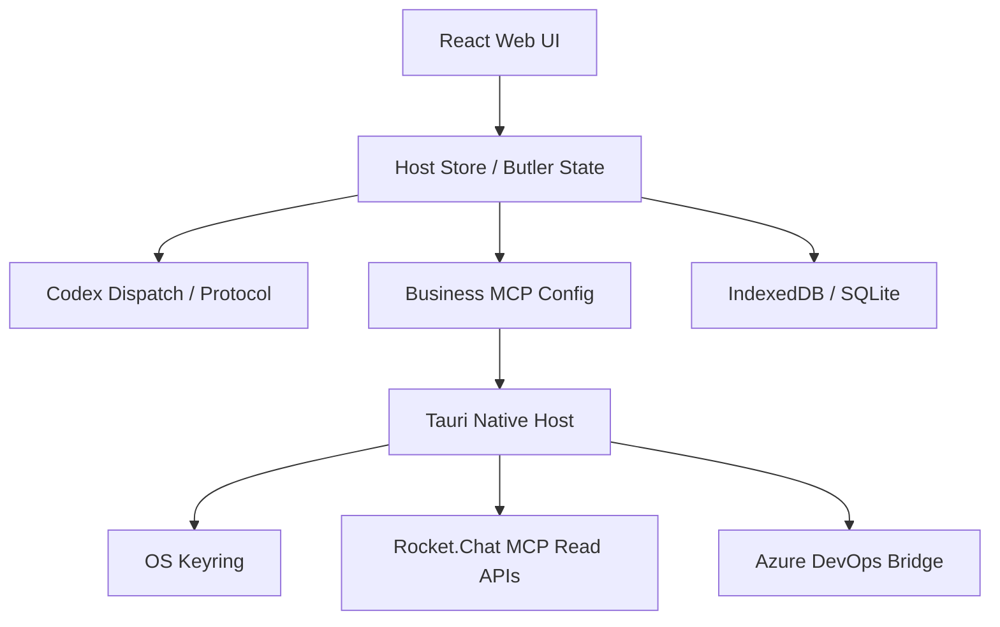

# ChatGPT Pro 产品成熟度审计记录

## 最终审计增补（2026-08-01）

- 对话：<https://chatgpt.com/c/6a6cb155-9cfc-83ea-b9ca-5de2ad9145f1>
- 基线源码包：`rocketx-product-readiness-3ab265f-20260731.zip`
- 文件数：1394
- 大小：2485294 bytes
- SHA-256：`f12749902c8a6048e7502ad2e9dff97940d1006d629582a3e40cea1fb2da7a06`
- round 3 报告：8120 bytes，SHA-256 `f84484cbe46cf3445db56c75458b3515578df919acfb198209f77afba825ce76`
- round 4 报告：7874 bytes，SHA-256 `21e352e104373ae9b6a5127b0681c00a3167fbbc8d55b5625009013107748e1c`

Codex 对最终报告的裁决是：产品方向已稳定为 Codex-first 的文字管家，不再扩展第二套 Agent Runtime；下一阶段只收敛现有闭环。优先级冻结为：

1. ADO 副作用安全：identity 绑定、确认前零写、unknown 不重放、共享 deadline；本轮已完成源码级与 UI 验收。
2. 状态真相与恢复投影：用户必须清楚知道 running、failed、offline、unknown 以及下一步；仍需跨页面和崩溃恢复的统一验收。
3. 连续性持久化：Memory、Todo、Commitment、routine 和 checkpoint 需要跨重启、升级、损坏数据的真实一致性证据；尚未完成真实环境验收。

审计仍不支持把 RocketX 宣称为“生产成熟”：真实 Rocket.Chat、ADO Server 2022 NTLM/PAT、Codex 长任务、Windows 安装升级、离线与崩溃恢复均未在本轮验证。源码回归和 mock E2E 不能替代这些门禁。

## 第一轮原始报告

- 对话：<https://chatgpt.com/c/6a6cb155-9cfc-83ea-b9ca-5de2ad9145f1>
- 源码快照：`rocketx-product-readiness-3ab265f-20260731.zip`
- 文件数：1394
- 快照大小：2485294 bytes
- 快照 SHA-256：`f12749902c8a6048e7502ad2e9dff97940d1006d629582a3e40cea1fb2da7a06`
- 基线 commit：`3ab265f5356a37b39750f47c71d43122e5967c44`
- 外部交付状态：第一轮报告已交付，但证据粒度和 backlog 可验收性不足，已要求第二轮修正。

以下为 ChatGPT Pro 第一轮原始报告正文；结论仍需由本地 Codex 独立复核，不能视为最终验收。

---

# RocketX Product Readiness Audit

- 审计角色：外部首席工程师（源码审计）
- 审计对象：rocketx-product-readiness-3ab265f-20260731.zip
- 基线：3ab265f5356a37b39750f47c71d43122e5967c44
- 方法：解压源码快照，检查真实入口、调用链、持久化、测试和文档；不连接真实 Rocket.Chat/ADO，不执行需要凭据的验证。

## 1. 执行摘要

### 当前是否可交付

结论：**尚未达到生产级可交付，但已经超过单纯 Demo 阶段。**

当前状态更接近：

> 一个架构方向正确、具备部分产品骨架的 AI 工作台原型，需要补齐可靠性、安全边界、真实集成验证和发行门禁。

主要判断：

- Codex-first 方向已经形成，但部分 Codex App Server 能力仍以 deep link / spike / contract 验证为主。
- Business MCP 的只读方向较清晰，Rocket.Chat MCP 已有 GET-only 约束；但 ADO 写闭环仍不是本包可证明的生产能力。
- Butler（管家）概念、Memory、Todo、Commitment 已有大量代码和测试，但存在“状态模型存在 != 真实持续助理能力完成”的风险。
- 测试数量较多，但很多属于源码级 regression/contract，不能替代真实环境 E2E。
- 发布、安装、升级、离线恢复、真实企业身份认证仍缺少证据。

## 最危险的 5 个事实

1. **文档中的产品愿景明显领先于真实运行闭环。** docs 下存在大量 blueprint/plan/design，但不能证明对应能力已经生产化。
2. **Codex 集成存在 spike 与 production 混杂风险。** scripts 中大量 `spike-*` 用于验证路线，不能作为交付证明。
3. **Business MCP 写入边界仍需严格隔离。** 当前本包主要证明配置注入和只读能力，没有证明完整 typed action + approval + remote verification。
4. **离线、恢复、升级、诊断尚未达到企业软件标准。** 有 checkpoint 等模型，但真实崩溃恢复和跨版本迁移证据不足。
5. **测试证明力不足。** regression 测试大量验证状态对象、字符串、store 行为，不证明真实 Rocket.Chat、ADO Server、Codex runtime 行为。

## 最强的 5 个已完成能力

1. 已建立较清晰的 Host / MCP / Codex / Skill 分层方向。
2. Rocket.Chat MCP 已采用 readOnlyHint，并限制工具 schema additionalProperties=false。
3. Tauri 侧已经考虑 keyring 保存 MCP 凭据，而不是直接明文 UI 持久化。
4. Butler 数据模型已有 Todo、Memory、Commitment、checkpoint 等产品概念。
5. 已有较完整的自动化脚本、regression 测试和架构文档体系。

---

# 2. 真实架构观察

## 分层职责判断

|层|当前状态|禁止事项|
|-|-|-|
|UI|partial|不能直接保存 token、不能执行业务副作用|
|Host/store|implemented-but-unproven|不能成为第二套 Agent Runtime|
|Codex|partial|不能被外层 router 替代|
|MCP|partial|不能开放任意 HTTP 方法|
|Native|implemented|不能绕过确认执行写操作|
|Persistence|partial|必须证明恢复一致性|

---

# 3. 产品面证据矩阵

## 1) 产品入口与对话体验

状态：partial

证据：

- `apps/web/src/agent/hostedConversation.ts`
- `apps/web/src/components/*Butler*`

已有：
- Hosted conversation projection
- Butler workspace UI

不足：
- 未证明完整“持续在线助理”闭环。
- 未证明主动提醒、长期上下文恢复。

风险：用户看到的是 AI 工作台，不一定是管家。

---

## 2) Codex App Server 集成

状态：implemented-but-unproven

证据：

- `apps/web/src/agent/codexTransfer.ts`
- `scripts/smoke-codex-app-server.mjs`
- `scripts/spike-codex-*`

发现：

存在 Codex deep link：

`codex://threads/new?...`

但：

- 未证明完整 thread 生命周期托管。
- 未证明生产审批流。
- 未证明断线恢复。

---

## 3) Rocket.Chat 集成

状态：partial / read-only 较成熟

证据：

- `apps/desktop/src-tauri/src/mcp.rs`

正面：

- MCP tools 明确 readOnlyHint。
- schema 限制参数。
- count 有范围限制。

缺口：

- 未验证真实权限模型。
- 未验证附件、mentions、未读同步完整性。

---

## 4) Azure DevOps Server

状态：partial

证据：

- `services/ado-bridge/src/index.ts`
- `docs/codex-business-write-actions-plan.md`

判断：

ADO 接入存在基础设施，但本包不能证明：

- Server 2022 NTLM 实测。
- Work Item typed write 完整闭环。
- 幂等、防重复提交。

---

## 5) Skill 与市场

状态：partial

证据：

- `apps/desktop/src-tauri/resources/codex-skills`
- `scripts/spike-butler-native-skills.ts`

问题：

大量能力仍以 spike 验证。

需要补：

- 安装/升级/卸载。
- 信任来源。
- 离线缓存。
- 版本锁定。

---

## 6) Butler 连续性

状态：implemented-but-unproven

证据：

- `packages/rcx-store`
- `apps/desktop/src-tauri/src/butler_db.rs`
- `scripts/regressions/butler-memory.test.ts`

已有模型：

- memory
- todo
- commitment
- checkpoint

缺口：

没有证明跨重启、升级、异常恢复后的真实一致性。

---

## 7) 安全边界

状态：partial

正面：

- Keyring 保存 MCP 配置。
- MCP 参数校验。
- Rocket.Chat MCP read-only。

风险：

需要进一步证明：

- 日志脱敏。
- prompt injection 防护。
- Skill 来源隔离。
- 外部脚本权限。

---

## 8) 可靠性

状态：partial

已有：

- deadline。
- checkpoint 状态。
- regression 覆盖。

缺失：

- 全链路取消。
- crash recovery。
- 网络断开恢复。
- 用户可理解错误状态。

---

## 9) 测试与门禁

状态：implemented-but-unproven

已有：

- typecheck
- regression
- playwright
- smoke scripts

问题：

测试类型主要证明：

- 模型。
- store。
- contract。

未证明：

- 安装包。
- 升级。
- 企业环境。
- 真实身份认证。

---

## 10) 文档与发行

状态：partial

发现：

docs 中大量成熟设计文档，但部分属于未来状态。

必须建立：

- capability matrix。
- release evidence。
- supported environment matrix。

---

# 4. 声明 vs 事实

|声明|事实判断|
|-|-|
|完整 Butler|已有模型和 UI，但持续助理闭环未证明|
|Codex native|方向正确，但部分仍是 transfer/spike|
|Business MCP|只读方向较可信，写入仍需产品化|
|企业级集成|存在适配代码，但缺真实环境证据|
|生产可靠|有模型，没有生产恢复证明|

---

# 5. 安全与副作用审计

## 凭据

当前：较好。

发现：

- Tauri keyring 使用。
- 前端通过 invoke 与 native 通信。

仍需验证：

- crash dump 是否包含 secret。
- log 是否脱敏。

## 写操作

目标架构正确：

草稿 -> 审批 -> 执行 -> 回读 -> 恢复

但当前源码包不足以证明完整实现。

## MCP

Rocket.Chat：偏安全。

ADO：需要继续隔离。

禁止：

- arbitrary URL。
- arbitrary PATCH。
- model 直接拿 token。

---

# 6. 交付门禁矩阵

|门禁|存在|成熟度|
|-|-|-|
|pnpm build|是|基础|
|typecheck|是|基础|
|unit/regression|是|中|
|Playwright|是|中|
|Codex smoke|是|验证性质|
|真实 RC E2E|否|缺失|
|真实 ADO Server E2E|否|缺失|
|安装升级测试|未证明|缺失|
|离线恢复测试|未证明|缺失|

---

# 7. P0/P1/P2 可独立交付切片

## P0-1 产品可信状态闭环

目标：让用户永远知道 AI 当前状态。

范围：

允许：status model、error classification、UI state。

禁止：重造 Agent Runtime。

验收：

- loading 必有结束状态。
- offline 明确提示。
- failure 可恢复。

测试：

- regression。
- UI。

---

## P0-2 Business MCP 安全边界冻结

目标：保证业务系统不会越权。

验收：

- 所有 read tool 白名单。
- 写入必须 typed action。
- confirmation 可审计。

---

## P1-1 Codex 生命周期托管

目标：从“打开 Codex”升级为“托管任务”。

验收：

- thread 生命周期。
- disconnect recovery。
- event projection。

---

## P1-2 Rocket.Chat 企业集成验证

目标：真实环境闭环。

验收：

- 登录。
- thread。
- attachment。
- permission。

---

## P1-3 Butler Persistence Hardening

目标：长期助理可靠。

验收：

- 重启恢复。
- schema migration。
- corruption handling。

---

## P2-1 Skill Marketplace 产品化

目标：Skill 从资源变产品。

验收：

- install/update/remove。
- trust metadata。
- offline cache。

---

# 8. 推荐前三个实现切片

1. P0-1 状态可信闭环

原因：直接决定产品是否像成熟软件。

2. P0-2 MCP 安全边界冻结

原因：避免后续业务接入返工。

3. P1-1 Codex 生命周期托管

原因：符合 Codex-first 核心战略。

---

# 9. 必须真实环境验证事项

以下不能由源码审计替代：

- Rocket.Chat 企业账号登录。
- ADO Server 2022 NTLM/PAT。
- Codex App Server 长任务运行。
- Windows 安装、升级、卸载。
- 离线启动和恢复。
- 崩溃恢复。
- 真实权限越界测试。

---

# 最终结论

RocketX 当前不是“没有实现”，而是处于：

**架构方向正确 + 大量能力骨架存在 + 产品交付证据不足。**

下一阶段不应该继续扩展功能，而应该把已有能力收敛成三个证明：

1. 用户相信状态。
2. 用户相信副作用安全。
3. 用户相信系统长期可靠。

完成这三个证明后，RocketX 才从 AI 工具进入可交付 AI 助理产品阶段。
