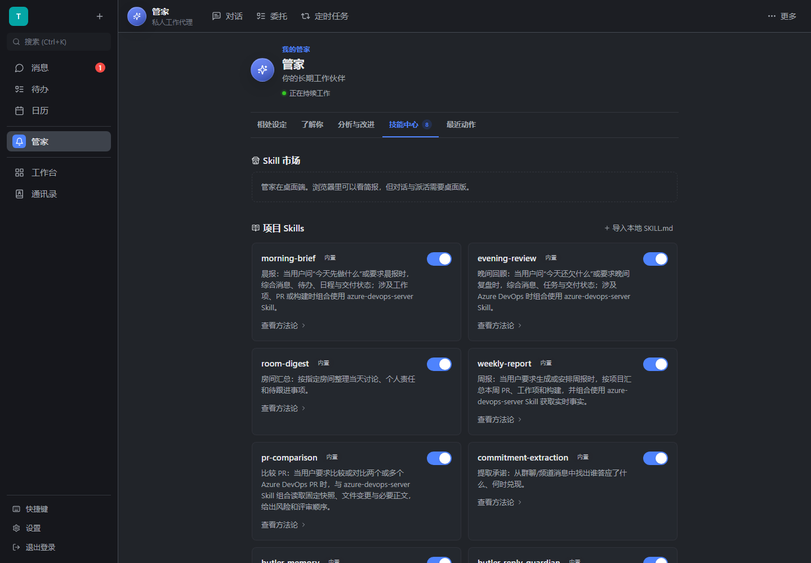
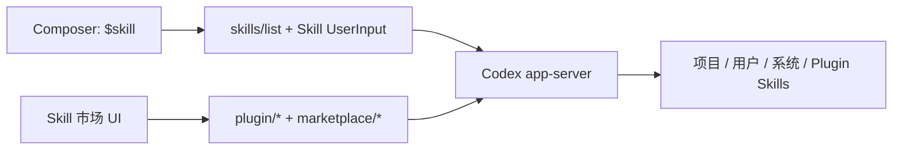

# Codex 原生 Skill 与 Marketplace 改造

> 文档状态：**历史评审记录**。本文截图和项目 Skill 数量是当时快照；当前发现、启停、安装、卸载和平台边界见[Skills、Plugins 与 Apps](specs/skills-and-plugins.md)。



> 管理页只保留 8 个可执行的项目 Skill；市场是 Codex 原生入口，浏览器版明确提示需在桌面端使用。

## 改了什么，为什么

RocketX 之前虽然以 Codex 为大脑，仍保留了自己的 Skill 注入、展示和安装心智，
用户也不能像 Codex App 一样直接键入 `$skill`。这会形成两套能力真相源。

现在 Composer 只从 Codex `skills/list` 取候选并补全 `$name `，执行时发送原生
Skill `UserInput`；市场读取、添加、更新、安装和卸载全部转发 Codex
Plugin/Marketplace 协议。RocketX 只保留界面、第一方 Markdown Skill 和必要的
宿主数据工具。

Marketplace 配置也不另存一份：界面直接展示 Codex 当前配置的市场，可添加 Git
URL 或本地路径、更新全部市场，并移除用户添加的来源。由 Codex 提供且没有本地
路径的目录只展示为“Codex 管理”，避免制造一个实际无效的删除开关。

离线是正常模式而不是错误页。浏览器明确报告离线时，界面跳过在线
`plugin/list`，在 4 秒截止时间内读取 `plugin/installed`；在线目录读取最多等待
8 秒，失败后同样回退到本地内容。添加、更新、安装和卸载最多等待 15 秒，超时后
释放界面并提醒用户先刷新状态，因为 Codex 当前没有通用的 Marketplace 请求取消
协议，后台操作仍可能稍后完成。网络恢复时界面会自动重新读取在线目录。



## 关键决策

1. **不建 RocketX Marketplace。** Codex 已提供完整协议和安装目录管理；自建索引、
   包格式或下载器只会再次分叉。被否决方案：复用旧 Markdown 粘贴入口作为市场。
2. **第一方能力继续是透明 `SKILL.md`。** 它们被镜像到 Butler 工作区，由 Codex
   原生发现；TypeScript 只负责装载和兼容数据。被否决方案：再生成一份 TS/JSON 注册表。
3. **只把可执行流程叫 Skill。** 七个内部学习算法没有 Codex 工具入口，已从 Skill
   目录和 Provider 注册层删除；学习算法本身仍作为类型化扩展运行。
4. **Memory 是 Skill 方法论加受控宿主数据。** 没有引入远程 Mem0 Runtime，也没有
   把跨 scope 记忆明文放进 Codex 工作目录。

## 已回答的未知点

- 固定版 Codex `0.144.4` 与系统版 `0.145.0` 都支持所需的
  `marketplace/*`、`plugin/*`、`skills/list` 和 `skills/changed` 合同。
- 隔离的 Codex Home 返回空市场是合法状态，不代表协议缺失；因此 UI 提供显式的
  “添加 Marketplace”，不会伪装内置目录。
- Marketplace 安装的用户级 Skill 会连同真实路径出现在 `skills/list`，手写
  `$name 参数` 不依赖 RocketX 的项目 Skill 清单。

## 没做什么

- 没有预装或猜测一个默认 Marketplace。
- 没有增加新的依赖、包格式、Agent Router 或沙箱实现。
- 本地粘贴 `SKILL.md` 暂时保留为旧项目 Skill 的兼容导入，不再是主要分发入口。
- 没有提交或推送当前工作区。

## 如何体验

1. 在桌面版打开“我的管家 → 记忆与技能”，添加、更新或移除 Marketplace，并安装 Plugin。
2. 在今日页、完整对话或房间管家输入 `$`，用上下键和 Tab/Enter 选择 Skill。
3. 输入参数后发送，例如 `$room-digest 发布群`。

验证命令：

```text
pnpm test:regression
pnpm test:pure
pnpm test:ui
pnpm build
pnpm spike:codex-plugin-marketplace
pnpm spike:butler-native-skills
pnpm spike:butler-native-skills:system
```

## 风险与回滚

- 市场可用性仍取决于用户配置和 Codex 运行时；加载错误会在市场区原样呈现。
- `navigator.onLine` 只用于离线快速路径，不能证明互联网真的可达；因此在线读取
  仍有截止时间和本地回退。
- 旧版本遗留的不规范自装 Skill 仍保留在兼容数据层，尚未强制删除；Codex 线程不会再获得
  `load_skill` Host Tool，只有旧 API 读取路径可以查看这些内容。
- 回滚时可撤销 UI 和协议适配；第一方 `SKILL.md` 与现有用户数据没有转换成不可逆格式。
